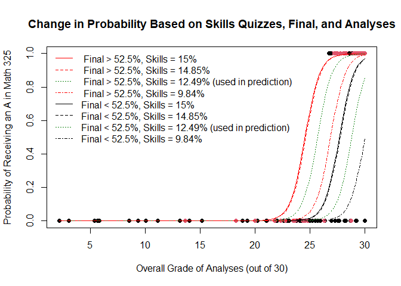

```r
library(readr)
library(mosaic)
library(tidyverse)
library(car)
library(pander)
library(DT)
```

## Introduction

MATH 325 can be a vigorous course at some points, especially if a student has had little exposure to other programming or scripting languages. It is a fair statement to be made that each student wants to do as well as he/she can, and an "A" is always a good score. This analysis will use data gathered on real students in MATH 325 and their grades on different assignments throughout the semester to predict if they will receive an A in the course overall.


```r
gradesTrain <- read.csv("Math325Grades_Train.csv")
gradesTest <- read.csv("Math325Grades_Test.csv")
```


```r
gradesTrain <- gradesTrain %>% 
  replace(is.na(.),0)

gradesTest <- gradesTest %>% 
  replace(is.na(.),0)

train <- gradesTrain %>% 
  mutate(
    missingAnalysis = case_when(
      Analysis1 == "0" | Analysis2 == "0" | Analysis3 == "0" | Analysis4 == "0" | Analysis5 == "0" | Analysis6 == "0" | Analysis7 == "0" | Analysis8 == "0" | Analysis10 == "0" | Analysis11 == "0" | Analysis12 == "0" | Analysis13 == "0" ~ "missing",
      TRUE ~ "all" 
    )
  )

train <- gradesTrain %>% 
  mutate(
    missingAnalysis = case_when(
      Analysis1 == 0 | Analysis2 == 0 | Analysis3 == 0 | Analysis4 == 0 | Analysis5 == 0 | Analysis6 == 0 | Analysis7 == 0 | Analysis8 == 0 | Analysis10 == 0 | Analysis11 == 0 | Analysis12 == 0 | Analysis13 == 0 ~ "missing",
      TRUE ~ "all" 
    )
  )

#train <- gradesTrain %>% 
#  mutate(
#    missingAnalysis = 
#      (Analysis1 == "0") + (Analysis2 == "0") + (Analysis3 == "0") + (Analysis4 == "0") + (Analysis5 == "0") + (Analysis6 == "0") + (Analysis7 == "0") + (Analysis8 == "0") + (Analysis10 == "0") + (Analysis11 == "0") + (Analysis12 == "0") + (Analysis13 == "0")
#  )

train$missingAnalysis <- factor(train$missingAnalysis)

train <- train %>% 
  mutate(
    examscore = case_when(
      FinalExam > 10.5 ~ 1,
      TRUE ~ 0
    )
  )

gradesTest <- gradesTest %>% 
  mutate(
    examscore = case_when(
      FinalExam > 10.5 ~ 1,
      TRUE ~ 0
    )
  )

train$examscore <- factor(train$examscore)
gradesTest$examscore <- factor(gradesTest$examscore)


train <- train %>% 
  select(FinalGrade, ProjectTotal, AnalysisTotal, CritiqueTotal, SkillsQuizzesTotal, ClassActivitiesTotal, missingAnalysis, examscore, FinalExam)
```


## The Model


$$

\overbrace{P(Y_i=1|x_i)}^\text{Probability of getting an A} = \frac{e^{\beta_0 + \beta_1\overbrace{X_1}^\text{Analyses} + \beta_2\overbrace{X_2}^\text{Skills Quizzes} + \beta_3\overbrace{X_2}^\text{Exam Score}}}

{1+e^{\beta_0 + \beta_1\underbrace{X_1}_\text{Analyses} + \beta_2\underbrace{X_2}_\text{Skills Quizzes} + \beta_3\underbrace{X_2}_\text{Exam Score}}}=\pi_i

$$

## Selected Model

The selected model uses 3 explanatory variables: AnalysisTotal, SkillsQuizzesTotal, and examscore. AnalysisTotal is a numeric variable that represents the percentage earned out of the total possible 30, considering it's weight on the final score. SkillsQuizzesTotal is also a quantitative variable that represents the percentage earned out of 15 for those assignments. The examscore variable is a boolean variable created from the FinalExam variable, which recorded the score out of 20 (given it's weight) a student scored on the final exam. A value of 10.5 was chosen to create a boundary of scoring above or below. A score of 10.5 equates to a score of 52.5% on the final exam. Each of these variables was found to be significant, and gives an AIC of 46.203, as opposed to a generalized linear model using just the AnalysisTotal computing an AIC of 66.879.


```r
glm8 <- glm(FinalGrade == "A" ~ AnalysisTotal + SkillsQuizzesTotal + examscore, data = train, family = binomial)
summary(glm8) %>% pander(caption = "Final Logistic Regression Model")
```


----------------------------------------------------------------------
         &nbsp;           Estimate   Std. Error   z value   Pr(>|z|)  
------------------------ ---------- ------------ --------- -----------
    **(Intercept)**        -51.94      12.76       -4.07    4.705e-05 

   **AnalysisTotal**       1.506       0.3524      4.274    1.92e-05  

 **SkillsQuizzesTotal**    0.6824      0.2866      2.381     0.01727  

     **examscore1**        4.707       1.496       3.147    0.001648  
----------------------------------------------------------------------


(Dispersion parameter for  binomial  family taken to be  1 )


-------------------- ---------------------------
   Null deviance:     166.1  on 119  degrees of 
                               freedom          

 Residual deviance:   38.2  on 116  degrees of  
                               freedom          
-------------------- ---------------------------

```r
b <- coef(glm8)
```

## Visualization of the Selected Model


```r
plot(FinalGrade == "A" ~ AnalysisTotal, data = train, col = as.factor(examscore), pch = 19, ylab = "Probability of Receiving an A in Math 325", main = "Change in Probability Based on Skills Quizzes, Final, and Analyses", xlab = "Overall Grade of Analyses (out of 30)")

summary(train$SkillsQuizzesTotal) %>% pander(caption = "Summary of the Skills Quizzes Total")
```


---------------------------------------------------
 Min.    1st Qu.   Median   Mean    3rd Qu.   Max. 
------- --------- -------- ------- --------- ------
 1.136    9.843    12.49    11.49    14.85     15  
---------------------------------------------------

Table: Summary of the Skills Quizzes Total

```r
SkillsQuizzesTotal = 15
examscore = 0
curve(exp(b[1] + b[2]*analysis + b[3]*SkillsQuizzesTotal + b[4]*examscore) / (1 + exp(b[1] + b[2]*analysis + b[3]*SkillsQuizzesTotal + b[4]*examscore)), xname = "analysis", add = TRUE)

SkillsQuizzesTotal = 14.85
examscore = 0
curve(exp(b[1] + b[2]*analysis + b[3]*SkillsQuizzesTotal + b[4]*examscore) / (1 + exp(b[1] + b[2]*analysis + b[3]*SkillsQuizzesTotal + b[4]*examscore)), xname = "analysis", add = TRUE, lty = 2)

SkillsQuizzesTotal = 12.49
examscore = 0
curve(exp(b[1] + b[2]*analysis + b[3]*SkillsQuizzesTotal + b[4]*examscore) / (1 + exp(b[1] + b[2]*analysis + b[3]*SkillsQuizzesTotal + b[4]*examscore)), xname = "analysis", add = TRUE, lty = 3, col = "forestgreen")

SkillsQuizzesTotal = 9.84
examscore = 0
curve(exp(b[1] + b[2]*analysis + b[3]*SkillsQuizzesTotal + b[4]*examscore) / (1 + exp(b[1] + b[2]*analysis + b[3]*SkillsQuizzesTotal + b[4]*examscore)), xname = "analysis", add = TRUE, lty = 4)

## Exam Score == 1 

SkillsQuizzesTotal = 15
examscore = 1
curve(exp(b[1] + b[2]*analysis + b[3]*SkillsQuizzesTotal + b[4]*examscore) / (1 + exp(b[1] + b[2]*analysis + b[3]*SkillsQuizzesTotal + b[4]*examscore)), xname = "analysis", add = TRUE, col = "red")

SkillsQuizzesTotal = 14.85
examscore = 1
curve(exp(b[1] + b[2]*analysis + b[3]*SkillsQuizzesTotal + b[4]*examscore) / (1 + exp(b[1] + b[2]*analysis + b[3]*SkillsQuizzesTotal + b[4]*examscore)), xname = "analysis", add = TRUE, lty = 2, col = "red")

SkillsQuizzesTotal = 12.49
examscore = 1
curve(exp(b[1] + b[2]*analysis + b[3]*SkillsQuizzesTotal + b[4]*examscore) / (1 + exp(b[1] + b[2]*analysis + b[3]*SkillsQuizzesTotal + b[4]*examscore)), xname = "analysis", add = TRUE, lty = 3, col = "forestgreen")

SkillsQuizzesTotal = 9.84
examscore = 1
curve(exp(b[1] + b[2]*analysis + b[3]*SkillsQuizzesTotal + b[4]*examscore) / (1 + exp(b[1] + b[2]*analysis + b[3]*SkillsQuizzesTotal + b[4]*examscore)), xname = "analysis", add = TRUE, lty = 4, col = "red")

legend("topleft", legend = c(" Final > 52.5%, Skills = 15%", " Final > 52.5%, Skills = 14.85%", " Final > 52.5%, Skills = 12.49% (used in prediction)", " Final > 52.5%, Skills = 9.84%", "Final < 52.5%, Skills = 15%", "Final < 52.5%, Skills = 14.85%", "Final < 52.5%, Skills = 12.49% (used in prediction)", "Final < 52.5%, Skills = 9.84%"),col = c("red","red","forestgreen","red","black","black","forestgreen","black"),lty = c(1,2,3,4,1,2,3,4), bty = "n")
```

<!-- -->

The values for the Skills Quizzes were chosen based upon the 5-number summary of the variable itself, using the first quartile, median, third quartile and the maximum. The red dots and regression curves represent scoring above the aforementioned boundary of 52.5% on the final, while the black show scoring below. The green lines are colored green for use in the prediction section of this analysis.

### Goodness of Fit

Given that there are many repeated values of our x variable, a deviance goodness of fit test has been run to evaluate the fit of the generalized regression model to the data:


```r
pchisq(38.2, 116, lower.tail = FALSE) %>% pander(caption="Deviance Goodness of Fit Test")
```

_1_

It is shown that our model is in fact a good fit for the data, considering the fact that the null hypothesis for this test is that it is a good fit and we have recieved a large p-value.


## Prediction {.tabset .tabset-fade}

Predictions have been included regarding the median Skills Quizzes Total, given that this data is skewed so the median is a good predictor of the typical value for this variable. This situation is modeled by the lines on the plot with line type = 3, and have been colored green for clarity purposes.

### Final Exam < 52.5%

As is shown in these predictions, there is almost no probability that a student can receive an A in MATH 325 if he/she: Scores below a 52.5% on the final exam, has the median score on the skills quizzes, and scores 26 or below on the analysis section of the course. This probability changes significantly, however, just by ensuring that a score of 30 is achieved on the analyses. The 4 predictions in this section differ only by the analysis score, beginning with a score of 24, 26, 28, and 30.


```r
predict(glm8, data.frame(SkillsQuizzesTotal = 12.49, examscore = "0", AnalysisTotal = 24), type = "response") %>% pander()
```


-----------
     1     
-----------
 0.0006964 
-----------

```r
predict(glm8, data.frame(SkillsQuizzesTotal = 12.49, examscore = "0", AnalysisTotal = 26), type = "response") %>% pander()
```


---------
    1    
---------
 0.01398 
---------

```r
predict(glm8, data.frame(SkillsQuizzesTotal = 12.49, examscore = "0", AnalysisTotal = 28), type = "response") %>% pander()
```


--------
   1    
--------
 0.2238 
--------

```r
predict(glm8, data.frame(SkillsQuizzesTotal = 12.49, examscore = "0", AnalysisTotal = 30), type = "response") %>% pander()
```


--------
   1    
--------
 0.8544 
--------

### Final Exam > 52.5%

As is shown here, the probability of receiving an A in MATH 325 increases dramatically as you increase the overall score of your analyses. The order of predictions begins with an Analysis total of 24, incremented by 2 until 30.


```r
predict(glm8, data.frame(SkillsQuizzesTotal = 12.49, examscore = "1", AnalysisTotal = 24), type = "response") %>% pander()
```


---------
    1    
---------
 0.07163 
---------

```r
predict(glm8, data.frame(SkillsQuizzesTotal = 12.49, examscore = "1", AnalysisTotal = 26), type = "response") %>% pander()
```


--------
   1    
--------
 0.6108 
--------

```r
predict(glm8, data.frame(SkillsQuizzesTotal = 12.49, examscore = "1", AnalysisTotal = 28), type = "response") %>% pander()
```


--------
   1    
--------
 0.9696 
--------

```r
predict(glm8, data.frame(SkillsQuizzesTotal = 12.49, examscore = "1", AnalysisTotal = 30), type = "response") %>% pander()
```


--------
   1    
--------
 0.9985 
--------


##


## Validation


```r
set.seed(17)


keep <- sample(1:nrow(train),70)
train1 <- train[keep,]
test1 <- train[-keep,]

train.glm <- glm(FinalGrade == "A" ~ AnalysisTotal + SkillsQuizzesTotal + examscore, data = train, family = binomial)
probs <- predict(train.glm, newdata = test1, type = "response")

mypreds <- ifelse(probs > .77, "Get an A", "Nope")

table(mypreds, test1$FinalGrade) %>% pander(caption = "Computing the PCC")
```


---------------------------
    &nbsp;      A    Other 
-------------- ---- -------
 **Get an A**   21     0   

   **Nope**     1     28   
---------------------------

Table: Computing the PCC

```r
pcc <- (21+28)/(21+28+1)
pcc
```

```
## [1] 0.98
```

A percentage correctly classified of 98% was computed for this model, meaning that 98% of the true outcomes were correctly predicted.


#### Read Data Into Test File


```r
gradesTest$FinalGrade <- ifelse(predict(glm8, gradesTest, type = "response") > .9, "A","Other")
write.csv(gradesTest, "Test.csv", row.names = FALSE)
```

