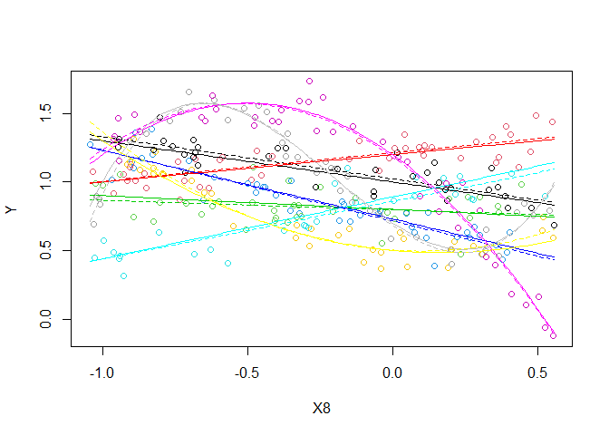
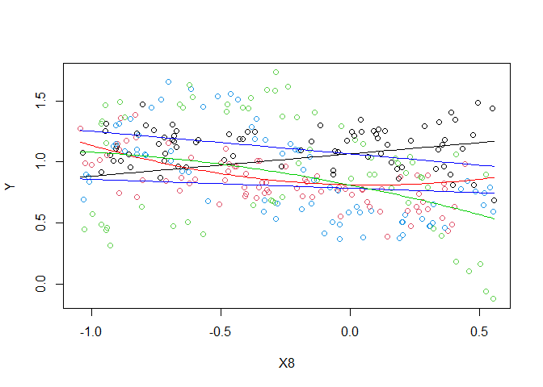
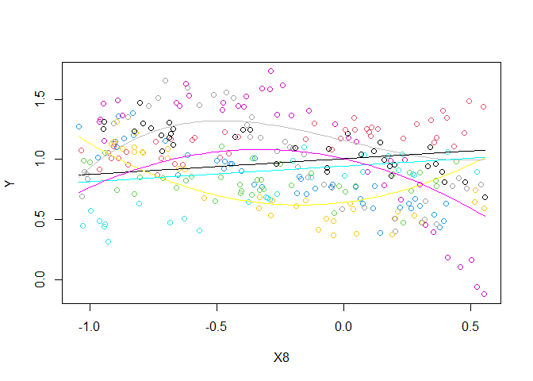
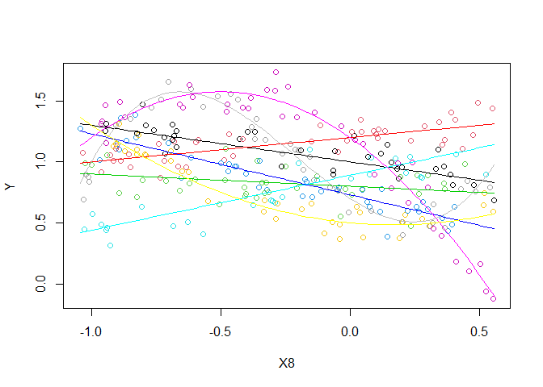

```r
library(pander)
library(tidyverse)
```

## Creating your Data

You need to design a "true linear regression model" of the form $Y_i = \beta_0 + \ldots + \epsilon_i$ where $\epsilon_i \sim N(0, \sigma^2)$. Then, using simulation in R, use your model to obtain a "sample" of data which must be saved in a csv file called `rbdata.csv`.

### Rules

1. Your csv file `rbdata.csv` must contain 11 columns of data.
    * The first column must be your (1) Y-variable (labeled as `Y`).
    * The other ten columns must be (10) X-variables (labeled as `X1`, `X2`, ... , `X10`). Please use all capital letters.
    
2. Your Y-variable (or some transformation of the Y-variable) must have been created from a linear regression model using only X-variables (or transformations of those X-variables) from within your data set.
    * Be very careful with transformations. You must ensure that you do not break the rules of a linear regression if you choose to use transformations.
    * If you choose transformations, only these functions are allowed when transforming X and Y variables: `1/Y^2`, `1/Y`, `log(Y)`, `sqrt(Y)`, `sqrt(sqrt(Y))`, `Y^2`, `Y^3`, `1/X^2`, `1/X`, `log(X)`, `sqrt(X)`, `sqrt(sqrt(X))`, `X^2`, `X^3`, `X^4`, and `X^5`. Don't forget to check Rule #3 carefully if you choose transformations.
    
3. Your sample size must be sufficiently large so that when the true model is fit to your data using lm(...), all p-values of X-variable terms (not including the intercept) found in the summary(...) are significant.

4. The $R^2$ value of your true model fit on your `rbdata` sample must be greater than or equal to $0.30$.

5. Your true model must be 2D-drawable.


## Your True Model

### The Desmos Graph

Include a picture of your Desmos graph showing your true model.


### The Mathematical Model

Write out your "true" model in mathematical form. Make sure it matches your code.

$$
Y_i = \beta_0 + \beta_1 X_{8i} + \beta_2 X_{3i} + \beta_3 X_{3i} X_{8i} + \beta_{4} X_{5i} + \beta_{5}X_{5i}X_{8i} + \beta_6X_{9i} + \beta_7X_{9i}X_{8i} + \beta_8X_{3i}X_{5i} + \beta_9X_{3i}X_{5i}X_{8i} + \beta_{10}X_{3i}X_{9i} + \beta_{11}X_{3i}X_{9i}X_{8i} + \beta_{12}X_{3i}X_{9i}X_{8i}^2 + \beta_{13}X_{5i}X_{9i} + \beta_{14}X_{5i}X_{9i}X_{8i} + \beta_{15}X_{5i}X_{9i}X_{8i}^2 +  \beta_{16}X_{9i}X_{5i}X_{3i} + \beta_{17}X_{9i}X_{5i}X_{3i}X_{8i} + \beta_{18}X_{9i}X_{5i}X_{3i}X_{8i}^2 + \beta_{19}X_{9i}X_{5i}X_{3i}X_{8i}^3 + \epsilon_i
$$


### The Code to Make the Data


```r
set.seed(122) #This ensures the randomness is the "same" everytime if you play the entire R-chunk as one entire piece of code. If you run lines separately, your data might not come out the same every time. You can pick any integer value you want for set.seed. Each choice produces a different sample, so you might want to play around with a few different choices.

## To begin, decide on your sample size. (You may have to revise it later to ensure all values in your lm(...) are significant.)
  
 n <- 300
  
## Then, create 10 X-variables using functions like rnorm(n, mean, sd), rchisq(n, df), rf(n, df1, df2), rt(n, df), rbeta(n, a, b), runif(n, a, b) or sample(c(1,0), n, replace=TRUE)... to see what any of these functions do, run codes like hist(rchisq(n, 3)). These functions are simply allowing you to get a random sample of x-values.

 X1 <- sample(c(1,0), n, replace=TRUE) #replace this
 X2 <- runif(n, -.7, 7) #replace this
 X3 <- sample(c(1,0), n, replace=TRUE) # dummy variable
 X4 <- sample(c(1,0), n, replace=TRUE) #replace this
 X5 <- sample(c(1,0), n, replace=TRUE) # dummy variable
 X6 <- runif(n,-1.3, .6) #replace this
 X7 <- runif(n,-.98, .63) #replace this
 X8 <- runif(n,-1.05,.57) #quantitative variable
 X9 <- sample(c(1,0), n, replace=TRUE) # dummy variable
 X10 <- runif(n,-1.17, .68) #replace this
 
## Then, create betas, sigma, normal error terms and Y
 
  beta0 <- 1
  beta1 <- -.3
  beta2 <- .2
  beta3 <- .5
  beta4 <- -.2
  beta5 <- .2
  beta6 <- -.11
  beta7 <- .75
  beta8 <- -.27
  beta9 <- -.9
  beta10 <- .11
  beta11 <- -2.45
  beta12 <- -1.5
  beta13 <- -.19
  beta14 <- -.85
  beta15 <- .6
  beta16 <- .16
  beta17 <- 1.65
  beta18 <- 2.7
  beta19 <- 2.9
  
 
 sigma <- 0.1 #change to whatever positive number you want


 ################################
 # You CANNOT change this part:
 epsilon_i <- rnorm(n, 0, sigma)
 ################################ 
 
 #An example of how to make Y...
 # Y <-  beta0 + beta1*X1 + beta2*X2 + beta3*X4*X2 + epsilon_i
 
 Y <- beta0 + beta1*X8 + #baseline
   beta2*X3 + beta3*X3*X8 + #second line
   beta4*X5 + beta5*X5*X8 + #third line
   beta6*X9 + beta7*X9*X8 + #fourth line
   beta8*X3*X5 + beta9*X3*X5*X8 + #fifth line
   beta10*X3*X9 + beta11*X3*X9*X8 + beta12*X3*X9*X8^2 + #first parabolic
   beta13*X9*X5 + beta14*X9*X5*X8 + beta15*X9*X5*X8^2 + #second parabolic
   beta16*X9*X5*X3 + beta17*X9*X5*X3*X8 + beta18*X9*X5*X3*X8^2 + beta19*X9*X5*X3*X8^3 + #cubic
   + epsilon_i
 
 
 # You can include Y' or X' instead of Y or X if you wish.
 # Remember, only these functions are allowed when transforming
 # variables: 1/Y^2, 1/Y, log(Y), sqrt(Y), sqrt(sqrt(Y)), Y^2, Y^3, 1/X^2, 1/X, log(X), sqrt(X), sqrt(sqrt(X)), X^2, X^3, X^4, X^5. 
 #########################################################
 # ILLEGAL: Y = (beta0 + beta1*X5)^2 + epsilon_i #########
 #########################################################
 # Legal: sqrt(Y) = beta0 + beta1*X5^2 + epsilon_i #######
 #########################################################
 # You can only transform individual terms, not groups of terms.
 # And the beta's cannot be part of the transformation.

 
 # This loads your data into a data set:
 rbdata <- data.frame(Y, X1, X2, X3, X4, X5, X6, X7, X8, X9, X10)
 
 #Now fit your model to make sure it comes out significant:
 mylm <- lm(Y ~ X8 + X3 + X3:X8 + X5 + X5:X8 + X9 + X9:X8 + X3:X5 + X3:X5:X8 + X3:X9 + X3:X9:X8 + I(X8^2):X3:X9 + X9:X5 + X9:X5:X8 + I(X8^2):X9:X5 + X9:X5:X3 + X9:X5:X3:X8 + I(X8^2):X9:X5:X3 + I(X8^3):X9:X5:X3, data=rbdata) #edit this code to be your true model
 
 b <- coef(mylm)
 
 summary(mylm) %>% pander()
```


--------------------------------------------------------------------
        &nbsp;          Estimate   Std. Error   t value   Pr(>|t|)  
---------------------- ---------- ------------ --------- -----------
   **(Intercept)**       1.023      0.01849      55.31    9.68e-153 

        **X8**          -0.3074     0.03612     -8.511    1.063e-15 

        **X3**           0.1898     0.02532      7.498    8.583e-13 

        **X5**          -0.2256      0.0279     -8.086    1.877e-14 

        **X9**          -0.1653     0.02948     -5.607    4.921e-08 

      **X8:X3**          0.5155     0.04744      10.87    3.508e-23 

      **X8:X5**          0.2384     0.05474      4.355    1.869e-05 

      **X8:X9**          0.7289     0.05471      13.32    1.055e-31 

      **X3:X5**         -0.2697     0.03759     -7.174    6.531e-12 

      **X3:X9**          0.1349      0.0413      3.266    0.001228  

      **X5:X9**         -0.1289     0.04401     -2.929     0.00368  

     **X8:X3:X5**       -0.9628     0.07262     -13.26    1.823e-31 

     **X8:X3:X9**        -2.446     0.08071      -30.3    2.187e-90 

  **X3:X9:I(X8^2)**      -1.456      0.0829     -17.57    4.393e-47 

     **X8:X5:X9**       -0.7991     0.09135     -8.748    2.072e-16 

  **X5:X9:I(X8^2)**      0.7246     0.09577      7.566    5.574e-13 

     **X3:X5:X9**        0.1249     0.06335      1.972     0.0496   

   **X8:X3:X5:X9**       1.571       0.1344      11.69    5.635e-26 

 **X3:X5:X9:I(X8^2)**    2.628       0.2268      11.58    1.291e-25 

 **X3:X5:X9:I(X8^3)**     3.13       0.2122      14.75    7.843e-37 
--------------------------------------------------------------------


-------------------------------------------------------------
 Observations   Residual Std. Error   $R^2$   Adjusted $R^2$ 
-------------- --------------------- ------- ----------------
     300              0.1033          0.907       0.9006     
-------------------------------------------------------------

Table: Fitting linear model: Y ~ X8 + X3 + X3:X8 + X5 + X5:X8 + X9 + X9:X8 + X3:X5 + X3:X5:X8 + X3:X9 + X3:X9:X8 + I(X8^2):X3:X9 + X9:X5 + X9:X5:X8 + I(X8^2):X9:X5 + X9:X5:X3 + X9:X5:X3:X8 + I(X8^2):X9:X5:X3 + I(X8^3):X9:X5:X3

```r
 #all p-values must be significant, except the "(Intercept)"
 #the R^2 value must be greater than or equal to 0.30.

 
 #Plot your True model (dashed lines) along with the correct estimated model (solid lines)
 #Your model must be cleanly visualizable with a 2D scatterplot.
```
  

```r
# Once you are ready, run this code to write your data to a csv:
write.csv(rbdata, "rbdata.csv", row.names=FALSE)
# The above code writes the dataset to your "current directory"
# To see where that is, use: getwd() in your Console.
# Find the data set and upload it to I-Learn.
```


 
## The Plot of your Model

Provide a 2D scatterplot that shows both your *true* model and *estimated* model on the same scatterplot. This should look nearly identical to your Desmos graph. This is the most important part of this assignment. This is where you earn your opportunity to participate in Regression Battleship.


```r
plot(Y ~ X8, data = rbdata, col = interaction(X3,X5,X9))
X5=0
X3=0
X9=0
curve(beta0 + beta1*X8 + #baseline
   beta2*X3 + beta3*X3*X8 + #second line
   beta4*X5 + beta5*X5*X8 + #third line
   beta6*X9 + beta7*X9*X8 + #fourth line
   beta8*X3*X5 + beta9*X3*X5*X8 + #fifth line
   beta10*X3*X9 + beta11*X3*X9*X8 + beta12*X3*X9*X8^2 + #first parabolic
   beta13*X9*X5 + beta14*X9*X5*X8 + beta15*X9*X5*X8^2 + #second parabolic
   beta16*X9*X5*X3 + beta17*X9*X5*X3*X8 + beta18*X9*X5*X3*X8^2 + beta19*X9*X5*X3*X8^3, add = TRUE, xname="X8", col = "black")
curve(b[1] + b[2]*X8 + #baseline
   b[3]*X3 + b[6]*X3*X8 + #second line
   b[4]*X5 + b[7]*X5*X8 + #third line
   b[5]*X9 + b[8]*X9*X8 + #fourth line
   b[9]*X3*X5 + b[12]*X3*X5*X8 + #fifth line
   b[10]*X3*X9 + b[13]*X3*X9*X8 + b[14]*X3*X9*X8^2 + #first parabolic
   b[11]*X9*X5 + b[15]*X9*X5*X8 + b[16]*X9*X5*X8^2 + #second parabolic
   b[17]*X9*X5*X3 + b[18]*X9*X5*X3*X8 + b[19]*X9*X5*X3*X8^2 + b[20]*X9*X5*X3*X8^3, add = TRUE, xname="X8", lty = 2, col = "black")

##

X5=0
X3=1
X9=0
curve(beta0 + beta1*X8 + #baseline
   beta2*X3 + beta3*X3*X8 + #second line
   beta4*X5 + beta5*X5*X8 + #third line
   beta6*X9 + beta7*X9*X8 + #fourth line
   beta8*X3*X5 + beta9*X3*X5*X8 + #fifth line
   beta10*X3*X9 + beta11*X3*X9*X8 + beta12*X3*X9*X8^2 + #first parabolic
   beta13*X9*X5 + beta14*X9*X5*X8 + beta15*X9*X5*X8^2 + #second parabolic
   beta16*X9*X5*X3 + beta17*X9*X5*X3*X8 + beta18*X9*X5*X3*X8^2 + beta19*X9*X5*X3*X8^3, add = TRUE, xname="X8", col = "red")
curve(b[1] + b[2]*X8 + #baseline
   b[3]*X3 + b[6]*X3*X8 + #second line
   b[4]*X5 + b[7]*X5*X8 + #third line
   b[5]*X9 + b[8]*X9*X8 + #fourth line
   b[9]*X3*X5 + b[12]*X3*X5*X8 + #fifth line
   b[10]*X3*X9 + b[13]*X3*X9*X8 + b[14]*X3*X9*X8^2 + #first parabolic
   b[11]*X9*X5 + b[15]*X9*X5*X8 + b[16]*X9*X5*X8^2 + #second parabolic
   b[17]*X9*X5*X3 + b[18]*X9*X5*X3*X8 + b[19]*X9*X5*X3*X8^2 + b[20]*X9*X5*X3*X8^3, add = TRUE, xname="X8", lty = 2, col = "red")
##

X5=1
X3=0
X9=0
curve(beta0 + beta1*X8 + #baseline
   beta2*X3 + beta3*X3*X8 + #second line
   beta4*X5 + beta5*X5*X8 + #third line
   beta6*X9 + beta7*X9*X8 + #fourth line
   beta8*X3*X5 + beta9*X3*X5*X8 + #fifth line
   beta10*X3*X9 + beta11*X3*X9*X8 + beta12*X3*X9*X8^2 + #first parabolic
   beta13*X9*X5 + beta14*X9*X5*X8 + beta15*X9*X5*X8^2 + #second parabolic
   beta16*X9*X5*X3 + beta17*X9*X5*X3*X8 + beta18*X9*X5*X3*X8^2 + beta19*X9*X5*X3*X8^3, add = TRUE, xname="X8", col = "green3")
curve(b[1] + b[2]*X8 + #baseline
   b[3]*X3 + b[6]*X3*X8 + #second line
   b[4]*X5 + b[7]*X5*X8 + #third line
   b[5]*X9 + b[8]*X9*X8 + #fourth line
   b[9]*X3*X5 + b[12]*X3*X5*X8 + #fifth line
   b[10]*X3*X9 + b[13]*X3*X9*X8 + b[14]*X3*X9*X8^2 + #first parabolic
   b[11]*X9*X5 + b[15]*X9*X5*X8 + b[16]*X9*X5*X8^2 + #second parabolic
   b[17]*X9*X5*X3 + b[18]*X9*X5*X3*X8 + b[19]*X9*X5*X3*X8^2 + b[20]*X9*X5*X3*X8^3, add = TRUE, xname="X8", lty = 2, col = "green3")

##
X5=0
X3=0
X9=1
curve(beta0 + beta1*X8 + #baseline
   beta2*X3 + beta3*X3*X8 + #second line
   beta4*X5 + beta5*X5*X8 + #third line
   beta6*X9 + beta7*X9*X8 + #fourth line
   beta8*X3*X5 + beta9*X3*X5*X8 + #fifth line
   beta10*X3*X9 + beta11*X3*X9*X8 + beta12*X3*X9*X8^2 + #first parabolic
   beta13*X9*X5 + beta14*X9*X5*X8 + beta15*X9*X5*X8^2 + #second parabolic
   beta16*X9*X5*X3 + beta17*X9*X5*X3*X8 + beta18*X9*X5*X3*X8^2 + beta19*X9*X5*X3*X8^3, add = TRUE, xname="X8", col = "cyan")
curve(b[1] + b[2]*X8 + #baseline
   b[3]*X3 + b[6]*X3*X8 + #second line
   b[4]*X5 + b[7]*X5*X8 + #third line
   b[5]*X9 + b[8]*X9*X8 + #fourth line
   b[9]*X3*X5 + b[12]*X3*X5*X8 + #fifth line
   b[10]*X3*X9 + b[13]*X3*X9*X8 + b[14]*X3*X9*X8^2 + #first parabolic
   b[11]*X9*X5 + b[15]*X9*X5*X8 + b[16]*X9*X5*X8^2 + #second parabolic
   b[17]*X9*X5*X3 + b[18]*X9*X5*X3*X8 + b[19]*X9*X5*X3*X8^2 + b[20]*X9*X5*X3*X8^3, add = TRUE, xname="X8", lty = 2, col = "cyan")


X5=1
X3=1
X9=0
curve(beta0 + beta1*X8 + #baseline
   beta2*X3 + beta3*X3*X8 + #second line
   beta4*X5 + beta5*X5*X8 + #third line
   beta6*X9 + beta7*X9*X8 + #fourth line
   beta8*X3*X5 + beta9*X3*X5*X8 + #fifth line
   beta10*X3*X9 + beta11*X3*X9*X8 + beta12*X3*X9*X8^2 + #first parabolic
   beta13*X9*X5 + beta14*X9*X5*X8 + beta15*X9*X5*X8^2 + #second parabolic
   beta16*X9*X5*X3 + beta17*X9*X5*X3*X8 + beta18*X9*X5*X3*X8^2 + beta19*X9*X5*X3*X8^3, add = TRUE, xname="X8", col = "blue")
curve(b[1] + b[2]*X8 + #baseline
   b[3]*X3 + b[6]*X3*X8 + #second line
   b[4]*X5 + b[7]*X5*X8 + #third line
   b[5]*X9 + b[8]*X9*X8 + #fourth line
   b[9]*X3*X5 + b[12]*X3*X5*X8 + #fifth line
   b[10]*X3*X9 + b[13]*X3*X9*X8 + b[14]*X3*X9*X8^2 + #first parabolic
   b[11]*X9*X5 + b[15]*X9*X5*X8 + b[16]*X9*X5*X8^2 + #second parabolic
   b[17]*X9*X5*X3 + b[18]*X9*X5*X3*X8 + b[19]*X9*X5*X3*X8^2 + b[20]*X9*X5*X3*X8^3, add = TRUE, xname="X8", lty = 2, col = "blue")

##

X5=0
X3=1
X9=1
curve(beta0 + beta1*X8 + #baseline
   beta2*X3 + beta3*X3*X8 + #second line
   beta4*X5 + beta5*X5*X8 + #third line
   beta6*X9 + beta7*X9*X8 + #fourth line
   beta8*X3*X5 + beta9*X3*X5*X8 + #fifth line
   beta10*X3*X9 + beta11*X3*X9*X8 + beta12*X3*X9*X8^2 + #first parabolic
   beta13*X9*X5 + beta14*X9*X5*X8 + beta15*X9*X5*X8^2 + #second parabolic
   beta16*X9*X5*X3 + beta17*X9*X5*X3*X8 + beta18*X9*X5*X3*X8^2 + beta19*X9*X5*X3*X8^3, add = TRUE, xname="X8", col = "magenta")
curve(b[1] + b[2]*X8 + #baseline
   b[3]*X3 + b[6]*X3*X8 + #second line
   b[4]*X5 + b[7]*X5*X8 + #third line
   b[5]*X9 + b[8]*X9*X8 + #fourth line
   b[9]*X3*X5 + b[12]*X3*X5*X8 + #fifth line
   b[10]*X3*X9 + b[13]*X3*X9*X8 + b[14]*X3*X9*X8^2 + #first parabolic
   b[11]*X9*X5 + b[15]*X9*X5*X8 + b[16]*X9*X5*X8^2 + #second parabolic
   b[17]*X9*X5*X3 + b[18]*X9*X5*X3*X8 + b[19]*X9*X5*X3*X8^2 + b[20]*X9*X5*X3*X8^3, add = TRUE, xname="X8", lty = 2, col = "magenta")

##

X5=1
X3=0
X9=1
curve(beta0 + beta1*X8 + #baseline
   beta2*X3 + beta3*X3*X8 + #second line
   beta4*X5 + beta5*X5*X8 + #third line
   beta6*X9 + beta7*X9*X8 + #fourth line
   beta8*X3*X5 + beta9*X3*X5*X8 + #fifth line
   beta10*X3*X9 + beta11*X3*X9*X8 + beta12*X3*X9*X8^2 + #first parabolic
   beta13*X9*X5 + beta14*X9*X5*X8 + beta15*X9*X5*X8^2 + #second parabolic
   beta16*X9*X5*X3 + beta17*X9*X5*X3*X8 + beta18*X9*X5*X3*X8^2 + beta19*X9*X5*X3*X8^3, add = TRUE, xname="X8", col = "yellow")
curve(b[1] + b[2]*X8 + #baseline
   b[3]*X3 + b[6]*X3*X8 + #second line
   b[4]*X5 + b[7]*X5*X8 + #third line
   b[5]*X9 + b[8]*X9*X8 + #fourth line
   b[9]*X3*X5 + b[12]*X3*X5*X8 + #fifth line
   b[10]*X3*X9 + b[13]*X3*X9*X8 + b[14]*X3*X9*X8^2 + #first parabolic
   b[11]*X9*X5 + b[15]*X9*X5*X8 + b[16]*X9*X5*X8^2 + #second parabolic
   b[17]*X9*X5*X3 + b[18]*X9*X5*X3*X8 + b[19]*X9*X5*X3*X8^2 + b[20]*X9*X5*X3*X8^3, add = TRUE, xname="X8", lty = 2, col = "yellow")

##

X5=1
X3=1
X9=1
curve(beta0 + beta1*X8 + #baseline
   beta2*X3 + beta3*X3*X8 + #second line
   beta4*X5 + beta5*X5*X8 + #third line
   beta6*X9 + beta7*X9*X8 + #fourth line
   beta8*X3*X5 + beta9*X3*X5*X8 + #fifth line
   beta10*X3*X9 + beta11*X3*X9*X8 + beta12*X3*X9*X8^2 + #first parabolic
   beta13*X9*X5 + beta14*X9*X5*X8 + beta15*X9*X5*X8^2 + #second parabolic
   beta16*X9*X5*X3 + beta17*X9*X5*X3*X8 + beta18*X9*X5*X3*X8^2 + beta19*X9*X5*X3*X8^3, add = TRUE, xname="X8", col = "gray")
curve(b[1] + b[2]*X8 + #baseline
   b[3]*X3 + b[6]*X3*X8 + #second line
   b[4]*X5 + b[7]*X5*X8 + #third line
   b[5]*X9 + b[8]*X9*X8 + #fourth line
   b[9]*X3*X5 + b[12]*X3*X5*X8 + #fifth line
   b[10]*X3*X9 + b[13]*X3*X9*X8 + b[14]*X3*X9*X8^2 + #first parabolic
   b[11]*X9*X5 + b[15]*X9*X5*X8 + b[16]*X9*X5*X8^2 + #second parabolic
   b[17]*X9*X5*X3 + b[18]*X9*X5*X3*X8 + b[19]*X9*X5*X3*X8^2 + b[20]*X9*X5*X3*X8^3, add = TRUE, xname="X8", lty = 2, col = "gray")
```

<!-- -->

```r
##
```
 
## Model Validation


```r
set.seed(1999) #This ensures the randomness is the "same" everytime if you play the entire R-chunk as one entire piece of code. If you run lines separately, your data might not come out the same every time. You can pick any integer value you want for set.seed. Each choice produces a different sample, so you might want to play around with a few different choices.

## To begin, decide on your sample size. (You may have to revise it later to ensure all values in your lm(...) are significant.)
  
 n <- 300
  
## Then, create 10 X-variables using functions like rnorm(n, mean, sd), rchisq(n, df), rf(n, df1, df2), rt(n, df), rbeta(n, a, b), runif(n, a, b) or sample(c(1,0), n, replace=TRUE)... to see what any of these functions do, run codes like hist(rchisq(n, 3)). These functions are simply allowing you to get a random sample of x-values.

 X1 <- sample(c(1,0), n, replace=TRUE) #replace this
 X2 <- runif(n, -.7, 7) #replace this
 X3 <- sample(c(1,0), n, replace=TRUE) # dummy variable
 X4 <- sample(c(1,0), n, replace=TRUE) #replace this
 X5 <- sample(c(1,0), n, replace=TRUE) # dummy variable
 X6 <- runif(n,-1.3, .6) #replace this
 X7 <- runif(n,-.98, .63) #replace this
 X8 <- runif(n,-1.05,.57) #quantitative variable
 X9 <- sample(c(1,0), n, replace=TRUE) # dummy variable
 X10 <- runif(n,-1.17, .68) #replace this
 
## Then, create betas, sigma, normal error terms and Y
 
  beta0 <- 1
  beta1 <- -.3
  beta2 <- .2
  beta3 <- .5
  beta4 <- -.2
  beta5 <- .2
  beta6 <- -.11
  beta7 <- .75
  beta8 <- -.27
  beta9 <- -.9
  beta10 <- .11
  beta11 <- -2.45
  beta12 <- -1.5
  beta13 <- -.19
  beta14 <- -.85
  beta15 <- .6
  beta16 <- .16
  beta17 <- 1.65
  beta18 <- 2.7
  beta19 <- 2.9
  
 
 sigma <- 0.1 #change to whatever positive number you want


 ################################
 # You CANNOT change this part:
 epsilon_i <- rnorm(n, 0, sigma)
 ################################ 
 
 #An example of how to make Y...
 # Y <-  beta0 + beta1*X1 + beta2*X2 + beta3*X4*X2 + epsilon_i
 
 Y <- beta0 + beta1*X8 + #baseline
   beta2*X3 + beta3*X3*X8 + #second line
   beta4*X5 + beta5*X5*X8 + #third line
   beta6*X9 + beta7*X9*X8 + #fourth line
   beta8*X3*X5 + beta9*X3*X5*X8 + #fifth line
   beta10*X3*X9 + beta11*X3*X9*X8 + beta12*X3*X9*X8^2 + #first parabolic
   beta13*X9*X5 + beta14*X9*X5*X8 + beta15*X9*X5*X8^2 + #second parabolic
   beta16*X9*X5*X3 + beta17*X9*X5*X3*X8 + beta18*X9*X5*X3*X8^2 + beta19*X9*X5*X3*X8^3 + #cubic
   + epsilon_i
 
 
 # You can include Y' or X' instead of Y or X if you wish.
 # Remember, only these functions are allowed when transforming
 # variables: 1/Y^2, 1/Y, log(Y), sqrt(Y), sqrt(sqrt(Y)), Y^2, Y^3, 1/X^2, 1/X, log(X), sqrt(X), sqrt(sqrt(X)), X^2, X^3, X^4, X^5. 
 #########################################################
 # ILLEGAL: Y = (beta0 + beta1*X5)^2 + epsilon_i #########
 #########################################################
 # Legal: sqrt(Y) = beta0 + beta1*X5^2 + epsilon_i #######
 #########################################################
 # You can only transform individual terms, not groups of terms.
 # And the beta's cannot be part of the transformation.

 
 # This loads your data into a data set:
 rbdata2 <- data.frame(Y, X1, X2, X3, X4, X5, X6, X7, X8, X9, X10)
```


### Model Guesses

#### Hannah


```r
lmh <- lm(Y~X8+X5+X9+X3:X8+X5:X8+X9:X8+X5:X3:I(X8^2)+X5:I(X8^2)+X9:X3, data=rbdata)

summary(lmh) %>% pander()
```


------------------------------------------------------------------
      &nbsp;         Estimate   Std. Error   t value    Pr(>|t|)  
------------------- ---------- ------------ --------- ------------
  **(Intercept)**     1.066      0.02676      39.83    1.313e-119 

      **X8**          0.1834     0.06397      2.867     0.004449  

      **X5**         -0.2541      0.0352      -7.22    4.597e-12  

      **X9**          -0.282     0.04176     -6.753    7.884e-11  

     **X8:X3**       -0.3686     0.06869     -5.366    1.647e-07  

     **X8:X5**       -0.2298     0.08468     -2.714     0.007053  

     **X8:X9**       -0.2563      0.0619      -4.14    4.551e-05  

  **X5:I(X8^2)**      0.2776      0.1305      2.128      0.0342   

     **X9:X3**        0.2933     0.04568      6.42     5.549e-10  

 **X5:X3:I(X8^2)**   -0.4256      0.1265     -3.363    0.0008735  
------------------------------------------------------------------


--------------------------------------------------------------
 Observations   Residual Std. Error   $R^2$    Adjusted $R^2$ 
-------------- --------------------- -------- ----------------
     300              0.2469          0.4496       0.4326     
--------------------------------------------------------------

Table: Fitting linear model: Y ~ X8 + X5 + X9 + X3:X8 + X5:X8 + X9:X8 + X5:X3:I(X8^2) + X5:I(X8^2) + X9:X3

##### Plot


```r
plot(Y ~ X8, data = rbdata, col = interaction(X5,X9))
b <- coef(lmh)

X3 = 0
X5 = 0
X9 = 0
curve(b[1] + b[2]*X8 + # baseline
         b[3]*X5 + b[6]*X5*X8 + # X5 = ON
         b[4]*X9 + b[7]*X9*X8 + # X9 = ON
         b[5]*X8*X3 + # X3 = ON
         b[9]*X9*X3 + # X3&X9 = ON
         b[10]*X5*X3*X8^2 # X5&X3 = ON
         , add = TRUE, xname = "X8", col = "black")
X3 = 0
X5 = 1
X9 = 0
curve(b[1] + b[2]*X8 + # baseline
         b[3]*X5 + b[6]*X5*X8 + b[8]*X5*X8^2 + # X5 = ON
         b[4]*X9 + b[7]*X9*X8 + # X9 = ON
         b[5]*X8*X3 +# X3 = ON
         b[9]*X9*X3 + # X3&X9 = ON
         b[10]*X5*X3*X8^2 # X5&X3 = ON
         , add = TRUE, xname = "X8", col = "red")
X3 = 0
X5 = 0
X9 = 1
curve(b[1] + b[2]*X8 + # baseline
         b[3]*X5 + b[6]*X5*X8 + # X5 = ON
         b[4]*X9 + b[7]*X9*X8 + # X9 = ON
         b[5]*X8*X3 + # X3 = ON
         b[9]*X9*X3 + # X3&X9 = ON
         b[10]*X5*X3*X8^2 # X5&X3 = ON
         , add = TRUE, xname = "X8", col = "blue")
X3 = 1
X5 = 0
X9 = 0
curve(b[1] + b[2]*X8 + # baseline
         b[3]*X5 + b[6]*X5*X8 + # X5 = ON
         b[4]*X9 + b[7]*X9*X8 + # X9 = ON
         b[5]*X8*X3 + # X3 = ON
         b[9]*X9*X3 + # X3&X9 = ON
         b[10]*X5*X3*X8^2 # X5&X3 = ON
         , add = TRUE, xname = "X8", col = "blue")
X3 = 1
X5 = 1
X9 = 0
curve(b[1] + b[2]*X8 + # baseline
         b[3]*X5 + b[6]*X5*X8 + b[8]*X5*X8^2 + # X5 = ON
         b[4]*X9 + b[7]*X9*X8 + # X9 = ON
         b[5]*X8*X3 + # X3 = ON
         b[9]*X9*X3 + # X3&X9 = ON
         b[10]*X5*X3*X8^2 # X5&X3 = ON
         , add = TRUE, xname = "X8", col = "green3")
```

<!-- -->


#### Trevor


```r
lmt <- lm(Y ~ X8 + X5 + X5:X8 + X3 + X3:X8 + I(X8^3):X3 + I(X8^2):X5 + X1:X8 + X8:X9 + I(X8^2):X9, data = rbdata)

summary(lmt) %>% pander()
```


----------------------------------------------------------------
     &nbsp;        Estimate   Std. Error   t value    Pr(>|t|)  
----------------- ---------- ------------ --------- ------------
 **(Intercept)**    1.005      0.02754      36.5     3.148e-110 

     **X8**         0.1304     0.06055      2.153     0.03213   

     **X5**        -0.3635     0.03391     -10.72    8.577e-23  

     **X3**         0.1527     0.03032      5.036    8.391e-07  

    **X8:X5**       0.1257     0.08678      1.448      0.1486   

    **X8:X3**      -0.6443     0.09503      -6.78    6.778e-11  

 **X3:I(X8^3)**     0.742       0.1291      5.746     2.32e-08  

 **X5:I(X8^2)**     0.7494      0.1233      6.078    3.846e-09  

    **X8:X1**      -0.06126    0.05062      -1.21      0.2272   

    **X8:X9**      -0.6001     0.08394     -7.149    7.177e-12  

 **I(X8^2):X9**    -0.7086      0.1036     -6.839    4.746e-11  
----------------------------------------------------------------


--------------------------------------------------------------
 Observations   Residual Std. Error   $R^2$    Adjusted $R^2$ 
-------------- --------------------- -------- ----------------
     300              0.2265          0.5385       0.5225     
--------------------------------------------------------------

Table: Fitting linear model: Y ~ X8 + X5 + X5:X8 + X3 + X3:X8 + I(X8^3):X3 + I(X8^2):X5 + X1:X8 + X8:X9 + I(X8^2):X9

##### Plot


```r
plot(Y ~ X8, data = rbdata, col = interaction(X3,X5,X9))
b <- coef(lmt)
X5 = 0
X3 = 0
X9 = 0
X1 = 0
curve(b[1] + b[2]*X8 + #baseline
         b[3]*X5 + b[5]*X5*X8 + b[8]*X5*X8^2 + #X5= On
         b[4]*X3 + b[6]*X3*X8 + b[7]*X3*X8^3 + # X3 = On
         b[9]*X1 + # X1 = ON
         b[10]*X9*X8 + b[11]*X9*X8^2
         , add = TRUE, xname = "X8", col = "black")
X5 = 1
X3 = 0
X9 = 0
X1 = 0
curve(b[1] + b[2]*X8 + #baseline
         b[3]*X5 + b[5]*X5*X8 + b[8]*X5*X8^2 + #X5= On
         b[4]*X3 + b[6]*X3*X8 + b[7]*X3*X8^3 + # X3 = On
         b[9]*X1 + # X1 = ON
         b[10]*X9*X8 + b[11]*X9*X8^2
         , add = TRUE, xname = "X8", col = "yellow")
X5 = 0
X3 = 1
X9 = 0
X1 = 0
curve(b[1] + b[2]*X8 + #baseline
         b[3]*X5 + b[5]*X5*X8 + b[8]*X5*X8^2 + #X5= On
         b[4]*X3 + b[6]*X3*X8 + b[7]*X3*X8^3 + # X3 = On
         b[9]*X1 + # X1 = ON
         b[10]*X9*X8 + b[11]*X9*X8^2
         , add = TRUE, xname = "X8", col = "grey")
X5 = 0
X3 = 0
X9 = 0
X1 = 1
curve(b[1] + b[2]*X8 + #baseline
         b[3]*X5 + b[5]*X5*X8 + b[8]*X5*X8^2 + #X5= On
         b[4]*X3 + b[6]*X3*X8 + b[7]*X3*X8^3 + # X3 = On
         b[9]*X1 + # X1 = ON
         b[10]*X9*X8 + b[11]*X9*X8^2
         , add = TRUE, xname = "X8", col = "cyan")
X5 = 0
X3 = 0
X9 = 1
X1 = 0
curve(b[1] + b[2]*X8 + #baseline
         b[3]*X5 + b[5]*X5*X8 + b[8]*X5*X8^2 + #X5= On
         b[4]*X3 + b[6]*X3*X8 + b[7]*X3*X8^3 + # X3 = On
         b[9]*X1 + # X1 = ON
         b[10]*X9*X8 + b[11]*X9*X8^2
         , add = TRUE, xname = "X8", col = "magenta")
```

<!-- -->

#### Brother Saunders

```r
lms <- lm(Y ~ X8 + 
            X3 + X3:X8 +
            X5 + X5:X8 +
            X9 + X9:X8 +
            X3:X5 + X3:X5:X8 + 
            X3:X9 + X3:X9:X8 + X3:X9:I(X8^2) + 
            X5:X9 + X5:X9:X8 + X5:X9:I(X8^2) + 
            X3:X5:X9 + X3:X5:X9:X8 + X3:X5:X9:I(X8^2) + X3:X5:X9:I(X8^3), data=rbdata)

summary(lms) %>% pander()
```


--------------------------------------------------------------------
        &nbsp;          Estimate   Std. Error   t value   Pr(>|t|)  
---------------------- ---------- ------------ --------- -----------
   **(Intercept)**       1.023      0.01849      55.31    9.68e-153 

        **X8**          -0.3074     0.03612     -8.511    1.063e-15 

        **X3**           0.1898     0.02532      7.498    8.583e-13 

        **X5**          -0.2256      0.0279     -8.086    1.877e-14 

        **X9**          -0.1653     0.02948     -5.607    4.921e-08 

      **X8:X3**          0.5155     0.04744      10.87    3.508e-23 

      **X8:X5**          0.2384     0.05474      4.355    1.869e-05 

      **X8:X9**          0.7289     0.05471      13.32    1.055e-31 

      **X3:X5**         -0.2697     0.03759     -7.174    6.531e-12 

      **X3:X9**          0.1349      0.0413      3.266    0.001228  

      **X5:X9**         -0.1289     0.04401     -2.929     0.00368  

     **X8:X3:X5**       -0.9628     0.07262     -13.26    1.823e-31 

     **X8:X3:X9**        -2.446     0.08071      -30.3    2.187e-90 

  **X3:X9:I(X8^2)**      -1.456      0.0829     -17.57    4.393e-47 

     **X8:X5:X9**       -0.7991     0.09135     -8.748    2.072e-16 

  **X5:X9:I(X8^2)**      0.7246     0.09577      7.566    5.574e-13 

     **X3:X5:X9**        0.1249     0.06335      1.972     0.0496   

   **X8:X3:X5:X9**       1.571       0.1344      11.69    5.635e-26 

 **X3:X5:X9:I(X8^2)**    2.628       0.2268      11.58    1.291e-25 

 **X3:X5:X9:I(X8^3)**     3.13       0.2122      14.75    7.843e-37 
--------------------------------------------------------------------


-------------------------------------------------------------
 Observations   Residual Std. Error   $R^2$   Adjusted $R^2$ 
-------------- --------------------- ------- ----------------
     300              0.1033          0.907       0.9006     
-------------------------------------------------------------

Table: Fitting linear model: Y ~ X8 + X3 + X3:X8 + X5 + X5:X8 + X9 + X9:X8 + X3:X5 + X3:X5:X8 + X3:X9 + X3:X9:X8 + X3:X9:I(X8^2) + X5:X9 + X5:X9:X8 + X5:X9:I(X8^2) + X3:X5:X9 + X3:X5:X9:X8 + X3:X5:X9:I(X8^2) + X3:X5:X9:I(X8^3)

##### Plot


```r
plot(Y ~ X8, data = rbdata, col = interaction(X3,X5,X9))
X5=0
X3=0
X9=0
curve(beta0 + beta1*X8 + #baseline
   beta2*X3 + beta3*X3*X8 + #second line
   beta4*X5 + beta5*X5*X8 + #third line
   beta6*X9 + beta7*X9*X8 + #fourth line
   beta8*X3*X5 + beta9*X3*X5*X8 + #fifth line
   beta10*X3*X9 + beta11*X3*X9*X8 + beta12*X3*X9*X8^2 + #first parabolic
   beta13*X9*X5 + beta14*X9*X5*X8 + beta15*X9*X5*X8^2 + #second parabolic
   beta16*X9*X5*X3 + beta17*X9*X5*X3*X8 + beta18*X9*X5*X3*X8^2 + beta19*X9*X5*X3*X8^3, add = TRUE, xname="X8", col = "black")
curve(b[1] + b[2]*X8 + #baseline
   b[3]*X3 + b[6]*X3*X8 + #second line
   b[4]*X5 + b[7]*X5*X8 + #third line
   b[5]*X9 + b[8]*X9*X8 + #fourth line
   b[9]*X3*X5 + b[12]*X3*X5*X8 + #fifth line
   b[10]*X3*X9 + b[13]*X3*X9*X8 + b[14]*X3*X9*X8^2 + #first parabolic
   b[11]*X9*X5 + b[15]*X9*X5*X8 + b[16]*X9*X5*X8^2 + #second parabolic
   b[17]*X9*X5*X3 + b[18]*X9*X5*X3*X8 + b[19]*X9*X5*X3*X8^2 + b[20]*X9*X5*X3*X8^3, add = TRUE, xname="X8", lty = 2, col = "black")

##

X5=0
X3=1
X9=0
curve(beta0 + beta1*X8 + #baseline
   beta2*X3 + beta3*X3*X8 + #second line
   beta4*X5 + beta5*X5*X8 + #third line
   beta6*X9 + beta7*X9*X8 + #fourth line
   beta8*X3*X5 + beta9*X3*X5*X8 + #fifth line
   beta10*X3*X9 + beta11*X3*X9*X8 + beta12*X3*X9*X8^2 + #first parabolic
   beta13*X9*X5 + beta14*X9*X5*X8 + beta15*X9*X5*X8^2 + #second parabolic
   beta16*X9*X5*X3 + beta17*X9*X5*X3*X8 + beta18*X9*X5*X3*X8^2 + beta19*X9*X5*X3*X8^3, add = TRUE, xname="X8", col = "red")
curve(b[1] + b[2]*X8 + #baseline
   b[3]*X3 + b[6]*X3*X8 + #second line
   b[4]*X5 + b[7]*X5*X8 + #third line
   b[5]*X9 + b[8]*X9*X8 + #fourth line
   b[9]*X3*X5 + b[12]*X3*X5*X8 + #fifth line
   b[10]*X3*X9 + b[13]*X3*X9*X8 + b[14]*X3*X9*X8^2 + #first parabolic
   b[11]*X9*X5 + b[15]*X9*X5*X8 + b[16]*X9*X5*X8^2 + #second parabolic
   b[17]*X9*X5*X3 + b[18]*X9*X5*X3*X8 + b[19]*X9*X5*X3*X8^2 + b[20]*X9*X5*X3*X8^3, add = TRUE, xname="X8", lty = 2, col = "red")
##

X5=1
X3=0
X9=0
curve(beta0 + beta1*X8 + #baseline
   beta2*X3 + beta3*X3*X8 + #second line
   beta4*X5 + beta5*X5*X8 + #third line
   beta6*X9 + beta7*X9*X8 + #fourth line
   beta8*X3*X5 + beta9*X3*X5*X8 + #fifth line
   beta10*X3*X9 + beta11*X3*X9*X8 + beta12*X3*X9*X8^2 + #first parabolic
   beta13*X9*X5 + beta14*X9*X5*X8 + beta15*X9*X5*X8^2 + #second parabolic
   beta16*X9*X5*X3 + beta17*X9*X5*X3*X8 + beta18*X9*X5*X3*X8^2 + beta19*X9*X5*X3*X8^3, add = TRUE, xname="X8", col = "green3")
curve(b[1] + b[2]*X8 + #baseline
   b[3]*X3 + b[6]*X3*X8 + #second line
   b[4]*X5 + b[7]*X5*X8 + #third line
   b[5]*X9 + b[8]*X9*X8 + #fourth line
   b[9]*X3*X5 + b[12]*X3*X5*X8 + #fifth line
   b[10]*X3*X9 + b[13]*X3*X9*X8 + b[14]*X3*X9*X8^2 + #first parabolic
   b[11]*X9*X5 + b[15]*X9*X5*X8 + b[16]*X9*X5*X8^2 + #second parabolic
   b[17]*X9*X5*X3 + b[18]*X9*X5*X3*X8 + b[19]*X9*X5*X3*X8^2 + b[20]*X9*X5*X3*X8^3, add = TRUE, xname="X8", lty = 2, col = "green3")

##
X5=0
X3=0
X9=1
curve(beta0 + beta1*X8 + #baseline
   beta2*X3 + beta3*X3*X8 + #second line
   beta4*X5 + beta5*X5*X8 + #third line
   beta6*X9 + beta7*X9*X8 + #fourth line
   beta8*X3*X5 + beta9*X3*X5*X8 + #fifth line
   beta10*X3*X9 + beta11*X3*X9*X8 + beta12*X3*X9*X8^2 + #first parabolic
   beta13*X9*X5 + beta14*X9*X5*X8 + beta15*X9*X5*X8^2 + #second parabolic
   beta16*X9*X5*X3 + beta17*X9*X5*X3*X8 + beta18*X9*X5*X3*X8^2 + beta19*X9*X5*X3*X8^3, add = TRUE, xname="X8", col = "cyan")
curve(b[1] + b[2]*X8 + #baseline
   b[3]*X3 + b[6]*X3*X8 + #second line
   b[4]*X5 + b[7]*X5*X8 + #third line
   b[5]*X9 + b[8]*X9*X8 + #fourth line
   b[9]*X3*X5 + b[12]*X3*X5*X8 + #fifth line
   b[10]*X3*X9 + b[13]*X3*X9*X8 + b[14]*X3*X9*X8^2 + #first parabolic
   b[11]*X9*X5 + b[15]*X9*X5*X8 + b[16]*X9*X5*X8^2 + #second parabolic
   b[17]*X9*X5*X3 + b[18]*X9*X5*X3*X8 + b[19]*X9*X5*X3*X8^2 + b[20]*X9*X5*X3*X8^3, add = TRUE, xname="X8", lty = 2, col = "cyan")


X5=1
X3=1
X9=0
curve(beta0 + beta1*X8 + #baseline
   beta2*X3 + beta3*X3*X8 + #second line
   beta4*X5 + beta5*X5*X8 + #third line
   beta6*X9 + beta7*X9*X8 + #fourth line
   beta8*X3*X5 + beta9*X3*X5*X8 + #fifth line
   beta10*X3*X9 + beta11*X3*X9*X8 + beta12*X3*X9*X8^2 + #first parabolic
   beta13*X9*X5 + beta14*X9*X5*X8 + beta15*X9*X5*X8^2 + #second parabolic
   beta16*X9*X5*X3 + beta17*X9*X5*X3*X8 + beta18*X9*X5*X3*X8^2 + beta19*X9*X5*X3*X8^3, add = TRUE, xname="X8", col = "blue")
curve(b[1] + b[2]*X8 + #baseline
   b[3]*X3 + b[6]*X3*X8 + #second line
   b[4]*X5 + b[7]*X5*X8 + #third line
   b[5]*X9 + b[8]*X9*X8 + #fourth line
   b[9]*X3*X5 + b[12]*X3*X5*X8 + #fifth line
   b[10]*X3*X9 + b[13]*X3*X9*X8 + b[14]*X3*X9*X8^2 + #first parabolic
   b[11]*X9*X5 + b[15]*X9*X5*X8 + b[16]*X9*X5*X8^2 + #second parabolic
   b[17]*X9*X5*X3 + b[18]*X9*X5*X3*X8 + b[19]*X9*X5*X3*X8^2 + b[20]*X9*X5*X3*X8^3, add = TRUE, xname="X8", lty = 2, col = "blue")

##

X5=0
X3=1
X9=1
curve(beta0 + beta1*X8 + #baseline
   beta2*X3 + beta3*X3*X8 + #second line
   beta4*X5 + beta5*X5*X8 + #third line
   beta6*X9 + beta7*X9*X8 + #fourth line
   beta8*X3*X5 + beta9*X3*X5*X8 + #fifth line
   beta10*X3*X9 + beta11*X3*X9*X8 + beta12*X3*X9*X8^2 + #first parabolic
   beta13*X9*X5 + beta14*X9*X5*X8 + beta15*X9*X5*X8^2 + #second parabolic
   beta16*X9*X5*X3 + beta17*X9*X5*X3*X8 + beta18*X9*X5*X3*X8^2 + beta19*X9*X5*X3*X8^3, add = TRUE, xname="X8", col = "magenta")
curve(b[1] + b[2]*X8 + #baseline
   b[3]*X3 + b[6]*X3*X8 + #second line
   b[4]*X5 + b[7]*X5*X8 + #third line
   b[5]*X9 + b[8]*X9*X8 + #fourth line
   b[9]*X3*X5 + b[12]*X3*X5*X8 + #fifth line
   b[10]*X3*X9 + b[13]*X3*X9*X8 + b[14]*X3*X9*X8^2 + #first parabolic
   b[11]*X9*X5 + b[15]*X9*X5*X8 + b[16]*X9*X5*X8^2 + #second parabolic
   b[17]*X9*X5*X3 + b[18]*X9*X5*X3*X8 + b[19]*X9*X5*X3*X8^2 + b[20]*X9*X5*X3*X8^3, add = TRUE, xname="X8", lty = 2, col = "magenta")

##

X5=1
X3=0
X9=1
curve(beta0 + beta1*X8 + #baseline
   beta2*X3 + beta3*X3*X8 + #second line
   beta4*X5 + beta5*X5*X8 + #third line
   beta6*X9 + beta7*X9*X8 + #fourth line
   beta8*X3*X5 + beta9*X3*X5*X8 + #fifth line
   beta10*X3*X9 + beta11*X3*X9*X8 + beta12*X3*X9*X8^2 + #first parabolic
   beta13*X9*X5 + beta14*X9*X5*X8 + beta15*X9*X5*X8^2 + #second parabolic
   beta16*X9*X5*X3 + beta17*X9*X5*X3*X8 + beta18*X9*X5*X3*X8^2 + beta19*X9*X5*X3*X8^3, add = TRUE, xname="X8", col = "yellow")
curve(b[1] + b[2]*X8 + #baseline
   b[3]*X3 + b[6]*X3*X8 + #second line
   b[4]*X5 + b[7]*X5*X8 + #third line
   b[5]*X9 + b[8]*X9*X8 + #fourth line
   b[9]*X3*X5 + b[12]*X3*X5*X8 + #fifth line
   b[10]*X3*X9 + b[13]*X3*X9*X8 + b[14]*X3*X9*X8^2 + #first parabolic
   b[11]*X9*X5 + b[15]*X9*X5*X8 + b[16]*X9*X5*X8^2 + #second parabolic
   b[17]*X9*X5*X3 + b[18]*X9*X5*X3*X8 + b[19]*X9*X5*X3*X8^2 + b[20]*X9*X5*X3*X8^3, add = TRUE, xname="X8", lty = 2, col = "yellow")

##

X5=1
X3=1
X9=1
curve(beta0 + beta1*X8 + #baseline
   beta2*X3 + beta3*X3*X8 + #second line
   beta4*X5 + beta5*X5*X8 + #third line
   beta6*X9 + beta7*X9*X8 + #fourth line
   beta8*X3*X5 + beta9*X3*X5*X8 + #fifth line
   beta10*X3*X9 + beta11*X3*X9*X8 + beta12*X3*X9*X8^2 + #first parabolic
   beta13*X9*X5 + beta14*X9*X5*X8 + beta15*X9*X5*X8^2 + #second parabolic
   beta16*X9*X5*X3 + beta17*X9*X5*X3*X8 + beta18*X9*X5*X3*X8^2 + beta19*X9*X5*X3*X8^3, add = TRUE, xname="X8", col = "gray")
curve(b[1] + b[2]*X8 + #baseline
   b[3]*X3 + b[6]*X3*X8 + #second line
   b[4]*X5 + b[7]*X5*X8 + #third line
   b[5]*X9 + b[8]*X9*X8 + #fourth line
   b[9]*X3*X5 + b[12]*X3*X5*X8 + #fifth line
   b[10]*X3*X9 + b[13]*X3*X9*X8 + b[14]*X3*X9*X8^2 + #first parabolic
   b[11]*X9*X5 + b[15]*X9*X5*X8 + b[16]*X9*X5*X8^2 + #second parabolic
   b[17]*X9*X5*X3 + b[18]*X9*X5*X3*X8 + b[19]*X9*X5*X3*X8^2 + b[20]*X9*X5*X3*X8^3, add = TRUE, xname="X8", lty = 2, col = "gray")
```

<!-- -->

```r
##
```


```r
# Compute R-squared for each validation
mylm <- lm(Y ~ X8 + X3 + X3:X8 + X5 + X5:X8 + X9 + X9:X8 + X3:X5 + X3:X5:X8 + X3:X9 + X3:X9:X8 + I(X8^2):X3:X9 + X9:X5 + X9:X5:X8 + I(X8^2):X9:X5 + X9:X5:X3 + X9:X5:X3:X8 + I(X8^2):X9:X5:X3 + I(X8^3):X9:X5:X3, data=rbdata)

  # Get y-hat for each model on new data.
  yhtm <- predict(mylm, newdata = rbdata2)
  yhth <- predict(lmh, newdata = rbdata2)
  yhtt <- predict(lmt, newdata = rbdata2)
  yhts <- predict(lms, newdata = rbdata2)
  
  # Compute y-bar
  ybar <- mean(rbdata2$Y) #Yi is given by Ynew from the new sample of data
  
  # Compute SSTO
  SSTO <- sum( (rbdata2$Y - ybar)^2 )
  
  # Compute SSE for each model using y - yhat
  SSEmy <- sum( (rbdata2$Y - yhtm)^2 )
  SSEh <- sum( (rbdata2$Y - yhth)^2 )
  SSEt <- sum( (rbdata2$Y - yhtt)^2 )
  SSEs <- sum( (rbdata2$Y - yhts)^2 )
  
  # Compute R-squared for each
  rsmy <- 1 - SSEmy/SSTO
  rsh <- 1 - SSEh/SSTO
  rst <- 1 - SSEt/SSTO
  rss <- 1 - SSEs/SSTO
  
  # Compute adjusted R-squared for each
  n <- length(rbdata2$Y) #sample size
  pmy <- length(coef(mylm))
  ph <- length(coef(lmh)) #num. parameters in model
  pt <- length(coef(lmt)) #num. parameters in model
  ps <- length(coef(lms)) #num. parameters in model
  rsmya <- 1 - (n-1)/(n-pmy)*SSEmy/SSTO
  rsha <- 1 - (n-1)/(n-ph)*SSEh/SSTO
  rsta <- 1 - (n-1)/(n-pt)*SSEt/SSTO
  rssa <- 1 - (n-1)/(n-ps)*SSEs/SSTO
  
  my_output_table2 <- data.frame(Model = c("True", "Hannah", "Trevor", "Brother Saunders"), `Original R2` = c(summary(mylm)$r.squared, summary(lmh)$r.squared, summary(lmt)$r.squared, summary(lms)$r.squared), `Orig. Adj. R-squared` = c(summary(mylm)$adj.r.squared, summary(lmh)$adj.r.squared, summary(lmt)$adj.r.squared, summary(lms)$adj.r.squared), `Validation R-squared` = c(rsmy, rsh, rst, rss), `Validation Adj. R^2` = c(rsmya, rsha, rsta, rssa))

colnames(my_output_table2) <- c("Model", "Original $R^2$", "Original Adj. $R^2$", "Validation $R^2$", "Validation Adj. $R^2$")

knitr::kable(my_output_table2, escape=TRUE, digits=4)
```


|Model            | Original $R^2$| Original Adj. $R^2$| Validation $R^2$| Validation Adj. $R^2$|
|:----------------|--------------:|-------------------:|----------------:|---------------------:|
|True             |         0.9070|              0.9006|           0.8943|                0.8872|
|Hannah           |         0.4496|              0.4326|           0.5114|                0.4962|
|Trevor           |         0.5385|              0.5225|           0.4956|                0.4781|
|Brother Saunders |         0.9070|              0.9006|           0.8943|                0.8872|

 
### Confidence Intervals for Brother Saunders' Estimates


```r
confint(lms)
```

```
##                          2.5 %      97.5 %
## (Intercept)       0.9862706857  1.05906155
## X8               -0.3784777881 -0.23629096
## X3                0.1399951008  0.23966854
## X5               -0.2805230640 -0.17067890
## X9               -0.2233158944 -0.10726705
## X8:X3             0.4221521734  0.60893777
## X8:X5             0.1306398406  0.34615420
## X8:X9             0.6212359332  0.83661014
## X3:X5            -0.3436588856 -0.19567221
## X3:X9             0.0535772967  0.21619253
## X5:X9            -0.2155530907 -0.04227647
## X8:X3:X5         -1.1057899872 -0.81987099
## X8:X3:X9         -2.6045340660 -2.28679448
## X3:X9:I(X8^2)    -1.6195597823 -1.29317950
## X8:X5:X9         -0.9789134134 -0.61927970
## X5:X9:I(X8^2)     0.5360755068  0.91312884
## X3:X5:X9          0.0002179673  0.24964041
## X8:X3:X5:X9       1.3066822693  1.83586279
## X3:X5:X9:I(X8^2)  2.1812897751  3.07430736
## X3:X5:X9:I(X8^3)  2.7121466869  3.54745408
```

Each of the 95% confidence intervals of the estimates does capture the true value of the parameters.
