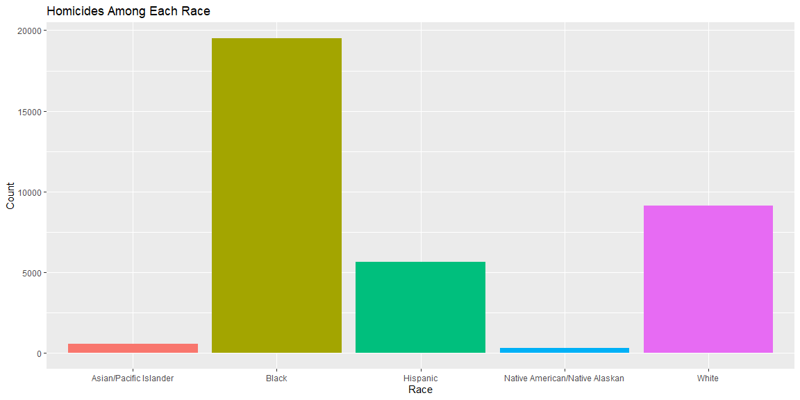
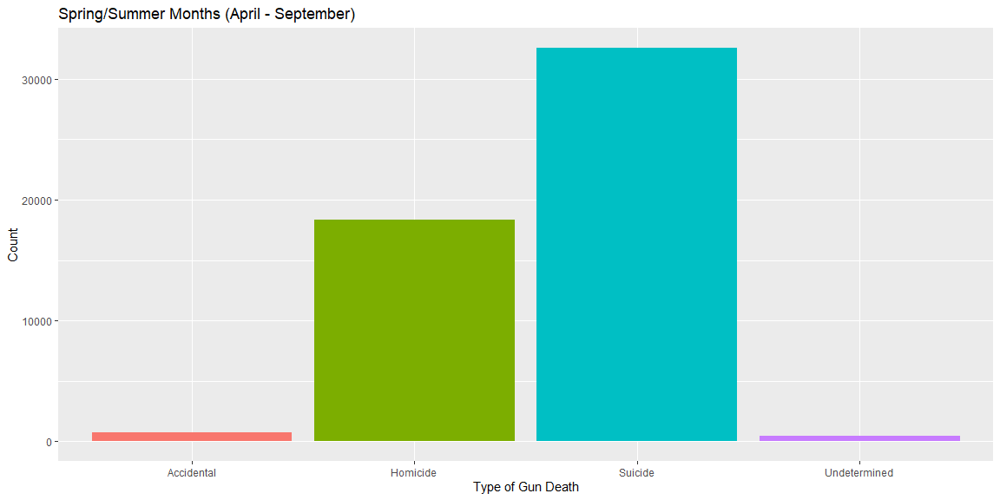
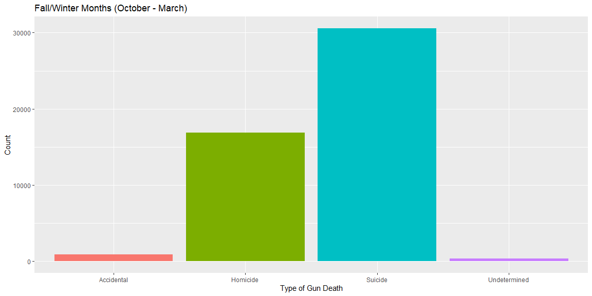

```r
csv_path <- 'https://github.com/fivethirtyeight/guns-data/blob/master/full_data.csv?raw=true'
gun_data <- read_csv(csv_path)
```

## Background

_The world is a dangerous place. During 2015 and 2016 there was a lot of discussion in the news about police shootings (Links to an external site.). FiveThirtyEight (Links to an external site.) reported on gun deaths in 2016 (Links to an external site.). As leaders in data journalism, they have posted a clean version of this data in their GitHub repo called full_data.csv (Links to an external site.) for us to use._

_While their visualizations focused on yearly averages, our client wants to create commercials that help reduce the gun deaths in the US. They would like to target the commercials in different seasons of the year (think month variable) to audiences that could have the most impact in reducing gun deaths. Our challenge is to summarize and visualize seasonal trends across the other variables in these data._

## Data Wrangling


```r
suicide <- gun_data %>% 
  filter(intent == "Suicide")
homicide <- gun_data %>% 
  filter(intent == "Homicide")

winter <- gun_data %>% 
  filter(month %in% c("10", "11", "12", "01", "02", "03")) %>% 
  drop_na(intent, month)

summer <- gun_data %>% 
  filter(month %in% c("04", "05", "06", "07", "08", "09")) %>% 
  drop_na(intent, month)
```

## Data Visualization


```r
ggplot(homicide, aes(x = race, fill = race))+
  geom_histogram(stat = "count")+
  labs(x = "Race",
       y = "Count",
       title = "Homicides Among Each Race")+
  theme(legend.position = "none")
```

<!-- -->


```r
ggplot(summer, aes(x = intent, fill = intent))+
  geom_histogram(stat = "count")+
  labs(x = "Type of Gun Death",
       y = "Count",
       title = "Spring/Summer Months (April - September)")+
  theme(legend.position = "none")
```

<!-- -->

```r
ggplot(winter, aes(x = intent, fill = intent))+
  geom_histogram(stat = "count")+
  labs(x = "Type of Gun Death",
       y = "Count",
       title = "Fall/Winter Months (October - March)")+
  theme(legend.position = "none")
```

<!-- -->


## Conclusions

These last two plots show the differences in the distribution of type of gun death in different seasons of the year. Though no noticeable difference is shown, it is possible that there is a significant difference between groups. A Chi-Squared test of independence could be performed on the data to determine if the observed (slight) difference is of statistical significance. 
