```r
dat <- read_csv("https://byuistats.github.io/M335/data/sales.csv")
```

## Background

_We have transaction data for a few businesses that have been in operation for three months. Each of these companies has come to your investment company for a loan to expand their business. Your boss has asked you to go through the transactions for each business and provide daily, weekly, and monthly gross revenue summaries and comparisons. Your boss would like a short write up with tables and visualizations that help with the decision of which company did the best over the three month period. You will also need to provide a short paragraph with your recommendation after building your analysis._

## Data Wrangling


```r
format_data <-function(data){
hourly_dat <- data %>% 
  mutate(hour = floor_date(Time, unit="hours")) %>% 
  group_by(hour) %>% 
  summarise(tot_amount = sum(Amount)) %>% 
  mutate(just_hour = format(hour, format = "%H")) %>% 
  mutate(day_of_week = weekdays(as.Date(hour))) %>% 
  mutate(pos_neg = case_when(
    tot_amount > 0 ~ 1,
    TRUE ~ 0
  )) %>% 
  mutate(month = format(hour, format = "%m"))

}

total_dat <- format_data(data = dat)
total_dat$day_of_week <- factor(total_dat$day_of_week, levels = c("Monday", "Tuesday", "Wednesday", "Thursday", "Friday", "Saturday", "Sunday"))

## Shortstop data creation
shortstop <- dat %>% 
  filter(Name == "ShortStop")

short_format <- format_data(data = shortstop)
short_format$day_of_week <- factor(short_format$day_of_week, levels = c("Monday", "Tuesday", "Wednesday", "Thursday", "Friday", "Saturday", "Sunday"))
##
hotdiggity <- dat %>% 
  filter(Name == "HotDiggity")
hot_format <- format_data(data = hotdiggity)

hot_format$day_of_week <- factor(hot_format$day_of_week, levels = c("Monday", "Tuesday", "Wednesday", "Thursday", "Friday", "Saturday", "Sunday"))

## SplashandDash data creation
splash <- dat %>% 
  filter(Name == "SplashandDash")
splash_format <- format_data(data = splash)

splash_format$day_of_week <- factor(splash_format$day_of_week, levels = c("Monday", "Tuesday", "Wednesday", "Thursday", "Friday", "Saturday", "Sunday"))

## Tacontento
tacontento <- dat %>% 
  filter(Name == "Tacontento")
taco_format <- format_data(data = tacontento)

taco_format$day_of_week <- factor(taco_format$day_of_week, levels = c("Monday", "Tuesday", "Wednesday", "Thursday", "Friday", "Saturday", "Sunday"))

## LeBelle
labelle <- dat %>% 
  filter(Name == "LeBelle")
lebelle_format <- format_data(data = labelle)
lebelle_format$day_of_week <- factor(lebelle_format$day_of_week, levels = c("Monday", "Tuesday", "Wednesday", "Thursday", "Friday", "Saturday", "Sunday"))

## Frozone
frozone <- dat %>% 
  filter(Name == "Frozone")
frozone_format <- format_data(data = frozone)
frozone_format$day_of_week <- factor(frozone_format$day_of_week, levels = c("Monday", "Tuesday", "Wednesday", "Thursday", "Friday", "Saturday", "Sunday"))
```

## Data Visualizations {.tabset .tabset-fade}

Included are the same two plots for each company, in addition to the same for all of the companies together. The first plot shows How the profits change for hours of the day per month. The second plots shows the same distribution across hours of the day, but is instead faceted on the day of the week.

### All Companies


```r
month_plot <- function(data){
  ggplot(data, aes(x = just_hour, y = tot_amount))+
  geom_col(aes(fill = as.factor(pos_neg)))+
  facet_wrap(vars(month), labeller = label_both) +
  scale_x_discrete(breaks = c("00", "04", "08", "12", "16", "20", "23"))+
    labs(x = "Hour of the Day",
         y = "Profit",
         title = "Profits Throughout the Day Based on the Month")+
    theme(legend.position = "none",
          panel.grid.minor = element_blank(),
          panel.grid.major.x = element_blank())
}
month_plot(data = total_dat)
```

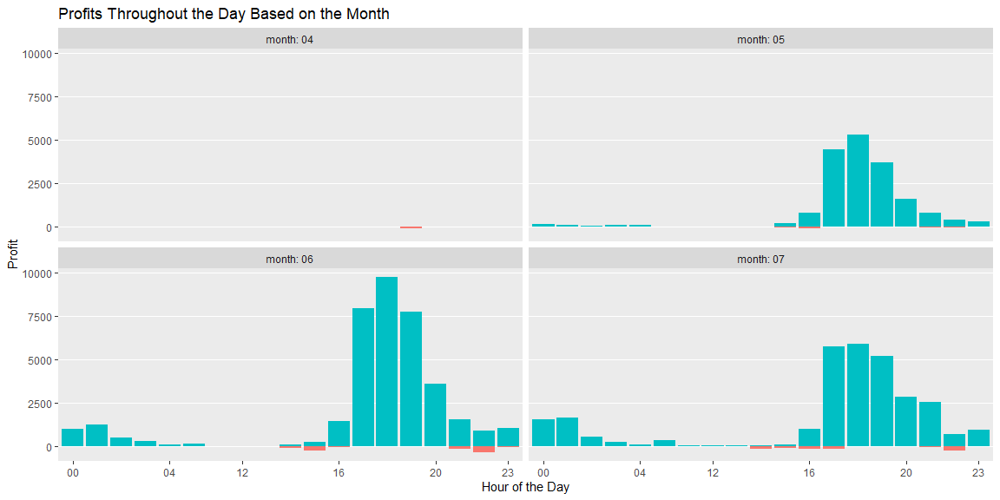<!-- -->

```r
week_plot <- function(data){
ggplot(data, aes(x = just_hour, y = tot_amount)) +
  geom_point(aes(color = as.factor(pos_neg)))+
  facet_wrap(vars(day_of_week))+
  scale_x_discrete(breaks = c("00", "04", "08", "12", "16", "20", "23"))+
    labs(x = "Hour of the Day",
         y = "Profit",
         title = "Profits Throughout the Day Based on Day of the Week")+
    theme(legend.position = "none",
          panel.grid.minor = element_blank(),
          panel.grid.major.x = element_blank())
}


week_plot(data = total_dat)
```

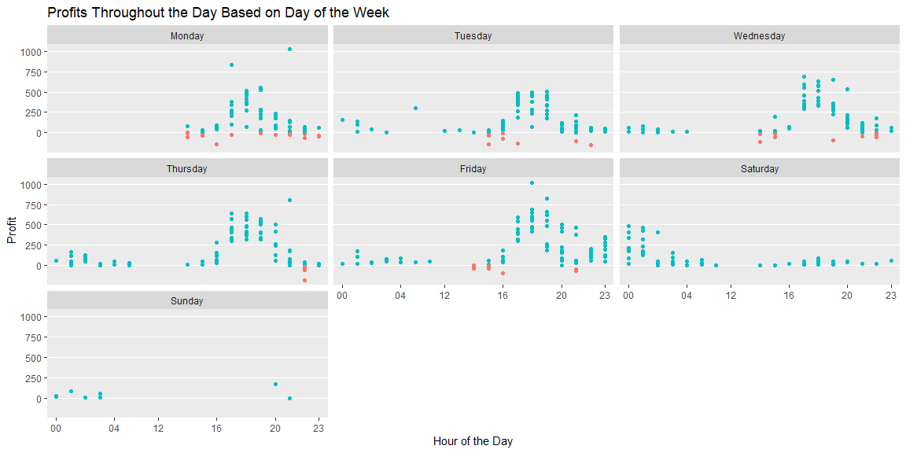<!-- -->


### ShortStop


```r
month_plot(data = short_format)
```

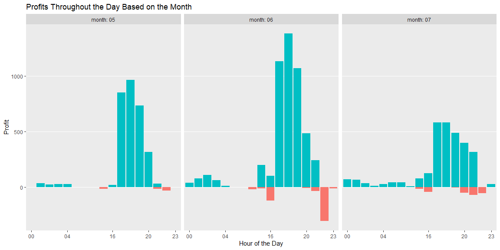<!-- -->

```r
week_plot(data = short_format)
```

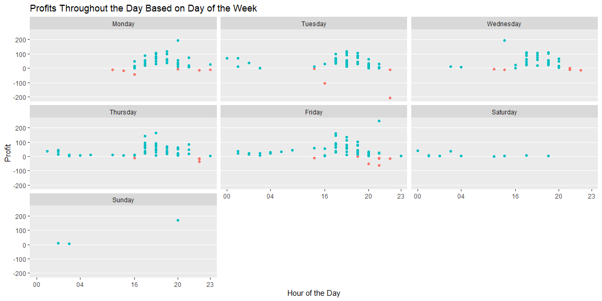<!-- -->

### Hot Diggity


```r
month_plot(data = hot_format)
```

<!-- -->

```r
week_plot(data = hot_format)
```

<!-- -->


### Splash and Dash

```r
month_plot(data = splash_format)
```

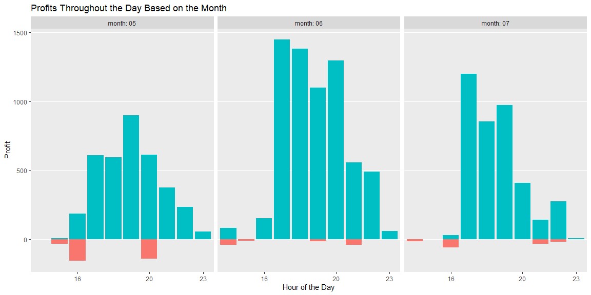<!-- -->

```r
week_plot(data = splash_format)
```

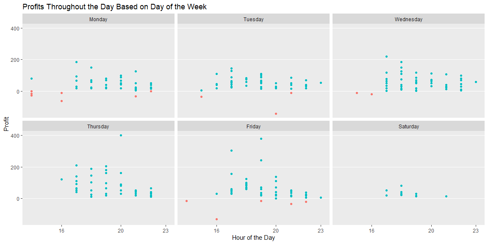<!-- -->

### Tacontento

```r
month_plot(data = taco_format)
```

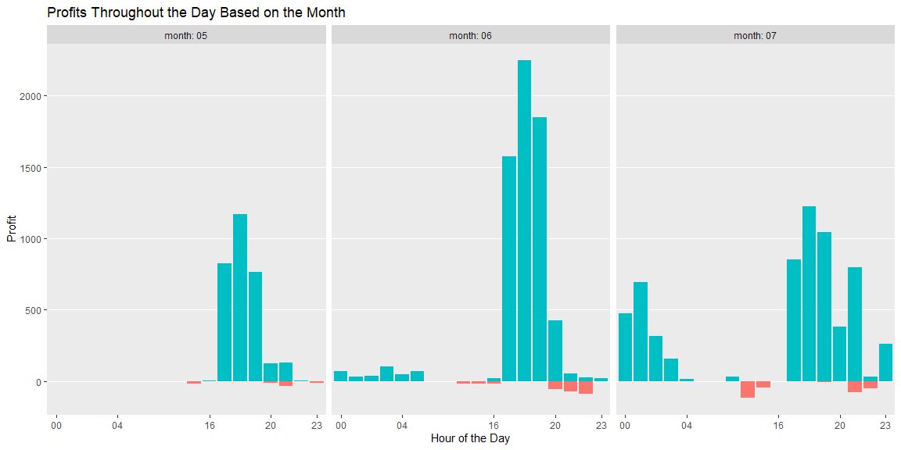<!-- -->

```r
week_plot(data = taco_format)
```

<!-- -->

### LeBelle

```r
month_plot(data = lebelle_format)
```

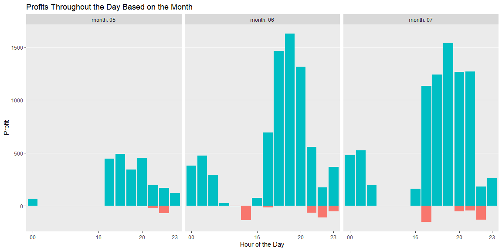<!-- -->

```r
week_plot(data = lebelle_format)
```

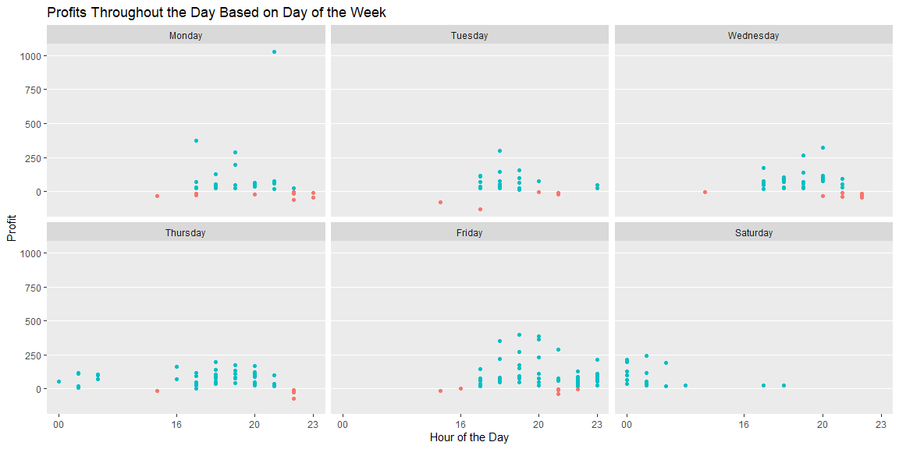<!-- -->

### Frozone


```r
month_plot(data = frozone_format)
```

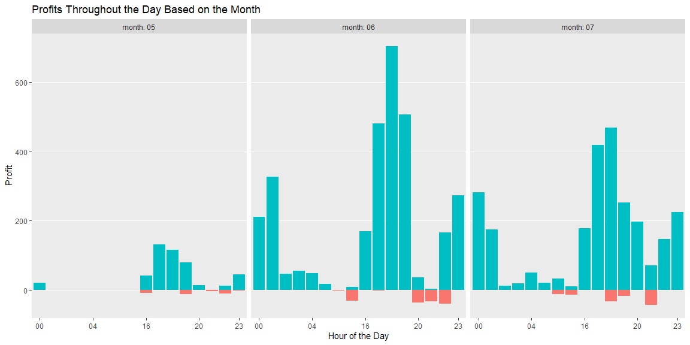<!-- -->

```r
week_plot(data = frozone_format)
```

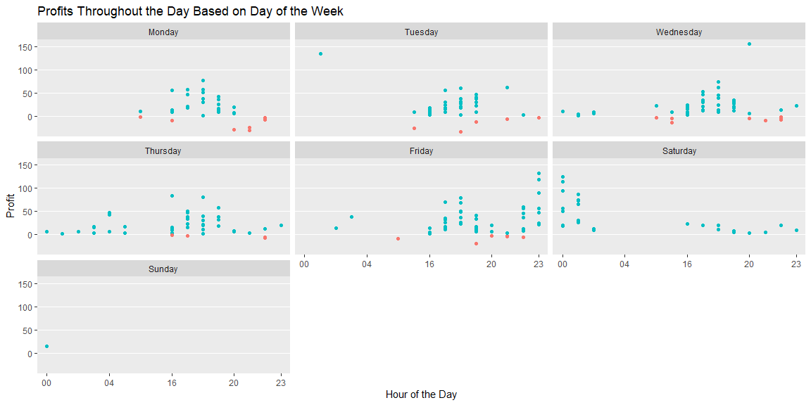<!-- -->

#

## Conclusions

To make a recommendation on what time of the day is best to have a business open, I will examine the plots that compare day-of-the-week profits. I choose this because for the most part, the month-faceted-plots show approximately the same distribution throughout the day.

To be precise, it must be observed that the optimal hours of operation depend on the day of week and the company. Though there is a general spike of increased profits from about 4 p.m. to 9 p.m. on weekdays (Monday-Friday). This trend changes on Saturday, however, where the spike is from about midnight to 3 a.m. approximately. 

Based off of these visualizations, a recommendation could initially be made to invest in "Hot Diggity" due to it having clearly the least amount of red (meaning the least amount of losses). When the scale on the y-axis is considered however, it is understood that they also have the smallest amount of profit, so it may not be the _best_ investment, though it is probably the _safest_ investment. With all factors considered, I recommend investing in either *Splash and Dash* or *LeBelle*. These two companies both have very high profits throughout each month.
