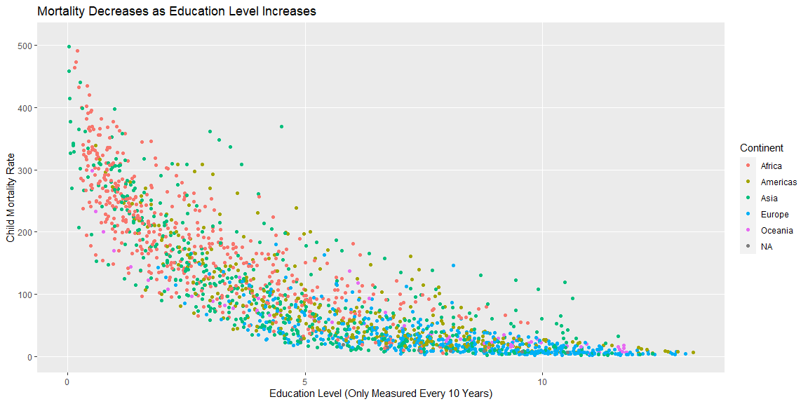
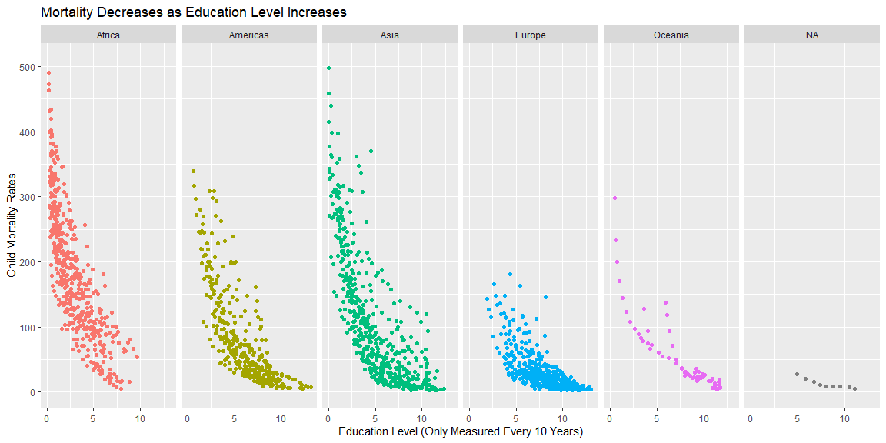
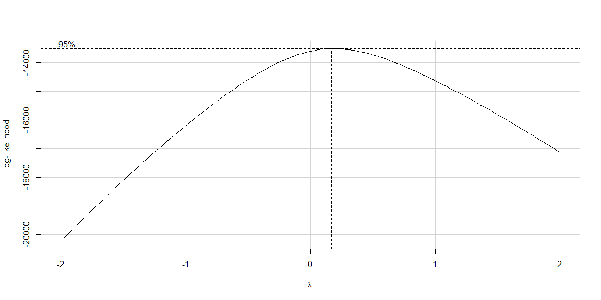
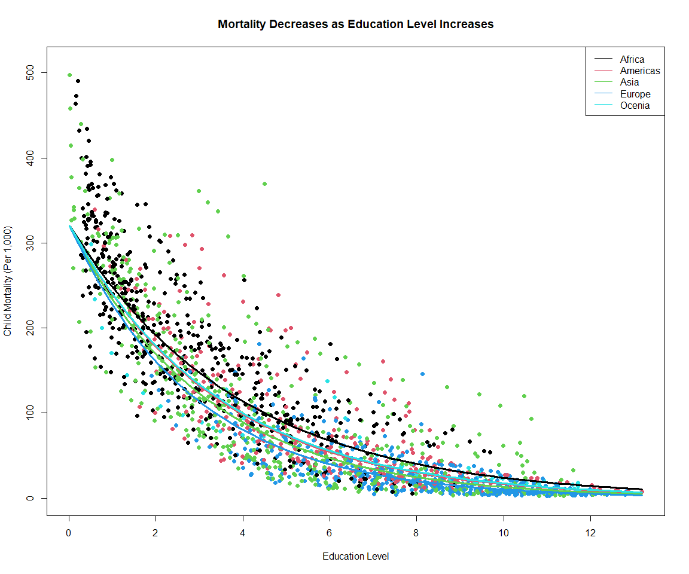
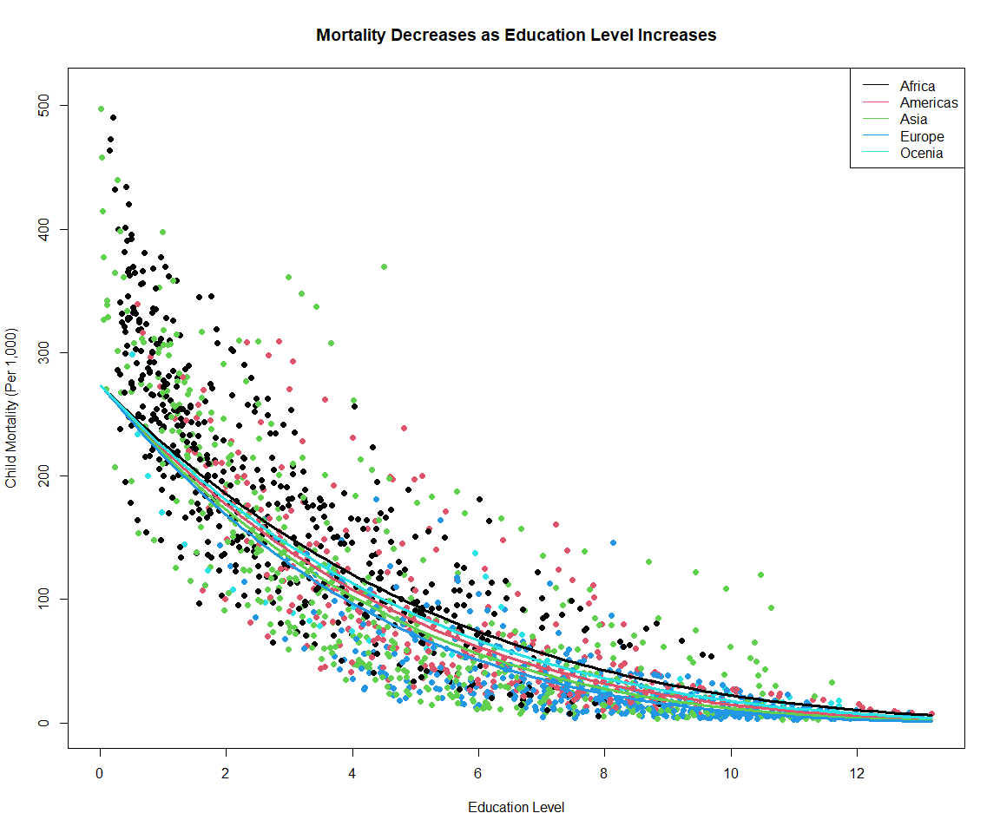

```r
devtools::install_github("drsimonj/ourworldindata")

library(ourworldindata)
library(MASS)
library(car)
library(pander)
```

## Background

_The Our World in Data (Links to an external site.) website has world data. It is nice that they have provided graphics and then the data that they used to generate the graphics. We are going to recreate some of their visualizations in R and then make them better._

## Data Wrangling


## Data Visualization


```r
ggplot(child_mortality, aes(x = education, y = child_mort))+
  geom_point(aes(color = as.factor(child_mortality$continent)))+
  labs(x = "Education Level (Only Measured Every 10 Years)",
       color = "Continent",
       y = "Child Mortality Rate",
       title = "Mortality Decreases as Education Level Increases")+
  ylim(0,510)+
  theme(panel.grid.minor.x = element_blank(),
        panel.grid.minor.y = element_blank())
```

<!-- -->

```r
ggplot(child_mortality, aes(x = education, y = child_mort))+
  geom_point(aes(color = as.factor(child_mortality$continent)))+
  facet_wrap(~continent, ncol = 6)+
  labs(x = "Education Level (Only Measured Every 10 Years)",
       y = "Child Mortality Rates",
       title = "Mortality Decreases as Education Level Increases")+
  ylim(0,510)+
  theme(legend.position = "none")
```

<!-- -->

## Conclusions

The above plots show the same thing, just in slightly different formats. The first was included to show the overall trend in child mortality rates as education level increases, and the second was the show how each continent differs. Education level is defined as the average years of schooling of the population aged 15 and over. Child Mortality is defined as the probability of a child out of 1,000 born in a specific year dying before reaching the age of 5 if subject to current age-specific mortality rates. It is important to notice that the education level was only measured every 10 years, thus much of the data regarding child mortality was removed. 

For those interested, a linear model was fit to these data in the following process:

## Extra Linear Models


```r
mylm <- lm(child_mort ~ education, data = child_mortality)
summary(mylm) %>% pander(caption = "First lm output")
```


--------------------------------------------------------------
     &nbsp;        Estimate   Std. Error   t value   Pr(>|t|) 
----------------- ---------- ------------ --------- ----------
 **(Intercept)**     240        2.574       93.24       0     

  **education**     -25.16      0.4064     -61.92       0     
--------------------------------------------------------------


--------------------------------------------------------------
 Observations   Residual Std. Error   $R^2$    Adjusted $R^2$ 
-------------- --------------------- -------- ----------------
     1876              56.2           0.6717       0.6715     
--------------------------------------------------------------

Table: First lm output

Above is the output of my initial regression model. Unsatisfied with the adjusted R^2 value of $R^2 = 0.6715$, I decided to use a boxcox plot to determine if a transformation should be used.


```r
boxCox(mylm)
```

<!-- -->

It was here determined to use both a log transformation and a 1/4 power transformation to better fit the data. These models are both included below. It was also determined to add the interaction of the education with continent. Continent with no interaction was also added, but removed after not showing significant p-values. Plots have been included for each of the fitted models. Notice the significant p-values for each of the parameter estimators (assuming $\alpha = 0.10$), and the difference in adjusted R-squared value. Further interpretation / diagnosis of these models has not been included due to the purpose of this assignment being accomplished above.


```r
mylm2 <- lm(log(child_mort) ~ education + education:continent, data = child_mortality)
pander(summary(mylm2))
```


--------------------------------------------------------------------------------
             &nbsp;                Estimate   Std. Error   t value    Pr(>|t|)  
--------------------------------- ---------- ------------ --------- ------------
         **(Intercept)**            5.775      0.02681      215.4        0      

          **education**            -0.2602     0.008955    -29.06    2.074e-153 

 **education:continentAmericas**   -0.03647    0.00833     -4.378    1.264e-05  

   **education:continentAsia**     -0.06092    0.008125    -7.498    9.971e-14  

  **education:continentEurope**    -0.08752    0.007895    -11.09    1.068e-27  

 **education:continentOceania**    -0.03261    0.01086     -3.002     0.002718  
--------------------------------------------------------------------------------


--------------------------------------------------------------
 Observations   Residual Std. Error   $R^2$    Adjusted $R^2$ 
-------------- --------------------- -------- ----------------
     1867             0.5422          0.7995       0.799      
--------------------------------------------------------------

Table: Fitting linear model: log(child_mort) ~ education + education:continent

```r
b <- coef(mylm2)
par(mfrow=c(1,1))
plot(child_mort ~ education, col = as.factor(continent), data = child_mortality, pch = 19, xlab = "Education Level",
     ylab = "Child Mortality (Per 1,000)", main = "Mortality Decreases as Education Level Increases", ylim = range(0:510))

legend("topright", legend = c("Africa", "Americas", "Asia", "Europe", "Ocenia"),col = c(palette()[1], palette()[2], palette()[3], palette()[4], palette()[5]), lty = 1)

curve(exp(b[1] + b[2]*x), add = TRUE, col = palette()[1], lwd = 3)
curve(exp(b[1] + b[2]*x + b[3]*x), add = TRUE, col = palette()[2], lwd = 3)
curve(exp(b[1] + b[2]*x + b[4]*x), add = TRUE, col = palette()[3], lwd = 3)
curve(exp(b[1] + b[2]*x + b[5]*x), add = TRUE, col = palette()[4], lwd = 3)
curve(exp(b[1] + b[2]*x + b[6]*x), add = TRUE, col = palette()[5], lwd = 3)
```

<!-- -->

```r
# 1/4 power transformation

mylm3 <- lm(sqrt(sqrt(child_mort)) ~ education + education:continent, data = child_mortality)
pander(summary(mylm3))
```


--------------------------------------------------------------------------------
             &nbsp;                Estimate   Std. Error   t value    Pr(>|t|)  
--------------------------------- ---------- ------------ --------- ------------
         **(Intercept)**            4.069      0.01805      225.4        0      

          **education**            -0.1896     0.00603     -31.45    1.763e-174 

 **education:continentAmericas**   -0.02181    0.005609    -3.889    0.0001042  

   **education:continentAsia**     -0.03285    0.005471    -6.004    2.313e-09  

  **education:continentEurope**    -0.04382    0.005316    -8.242    3.165e-16  

 **education:continentOceania**    -0.01246    0.007314    -1.703     0.08866   
--------------------------------------------------------------------------------


--------------------------------------------------------------
 Observations   Residual Std. Error   $R^2$    Adjusted $R^2$ 
-------------- --------------------- -------- ----------------
     1867             0.3651          0.8009       0.8003     
--------------------------------------------------------------

Table: Fitting linear model: sqrt(sqrt(child_mort)) ~ education + education:continent

```r
b <- coef(mylm3)
par(mfrow=c(1,1))
plot(child_mort ~ education, col = as.factor(continent), data = child_mortality, pch = 19, xlab = "Education Level",
     ylab = "Child Mortality (Per 1,000)", main = "Mortality Decreases as Education Level Increases", ylim = range(0:510))

legend("topright", legend = c("Africa", "Americas", "Asia", "Europe", "Ocenia"),col = c(palette()[1], palette()[2], palette()[3], palette()[4], palette()[5]), lty = 1)

curve((b[1] + b[2]*x)^4, add = TRUE, col = palette()[1], lwd = 3)
curve((b[1] + b[2]*x + b[3]*x)^4, add = TRUE, col = palette()[2], lwd = 3)
curve((b[1] + b[2]*x + b[4]*x)^4, add = TRUE, col = palette()[3], lwd = 3)
curve((b[1] + b[2]*x + b[5]*x)^4, add = TRUE, col = palette()[4], lwd = 3)
curve((b[1] + b[2]*x + b[6]*x)^4, add = TRUE, col = palette()[5], lwd = 3)
```

<!-- -->

