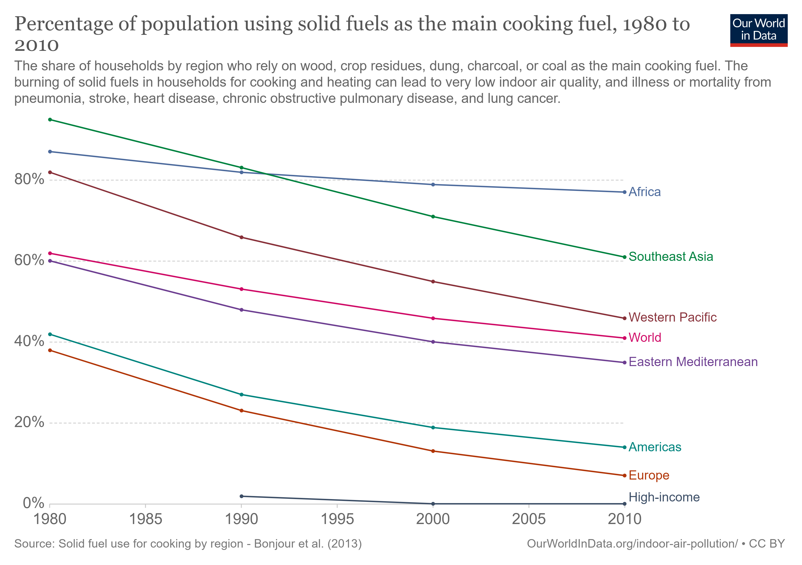
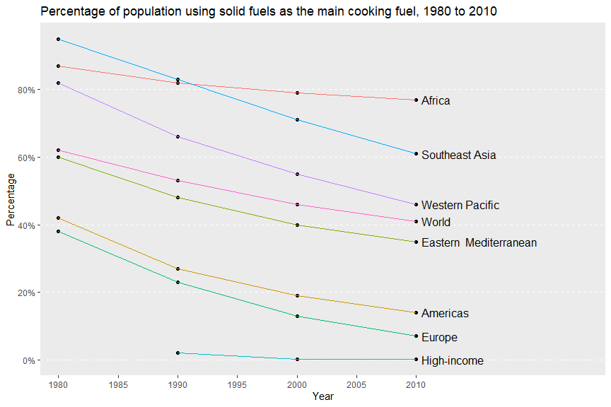
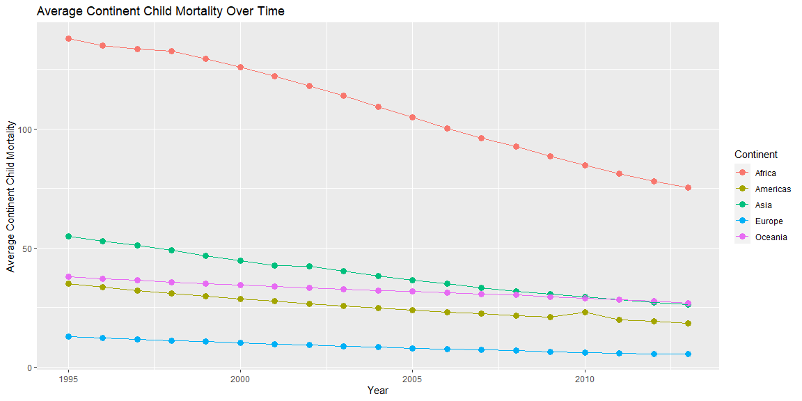

```r
dat <- read.csv("population-using-solid-fuels-for-cooking.csv")
dat2010 <- dat %>%
  filter(Year == 2010)
devtools::install_github("drsimonj/ourworldindata")
library(ourworldindata)
mort2 <- financing_healthcare %>% 
  drop_na(continent, health_exp_public_percent, child_mort)
```

## Background

_Place Task Background Here_

## Data Wrangling


```r
means <- mort2 %>% 
  group_by(continent, year) %>% 
  summarise(avg_mort = mean(child_mort))

means
```

```
## # A tibble: 95 x 3
## # Groups:   continent [5]
##    continent  year avg_mort
##    <chr>     <int>    <dbl>
##  1 Africa     1995     138.
##  2 Africa     1996     135.
##  3 Africa     1997     133.
##  4 Africa     1998     133.
##  5 Africa     1999     129.
##  6 Africa     2000     126.
##  7 Africa     2001     122.
##  8 Africa     2002     118.
##  9 Africa     2003     114.
## 10 Africa     2004     109.
## # ... with 85 more rows
```

## Data Visualization

Below is the plot that I chose to model:



And my replica:


```r
ggplot(dat, aes(x = Year, y = Households.using.solid.fuels.as.the.main.cooking.fuel))+
  geom_point()+
  geom_line(aes(color = Entity))+
  theme(legend.position = "none",
        panel.grid.minor.y = element_blank(),
        panel.grid.minor.x = element_blank(),
        panel.grid.major.x = element_blank(),
        panel.grid.major.y = element_line(linetype = 2))+
  geom_dl(aes(label = Entity), method = list(dl.trans(x = x+.2),"last.points"))+
  scale_x_continuous(breaks = c(1980, 1985, 1990, 1995, 2000, 2005, 2010),
        labels = c("1980","1985", "1990", "1995", "2000", "2005", "2010" ),
        expand = expansion(mult = c(.05,.53)))+
  scale_y_continuous(breaks = c(0, 20, 40, 60, 80),
                     labels = paste(seq(0,80, by = 20), "%", sep = "")) +
  labs(title = "Percentage of population using solid fuels as the main cooking fuel, 1980 to 2010", 
       x = "Year",
       y = "Percentage")
```

<!-- -->

Using the ___ dataset, here is a plot describing child mortality:


```r
ggplot(means, aes(x = year, y = avg_mort))+
  geom_point(aes(color = continent), size = 3)+
  geom_line(aes(color = continent))+
  labs(x = "Year",
       y = "Average Continent Child Mortality",
       title = "Average Continent Child Mortality Over Time",
       color = "Continent")
```

<!-- -->

