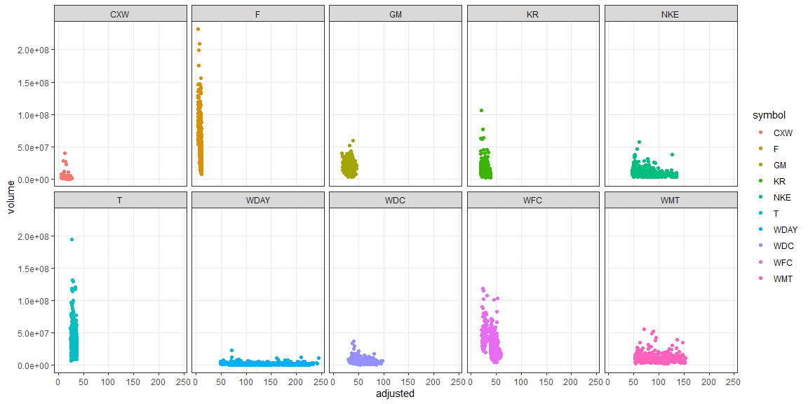

```r
# Use this R-Chunk to import all your datasets!
```

## Background

_Your data science income has ballooned, and you need to find somewhere to invest $25,000 that you have saved over the last year. You have a savvy investment friend that is kind enough to tell you ten stocks he has been watching during the last year. You will need to visualize the last five years performance to help in the conversation with your friend._

_Your friend is going to give you his tickers at the beginning of your half-hour meeting with him (he is a busy friend). You will need to build an .Rmd file that will build a suite of visualizations rapidly for your conversation. You will need a series of stock performance graphics using library(dygraphs) and library(ggplot2). In real life, you might use one or the other, but this task is built to help you move from ts and xts to tidy objects for visualization._

_Specifically, in class the Tuesday following this case study you will get 5 - 10 ticker symbols and will need to build visualizations quickly that allows you to answer questions about the stocks in a few seconds._

## Data Wrangling


```r
tickers_today <- c("CXW", "F", "GM", "JCP", "KR", "WDC", "NKE","T", "WDAY", "WFC", "WMT")

prices <- tq_get(tickers_today,
                 get = "stock.prices",
                 from = "2015-11-21")

prices2 <- prices %>% 
  pivot_wider(
    names_from = symbol,
    values_from = open,
    id_cols = date
  )

prices2_xts <- prices2 %>% timetk::tk_xts(date = date)
```

## Data Visualization


```r
dygraph(data = prices2_xts, main = "10 Recommended Stocks (JCP not included)") %>% 
  dyHighlight(highlightCircleSize = 5,
              highlightSeriesBackgroundAlpha = .2,
              hideOnMouseOut = FALSE)
```

<!--html_preserve--><div id="htmlwidget-ea63f01de484979041ee" style="width:1152px;height:576px;" class="dygraphs html-widget"></div>
<script type="application/json" data-for="htmlwidget-ea63f01de484979041ee">{"x":{"attrs":{"title":"10 Recommended Stocks (JCP not included)","labels":["day","CXW","F","GM","KR","WDC","NKE","T","WDAY","WFC","WMT"],"legend":"auto","retainDateWindow":false,"axes":{"x":{"pixelsPerLabel":60}},"highlightCircleSize":5,"highlightSeriesBackgroundAlpha":0.2,"highlightSeriesOpts":[],"hideOverlayOnMouseOut":false},"scale":"daily","annotations":[],"shadings":[],"events":[],"format":"date","data":[["2015-11-23T00:00:00.000Z","2015-11-24T00:00:00.000Z","2015-11-25T00:00:00.000Z","2015-11-27T00:00:00.000Z","2015-11-30T00:00:00.000Z","2015-12-01T00:00:00.000Z","2015-12-02T00:00:00.000Z","2015-12-03T00:00:00.000Z","2015-12-04T00:00:00.000Z","2015-12-07T00:00:00.000Z","2015-12-08T00:00:00.000Z","2015-12-09T00:00:00.000Z","2015-12-10T00:00:00.000Z","2015-12-11T00:00:00.000Z","2015-12-14T00:00:00.000Z","2015-12-15T00:00:00.000Z","2015-12-16T00:00:00.000Z","2015-12-17T00:00:00.000Z","2015-12-18T00:00:00.000Z","2015-12-21T00:00:00.000Z","2015-12-22T00:00:00.000Z","2015-12-23T00:00:00.000Z","2015-12-24T00:00:00.000Z","2015-12-28T00:00:00.000Z","2015-12-29T00:00:00.000Z","2015-12-30T00:00:00.000Z","2015-12-31T00:00:00.000Z","2016-01-04T00:00:00.000Z","2016-01-05T00:00:00.000Z","2016-01-06T00:00:00.000Z","2016-01-07T00:00:00.000Z","2016-01-08T00:00:00.000Z","2016-01-11T00:00:00.000Z","2016-01-12T00:00:00.000Z","2016-01-13T00:00:00.000Z","2016-01-14T00:00:00.000Z","2016-01-15T00:00:00.000Z","2016-01-19T00:00:00.000Z","2016-01-20T00:00:00.000Z","2016-01-21T00:00:00.000Z","2016-01-22T00:00:00.000Z","2016-01-25T00:00:00.000Z","2016-01-26T00:00:00.000Z","2016-01-27T00:00:00.000Z","2016-01-28T00:00:00.000Z","2016-01-29T00:00:00.000Z","2016-02-01T00:00:00.000Z","2016-02-02T00:00:00.000Z","2016-02-03T00:00:00.000Z","2016-02-04T00:00:00.000Z","2016-02-05T00:00:00.000Z","2016-02-08T00:00:00.000Z","2016-02-09T00:00:00.000Z","2016-02-10T00:00:00.000Z","2016-02-11T00:00:00.000Z","2016-02-12T00:00:00.000Z","2016-02-16T00:00:00.000Z","2016-02-17T00:00:00.000Z","2016-02-18T00:00:00.000Z","2016-02-19T00:00:00.000Z","2016-02-22T00:00:00.000Z","2016-02-23T00:00:00.000Z","2016-02-24T00:00:00.000Z","2016-02-25T00:00:00.000Z","2016-02-26T00:00:00.000Z","2016-02-29T00:00:00.000Z","2016-03-01T00:00:00.000Z","2016-03-02T00:00:00.000Z","2016-03-03T00:00:00.000Z","2016-03-04T00:00:00.000Z","2016-03-07T00:00:00.000Z","2016-03-08T00:00:00.000Z","2016-03-09T00:00:00.000Z","2016-03-10T00:00:00.000Z","2016-03-11T00:00:00.000Z","2016-03-14T00:00:00.000Z","2016-03-15T00:00:00.000Z","2016-03-16T00:00:00.000Z","2016-03-17T00:00:00.000Z","2016-03-18T00:00:00.000Z","2016-03-21T00:00:00.000Z","2016-03-22T00:00:00.000Z","2016-03-23T00:00:00.000Z","2016-03-24T00:00:00.000Z","2016-03-28T00:00:00.000Z","2016-03-29T00:00:00.000Z","2016-03-30T00:00:00.000Z","2016-03-31T00:00:00.000Z","2016-04-01T00:00:00.000Z","2016-04-04T00:00:00.000Z","2016-04-05T00:00:00.000Z","2016-04-06T00:00:00.000Z","2016-04-07T00:00:00.000Z","2016-04-08T00:00:00.000Z","2016-04-11T00:00:00.000Z","2016-04-12T00:00:00.000Z","2016-04-13T00:00:00.000Z","2016-04-14T00:00:00.000Z","2016-04-15T00:00:00.000Z","2016-04-18T00:00:00.000Z","2016-04-19T00:00:00.000Z","2016-04-20T00:00:00.000Z","2016-04-21T00:00:00.000Z","2016-04-22T00:00:00.000Z","2016-04-25T00:00:00.000Z","2016-04-26T00:00:00.000Z","2016-04-27T00:00:00.000Z","2016-04-28T00:00:00.000Z","2016-04-29T00:00:00.000Z","2016-05-02T00:00:00.000Z","2016-05-03T00:00:00.000Z","2016-05-04T00:00:00.000Z","2016-05-05T00:00:00.000Z","2016-05-06T00:00:00.000Z","2016-05-09T00:00:00.000Z","2016-05-10T00:00:00.000Z","2016-05-11T00:00:00.000Z","2016-05-12T00:00:00.000Z","2016-05-13T00:00:00.000Z","2016-05-16T00:00:00.000Z","2016-05-17T00:00:00.000Z","2016-05-18T00:00:00.000Z","2016-05-19T00:00:00.000Z","2016-05-20T00:00:00.000Z","2016-05-23T00:00:00.000Z","2016-05-24T00:00:00.000Z","2016-05-25T00:00:00.000Z","2016-05-26T00:00:00.000Z","2016-05-27T00:00:00.000Z","2016-05-31T00:00:00.000Z","2016-06-01T00:00:00.000Z","2016-06-02T00:00:00.000Z","2016-06-03T00:00:00.000Z","2016-06-06T00:00:00.000Z","2016-06-07T00:00:00.000Z","2016-06-08T00:00:00.000Z","2016-06-09T00:00:00.000Z","2016-06-10T00:00:00.000Z","2016-06-13T00:00:00.000Z","2016-06-14T00:00:00.000Z","2016-06-15T00:00:00.000Z","2016-06-16T00:00:00.000Z","2016-06-17T00:00:00.000Z","2016-06-20T00:00:00.000Z","2016-06-21T00:00:00.000Z","2016-06-22T00:00:00.000Z","2016-06-23T00:00:00.000Z","2016-06-24T00:00:00.000Z","2016-06-27T00:00:00.000Z","2016-06-28T00:00:00.000Z","2016-06-29T00:00:00.000Z","2016-06-30T00:00:00.000Z","2016-07-01T00:00:00.000Z","2016-07-05T00:00:00.000Z","2016-07-06T00:00:00.000Z","2016-07-07T00:00:00.000Z","2016-07-08T00:00:00.000Z","2016-07-11T00:00:00.000Z","2016-07-12T00:00:00.000Z","2016-07-13T00:00:00.000Z","2016-07-14T00:00:00.000Z","2016-07-15T00:00:00.000Z","2016-07-18T00:00:00.000Z","2016-07-19T00:00:00.000Z","2016-07-20T00:00:00.000Z","2016-07-21T00:00:00.000Z","2016-07-22T00:00:00.000Z","2016-07-25T00:00:00.000Z","2016-07-26T00:00:00.000Z","2016-07-27T00:00:00.000Z","2016-07-28T00:00:00.000Z","2016-07-29T00:00:00.000Z","2016-08-01T00:00:00.000Z","2016-08-02T00:00:00.000Z","2016-08-03T00:00:00.000Z","2016-08-04T00:00:00.000Z","2016-08-05T00:00:00.000Z","2016-08-08T00:00:00.000Z","2016-08-09T00:00:00.000Z","2016-08-10T00:00:00.000Z","2016-08-11T00:00:00.000Z","2016-08-12T00:00:00.000Z","2016-08-15T00:00:00.000Z","2016-08-16T00:00:00.000Z","2016-08-17T00:00:00.000Z","2016-08-18T00:00:00.000Z","2016-08-19T00:00:00.000Z","2016-08-22T00:00:00.000Z","2016-08-23T00:00:00.000Z","2016-08-24T00:00:00.000Z","2016-08-25T00:00:00.000Z","2016-08-26T00:00:00.000Z","2016-08-29T00:00:00.000Z","2016-08-30T00:00:00.000Z","2016-08-31T00:00:00.000Z","2016-09-01T00:00:00.000Z","2016-09-02T00:00:00.000Z","2016-09-06T00:00:00.000Z","2016-09-07T00:00:00.000Z","2016-09-08T00:00:00.000Z","2016-09-09T00:00:00.000Z","2016-09-12T00:00:00.000Z","2016-09-13T00:00:00.000Z","2016-09-14T00:00:00.000Z","2016-09-15T00:00:00.000Z","2016-09-16T00:00:00.000Z","2016-09-19T00:00:00.000Z","2016-09-20T00:00:00.000Z","2016-09-21T00:00:00.000Z","2016-09-22T00:00:00.000Z","2016-09-23T00:00:00.000Z","2016-09-26T00:00:00.000Z","2016-09-27T00:00:00.000Z","2016-09-28T00:00:00.000Z","2016-09-29T00:00:00.000Z","2016-09-30T00:00:00.000Z","2016-10-03T00:00:00.000Z","2016-10-04T00:00:00.000Z","2016-10-05T00:00:00.000Z","2016-10-06T00:00:00.000Z","2016-10-07T00:00:00.000Z","2016-10-10T00:00:00.000Z","2016-10-11T00:00:00.000Z","2016-10-12T00:00:00.000Z","2016-10-13T00:00:00.000Z","2016-10-14T00:00:00.000Z","2016-10-17T00:00:00.000Z","2016-10-18T00:00:00.000Z","2016-10-19T00:00:00.000Z","2016-10-20T00:00:00.000Z","2016-10-21T00:00:00.000Z","2016-10-24T00:00:00.000Z","2016-10-25T00:00:00.000Z","2016-10-26T00:00:00.000Z","2016-10-27T00:00:00.000Z","2016-10-28T00:00:00.000Z","2016-10-31T00:00:00.000Z","2016-11-01T00:00:00.000Z","2016-11-02T00:00:00.000Z","2016-11-03T00:00:00.000Z","2016-11-04T00:00:00.000Z","2016-11-07T00:00:00.000Z","2016-11-08T00:00:00.000Z","2016-11-09T00:00:00.000Z","2016-11-10T00:00:00.000Z","2016-11-11T00:00:00.000Z","2016-11-14T00:00:00.000Z","2016-11-15T00:00:00.000Z","2016-11-16T00:00:00.000Z","2016-11-17T00:00:00.000Z","2016-11-18T00:00:00.000Z","2016-11-21T00:00:00.000Z","2016-11-22T00:00:00.000Z","2016-11-23T00:00:00.000Z","2016-11-25T00:00:00.000Z","2016-11-28T00:00:00.000Z","2016-11-29T00:00:00.000Z","2016-11-30T00:00:00.000Z","2016-12-01T00:00:00.000Z","2016-12-02T00:00:00.000Z","2016-12-05T00:00:00.000Z","2016-12-06T00:00:00.000Z","2016-12-07T00:00:00.000Z","2016-12-08T00:00:00.000Z","2016-12-09T00:00:00.000Z","2016-12-12T00:00:00.000Z","2016-12-13T00:00:00.000Z","2016-12-14T00:00:00.000Z","2016-12-15T00:00:00.000Z","2016-12-16T00:00:00.000Z","2016-12-19T00:00:00.000Z","2016-12-20T00:00:00.000Z","2016-12-21T00:00:00.000Z","2016-12-22T00:00:00.000Z","2016-12-23T00:00:00.000Z","2016-12-27T00:00:00.000Z","2016-12-28T00:00:00.000Z","2016-12-29T00:00:00.000Z","2016-12-30T00:00:00.000Z","2017-01-03T00:00:00.000Z","2017-01-04T00:00:00.000Z","2017-01-05T00:00:00.000Z","2017-01-06T00:00:00.000Z","2017-01-09T00:00:00.000Z","2017-01-10T00:00:00.000Z","2017-01-11T00:00:00.000Z","2017-01-12T00:00:00.000Z","2017-01-13T00:00:00.000Z","2017-01-17T00:00:00.000Z","2017-01-18T00:00:00.000Z","2017-01-19T00:00:00.000Z","2017-01-20T00:00:00.000Z","2017-01-23T00:00:00.000Z","2017-01-24T00:00:00.000Z","2017-01-25T00:00:00.000Z","2017-01-26T00:00:00.000Z","2017-01-27T00:00:00.000Z","2017-01-30T00:00:00.000Z","2017-01-31T00:00:00.000Z","2017-02-01T00:00:00.000Z","2017-02-02T00:00:00.000Z","2017-02-03T00:00:00.000Z","2017-02-06T00:00:00.000Z","2017-02-07T00:00:00.000Z","2017-02-08T00:00:00.000Z","2017-02-09T00:00:00.000Z","2017-02-10T00:00:00.000Z","2017-02-13T00:00:00.000Z","2017-02-14T00:00:00.000Z","2017-02-15T00:00:00.000Z","2017-02-16T00:00:00.000Z","2017-02-17T00:00:00.000Z","2017-02-21T00:00:00.000Z","2017-02-22T00:00:00.000Z","2017-02-23T00:00:00.000Z","2017-02-24T00:00:00.000Z","2017-02-27T00:00:00.000Z","2017-02-28T00:00:00.000Z","2017-03-01T00:00:00.000Z","2017-03-02T00:00:00.000Z","2017-03-03T00:00:00.000Z","2017-03-06T00:00:00.000Z","2017-03-07T00:00:00.000Z","2017-03-08T00:00:00.000Z","2017-03-09T00:00:00.000Z","2017-03-10T00:00:00.000Z","2017-03-13T00:00:00.000Z","2017-03-14T00:00:00.000Z","2017-03-15T00:00:00.000Z","2017-03-16T00:00:00.000Z","2017-03-17T00:00:00.000Z","2017-03-20T00:00:00.000Z","2017-03-21T00:00:00.000Z","2017-03-22T00:00:00.000Z","2017-03-23T00:00:00.000Z","2017-03-24T00:00:00.000Z","2017-03-27T00:00:00.000Z","2017-03-28T00:00:00.000Z","2017-03-29T00:00:00.000Z","2017-03-30T00:00:00.000Z","2017-03-31T00:00:00.000Z","2017-04-03T00:00:00.000Z","2017-04-04T00:00:00.000Z","2017-04-05T00:00:00.000Z","2017-04-06T00:00:00.000Z","2017-04-07T00:00:00.000Z","2017-04-10T00:00:00.000Z","2017-04-11T00:00:00.000Z","2017-04-12T00:00:00.000Z","2017-04-13T00:00:00.000Z","2017-04-17T00:00:00.000Z","2017-04-18T00:00:00.000Z","2017-04-19T00:00:00.000Z","2017-04-20T00:00:00.000Z","2017-04-21T00:00:00.000Z","2017-04-24T00:00:00.000Z","2017-04-25T00:00:00.000Z","2017-04-26T00:00:00.000Z","2017-04-27T00:00:00.000Z","2017-04-28T00:00:00.000Z","2017-05-01T00:00:00.000Z","2017-05-02T00:00:00.000Z","2017-05-03T00:00:00.000Z","2017-05-04T00:00:00.000Z","2017-05-05T00:00:00.000Z","2017-05-08T00:00:00.000Z","2017-05-09T00:00:00.000Z","2017-05-10T00:00:00.000Z","2017-05-11T00:00:00.000Z","2017-05-12T00:00:00.000Z","2017-05-15T00:00:00.000Z","2017-05-16T00:00:00.000Z","2017-05-17T00:00:00.000Z","2017-05-18T00:00:00.000Z","2017-05-19T00:00:00.000Z","2017-05-22T00:00:00.000Z","2017-05-23T00:00:00.000Z","2017-05-24T00:00:00.000Z","2017-05-25T00:00:00.000Z","2017-05-26T00:00:00.000Z","2017-05-30T00:00:00.000Z","2017-05-31T00:00:00.000Z","2017-06-01T00:00:00.000Z","2017-06-02T00:00:00.000Z","2017-06-05T00:00:00.000Z","2017-06-06T00:00:00.000Z","2017-06-07T00:00:00.000Z","2017-06-08T00:00:00.000Z","2017-06-09T00:00:00.000Z","2017-06-12T00:00:00.000Z","2017-06-13T00:00:00.000Z","2017-06-14T00:00:00.000Z","2017-06-15T00:00:00.000Z","2017-06-16T00:00:00.000Z","2017-06-19T00:00:00.000Z","2017-06-20T00:00:00.000Z","2017-06-21T00:00:00.000Z","2017-06-22T00:00:00.000Z","2017-06-23T00:00:00.000Z","2017-06-26T00:00:00.000Z","2017-06-27T00:00:00.000Z","2017-06-28T00:00:00.000Z","2017-06-29T00:00:00.000Z","2017-06-30T00:00:00.000Z","2017-07-03T00:00:00.000Z","2017-07-05T00:00:00.000Z","2017-07-06T00:00:00.000Z","2017-07-07T00:00:00.000Z","2017-07-10T00:00:00.000Z","2017-07-11T00:00:00.000Z","2017-07-12T00:00:00.000Z","2017-07-13T00:00:00.000Z","2017-07-14T00:00:00.000Z","2017-07-17T00:00:00.000Z","2017-07-18T00:00:00.000Z","2017-07-19T00:00:00.000Z","2017-07-20T00:00:00.000Z","2017-07-21T00:00:00.000Z","2017-07-24T00:00:00.000Z","2017-07-25T00:00:00.000Z","2017-07-26T00:00:00.000Z","2017-07-27T00:00:00.000Z","2017-07-28T00:00:00.000Z","2017-07-31T00:00:00.000Z","2017-08-01T00:00:00.000Z","2017-08-02T00:00:00.000Z","2017-08-03T00:00:00.000Z","2017-08-04T00:00:00.000Z","2017-08-07T00:00:00.000Z","2017-08-08T00:00:00.000Z","2017-08-09T00:00:00.000Z","2017-08-10T00:00:00.000Z","2017-08-11T00:00:00.000Z","2017-08-14T00:00:00.000Z","2017-08-15T00:00:00.000Z","2017-08-16T00:00:00.000Z","2017-08-17T00:00:00.000Z","2017-08-18T00:00:00.000Z","2017-08-21T00:00:00.000Z","2017-08-22T00:00:00.000Z","2017-08-23T00:00:00.000Z","2017-08-24T00:00:00.000Z","2017-08-25T00:00:00.000Z","2017-08-28T00:00:00.000Z","2017-08-29T00:00:00.000Z","2017-08-30T00:00:00.000Z","2017-08-31T00:00:00.000Z","2017-09-01T00:00:00.000Z","2017-09-05T00:00:00.000Z","2017-09-06T00:00:00.000Z","2017-09-07T00:00:00.000Z","2017-09-08T00:00:00.000Z","2017-09-11T00:00:00.000Z","2017-09-12T00:00:00.000Z","2017-09-13T00:00:00.000Z","2017-09-14T00:00:00.000Z","2017-09-15T00:00:00.000Z","2017-09-18T00:00:00.000Z","2017-09-19T00:00:00.000Z","2017-09-20T00:00:00.000Z","2017-09-21T00:00:00.000Z","2017-09-22T00:00:00.000Z","2017-09-25T00:00:00.000Z","2017-09-26T00:00:00.000Z","2017-09-27T00:00:00.000Z","2017-09-28T00:00:00.000Z","2017-09-29T00:00:00.000Z","2017-10-02T00:00:00.000Z","2017-10-03T00:00:00.000Z","2017-10-04T00:00:00.000Z","2017-10-05T00:00:00.000Z","2017-10-06T00:00:00.000Z","2017-10-09T00:00:00.000Z","2017-10-10T00:00:00.000Z","2017-10-11T00:00:00.000Z","2017-10-12T00:00:00.000Z","2017-10-13T00:00:00.000Z","2017-10-16T00:00:00.000Z","2017-10-17T00:00:00.000Z","2017-10-18T00:00:00.000Z","2017-10-19T00:00:00.000Z","2017-10-20T00:00:00.000Z","2017-10-23T00:00:00.000Z","2017-10-24T00:00:00.000Z","2017-10-25T00:00:00.000Z","2017-10-26T00:00:00.000Z","2017-10-27T00:00:00.000Z","2017-10-30T00:00:00.000Z","2017-10-31T00:00:00.000Z","2017-11-01T00:00:00.000Z","2017-11-02T00:00:00.000Z","2017-11-03T00:00:00.000Z","2017-11-06T00:00:00.000Z","2017-11-07T00:00:00.000Z","2017-11-08T00:00:00.000Z","2017-11-09T00:00:00.000Z","2017-11-10T00:00:00.000Z","2017-11-13T00:00:00.000Z","2017-11-14T00:00:00.000Z","2017-11-15T00:00:00.000Z","2017-11-16T00:00:00.000Z","2017-11-17T00:00:00.000Z","2017-11-20T00:00:00.000Z","2017-11-21T00:00:00.000Z","2017-11-22T00:00:00.000Z","2017-11-24T00:00:00.000Z","2017-11-27T00:00:00.000Z","2017-11-28T00:00:00.000Z","2017-11-29T00:00:00.000Z","2017-11-30T00:00:00.000Z","2017-12-01T00:00:00.000Z","2017-12-04T00:00:00.000Z","2017-12-05T00:00:00.000Z","2017-12-06T00:00:00.000Z","2017-12-07T00:00:00.000Z","2017-12-08T00:00:00.000Z","2017-12-11T00:00:00.000Z","2017-12-12T00:00:00.000Z","2017-12-13T00:00:00.000Z","2017-12-14T00:00:00.000Z","2017-12-15T00:00:00.000Z","2017-12-18T00:00:00.000Z","2017-12-19T00:00:00.000Z","2017-12-20T00:00:00.000Z","2017-12-21T00:00:00.000Z","2017-12-22T00:00:00.000Z","2017-12-26T00:00:00.000Z","2017-12-27T00:00:00.000Z","2017-12-28T00:00:00.000Z","2017-12-29T00:00:00.000Z","2018-01-02T00:00:00.000Z","2018-01-03T00:00:00.000Z","2018-01-04T00:00:00.000Z","2018-01-05T00:00:00.000Z","2018-01-08T00:00:00.000Z","2018-01-09T00:00:00.000Z","2018-01-10T00:00:00.000Z","2018-01-11T00:00:00.000Z","2018-01-12T00:00:00.000Z","2018-01-16T00:00:00.000Z","2018-01-17T00:00:00.000Z","2018-01-18T00:00:00.000Z","2018-01-19T00:00:00.000Z","2018-01-22T00:00:00.000Z","2018-01-23T00:00:00.000Z","2018-01-24T00:00:00.000Z","2018-01-25T00:00:00.000Z","2018-01-26T00:00:00.000Z","2018-01-29T00:00:00.000Z","2018-01-30T00:00:00.000Z","2018-01-31T00:00:00.000Z","2018-02-01T00:00:00.000Z","2018-02-02T00:00:00.000Z","2018-02-05T00:00:00.000Z","2018-02-06T00:00:00.000Z","2018-02-07T00:00:00.000Z","2018-02-08T00:00:00.000Z","2018-02-09T00:00:00.000Z","2018-02-12T00:00:00.000Z","2018-02-13T00:00:00.000Z","2018-02-14T00:00:00.000Z","2018-02-15T00:00:00.000Z","2018-02-16T00:00:00.000Z","2018-02-20T00:00:00.000Z","2018-02-21T00:00:00.000Z","2018-02-22T00:00:00.000Z","2018-02-23T00:00:00.000Z","2018-02-26T00:00:00.000Z","2018-02-27T00:00:00.000Z","2018-02-28T00:00:00.000Z","2018-03-01T00:00:00.000Z","2018-03-02T00:00:00.000Z","2018-03-05T00:00:00.000Z","2018-03-06T00:00:00.000Z","2018-03-07T00:00:00.000Z","2018-03-08T00:00:00.000Z","2018-03-09T00:00:00.000Z","2018-03-12T00:00:00.000Z","2018-03-13T00:00:00.000Z","2018-03-14T00:00:00.000Z","2018-03-15T00:00:00.000Z","2018-03-16T00:00:00.000Z","2018-03-19T00:00:00.000Z","2018-03-20T00:00:00.000Z","2018-03-21T00:00:00.000Z","2018-03-22T00:00:00.000Z","2018-03-23T00:00:00.000Z","2018-03-26T00:00:00.000Z","2018-03-27T00:00:00.000Z","2018-03-28T00:00:00.000Z","2018-03-29T00:00:00.000Z","2018-04-02T00:00:00.000Z","2018-04-03T00:00:00.000Z","2018-04-04T00:00:00.000Z","2018-04-05T00:00:00.000Z","2018-04-06T00:00:00.000Z","2018-04-09T00:00:00.000Z","2018-04-10T00:00:00.000Z","2018-04-11T00:00:00.000Z","2018-04-12T00:00:00.000Z","2018-04-13T00:00:00.000Z","2018-04-16T00:00:00.000Z","2018-04-17T00:00:00.000Z","2018-04-18T00:00:00.000Z","2018-04-19T00:00:00.000Z","2018-04-20T00:00:00.000Z","2018-04-23T00:00:00.000Z","2018-04-24T00:00:00.000Z","2018-04-25T00:00:00.000Z","2018-04-26T00:00:00.000Z","2018-04-27T00:00:00.000Z","2018-04-30T00:00:00.000Z","2018-05-01T00:00:00.000Z","2018-05-02T00:00:00.000Z","2018-05-03T00:00:00.000Z","2018-05-04T00:00:00.000Z","2018-05-07T00:00:00.000Z","2018-05-08T00:00:00.000Z","2018-05-09T00:00:00.000Z","2018-05-10T00:00:00.000Z","2018-05-11T00:00:00.000Z","2018-05-14T00:00:00.000Z","2018-05-15T00:00:00.000Z","2018-05-16T00:00:00.000Z","2018-05-17T00:00:00.000Z","2018-05-18T00:00:00.000Z","2018-05-21T00:00:00.000Z","2018-05-22T00:00:00.000Z","2018-05-23T00:00:00.000Z","2018-05-24T00:00:00.000Z","2018-05-25T00:00:00.000Z","2018-05-29T00:00:00.000Z","2018-05-30T00:00:00.000Z","2018-05-31T00:00:00.000Z","2018-06-01T00:00:00.000Z","2018-06-04T00:00:00.000Z","2018-06-05T00:00:00.000Z","2018-06-06T00:00:00.000Z","2018-06-07T00:00:00.000Z","2018-06-08T00:00:00.000Z","2018-06-11T00:00:00.000Z","2018-06-12T00:00:00.000Z","2018-06-13T00:00:00.000Z","2018-06-14T00:00:00.000Z","2018-06-15T00:00:00.000Z","2018-06-18T00:00:00.000Z","2018-06-19T00:00:00.000Z","2018-06-20T00:00:00.000Z","2018-06-21T00:00:00.000Z","2018-06-22T00:00:00.000Z","2018-06-25T00:00:00.000Z","2018-06-26T00:00:00.000Z","2018-06-27T00:00:00.000Z","2018-06-28T00:00:00.000Z","2018-06-29T00:00:00.000Z","2018-07-02T00:00:00.000Z","2018-07-03T00:00:00.000Z","2018-07-05T00:00:00.000Z","2018-07-06T00:00:00.000Z","2018-07-09T00:00:00.000Z","2018-07-10T00:00:00.000Z","2018-07-11T00:00:00.000Z","2018-07-12T00:00:00.000Z","2018-07-13T00:00:00.000Z","2018-07-16T00:00:00.000Z","2018-07-17T00:00:00.000Z","2018-07-18T00:00:00.000Z","2018-07-19T00:00:00.000Z","2018-07-20T00:00:00.000Z","2018-07-23T00:00:00.000Z","2018-07-24T00:00:00.000Z","2018-07-25T00:00:00.000Z","2018-07-26T00:00:00.000Z","2018-07-27T00:00:00.000Z","2018-07-30T00:00:00.000Z","2018-07-31T00:00:00.000Z","2018-08-01T00:00:00.000Z","2018-08-02T00:00:00.000Z","2018-08-03T00:00:00.000Z","2018-08-06T00:00:00.000Z","2018-08-07T00:00:00.000Z","2018-08-08T00:00:00.000Z","2018-08-09T00:00:00.000Z","2018-08-10T00:00:00.000Z","2018-08-13T00:00:00.000Z","2018-08-14T00:00:00.000Z","2018-08-15T00:00:00.000Z","2018-08-16T00:00:00.000Z","2018-08-17T00:00:00.000Z","2018-08-20T00:00:00.000Z","2018-08-21T00:00:00.000Z","2018-08-22T00:00:00.000Z","2018-08-23T00:00:00.000Z","2018-08-24T00:00:00.000Z","2018-08-27T00:00:00.000Z","2018-08-28T00:00:00.000Z","2018-08-29T00:00:00.000Z","2018-08-30T00:00:00.000Z","2018-08-31T00:00:00.000Z","2018-09-04T00:00:00.000Z","2018-09-05T00:00:00.000Z","2018-09-06T00:00:00.000Z","2018-09-07T00:00:00.000Z","2018-09-10T00:00:00.000Z","2018-09-11T00:00:00.000Z","2018-09-12T00:00:00.000Z","2018-09-13T00:00:00.000Z","2018-09-14T00:00:00.000Z","2018-09-17T00:00:00.000Z","2018-09-18T00:00:00.000Z","2018-09-19T00:00:00.000Z","2018-09-20T00:00:00.000Z","2018-09-21T00:00:00.000Z","2018-09-24T00:00:00.000Z","2018-09-25T00:00:00.000Z","2018-09-26T00:00:00.000Z","2018-09-27T00:00:00.000Z","2018-09-28T00:00:00.000Z","2018-10-01T00:00:00.000Z","2018-10-02T00:00:00.000Z","2018-10-03T00:00:00.000Z","2018-10-04T00:00:00.000Z","2018-10-05T00:00:00.000Z","2018-10-08T00:00:00.000Z","2018-10-09T00:00:00.000Z","2018-10-10T00:00:00.000Z","2018-10-11T00:00:00.000Z","2018-10-12T00:00:00.000Z","2018-10-15T00:00:00.000Z","2018-10-16T00:00:00.000Z","2018-10-17T00:00:00.000Z","2018-10-18T00:00:00.000Z","2018-10-19T00:00:00.000Z","2018-10-22T00:00:00.000Z","2018-10-23T00:00:00.000Z","2018-10-24T00:00:00.000Z","2018-10-25T00:00:00.000Z","2018-10-26T00:00:00.000Z","2018-10-29T00:00:00.000Z","2018-10-30T00:00:00.000Z","2018-10-31T00:00:00.000Z","2018-11-01T00:00:00.000Z","2018-11-02T00:00:00.000Z","2018-11-05T00:00:00.000Z","2018-11-06T00:00:00.000Z","2018-11-07T00:00:00.000Z","2018-11-08T00:00:00.000Z","2018-11-09T00:00:00.000Z","2018-11-12T00:00:00.000Z","2018-11-13T00:00:00.000Z","2018-11-14T00:00:00.000Z","2018-11-15T00:00:00.000Z","2018-11-16T00:00:00.000Z","2018-11-19T00:00:00.000Z","2018-11-20T00:00:00.000Z","2018-11-21T00:00:00.000Z","2018-11-23T00:00:00.000Z","2018-11-26T00:00:00.000Z","2018-11-27T00:00:00.000Z","2018-11-28T00:00:00.000Z","2018-11-29T00:00:00.000Z","2018-11-30T00:00:00.000Z","2018-12-03T00:00:00.000Z","2018-12-04T00:00:00.000Z","2018-12-06T00:00:00.000Z","2018-12-07T00:00:00.000Z","2018-12-10T00:00:00.000Z","2018-12-11T00:00:00.000Z","2018-12-12T00:00:00.000Z","2018-12-13T00:00:00.000Z","2018-12-14T00:00:00.000Z","2018-12-17T00:00:00.000Z","2018-12-18T00:00:00.000Z","2018-12-19T00:00:00.000Z","2018-12-20T00:00:00.000Z","2018-12-21T00:00:00.000Z","2018-12-24T00:00:00.000Z","2018-12-26T00:00:00.000Z","2018-12-27T00:00:00.000Z","2018-12-28T00:00:00.000Z","2018-12-31T00:00:00.000Z","2019-01-02T00:00:00.000Z","2019-01-03T00:00:00.000Z","2019-01-04T00:00:00.000Z","2019-01-07T00:00:00.000Z","2019-01-08T00:00:00.000Z","2019-01-09T00:00:00.000Z","2019-01-10T00:00:00.000Z","2019-01-11T00:00:00.000Z","2019-01-14T00:00:00.000Z","2019-01-15T00:00:00.000Z","2019-01-16T00:00:00.000Z","2019-01-17T00:00:00.000Z","2019-01-18T00:00:00.000Z","2019-01-22T00:00:00.000Z","2019-01-23T00:00:00.000Z","2019-01-24T00:00:00.000Z","2019-01-25T00:00:00.000Z","2019-01-28T00:00:00.000Z","2019-01-29T00:00:00.000Z","2019-01-30T00:00:00.000Z","2019-01-31T00:00:00.000Z","2019-02-01T00:00:00.000Z","2019-02-04T00:00:00.000Z","2019-02-05T00:00:00.000Z","2019-02-06T00:00:00.000Z","2019-02-07T00:00:00.000Z","2019-02-08T00:00:00.000Z","2019-02-11T00:00:00.000Z","2019-02-12T00:00:00.000Z","2019-02-13T00:00:00.000Z","2019-02-14T00:00:00.000Z","2019-02-15T00:00:00.000Z","2019-02-19T00:00:00.000Z","2019-02-20T00:00:00.000Z","2019-02-21T00:00:00.000Z","2019-02-22T00:00:00.000Z","2019-02-25T00:00:00.000Z","2019-02-26T00:00:00.000Z","2019-02-27T00:00:00.000Z","2019-02-28T00:00:00.000Z","2019-03-01T00:00:00.000Z","2019-03-04T00:00:00.000Z","2019-03-05T00:00:00.000Z","2019-03-06T00:00:00.000Z","2019-03-07T00:00:00.000Z","2019-03-08T00:00:00.000Z","2019-03-11T00:00:00.000Z","2019-03-12T00:00:00.000Z","2019-03-13T00:00:00.000Z","2019-03-14T00:00:00.000Z","2019-03-15T00:00:00.000Z","2019-03-18T00:00:00.000Z","2019-03-19T00:00:00.000Z","2019-03-20T00:00:00.000Z","2019-03-21T00:00:00.000Z","2019-03-22T00:00:00.000Z","2019-03-25T00:00:00.000Z","2019-03-26T00:00:00.000Z","2019-03-27T00:00:00.000Z","2019-03-28T00:00:00.000Z","2019-03-29T00:00:00.000Z","2019-04-01T00:00:00.000Z","2019-04-02T00:00:00.000Z","2019-04-03T00:00:00.000Z","2019-04-04T00:00:00.000Z","2019-04-05T00:00:00.000Z","2019-04-08T00:00:00.000Z","2019-04-09T00:00:00.000Z","2019-04-10T00:00:00.000Z","2019-04-11T00:00:00.000Z","2019-04-12T00:00:00.000Z","2019-04-15T00:00:00.000Z","2019-04-16T00:00:00.000Z","2019-04-17T00:00:00.000Z","2019-04-18T00:00:00.000Z","2019-04-22T00:00:00.000Z","2019-04-23T00:00:00.000Z","2019-04-24T00:00:00.000Z","2019-04-25T00:00:00.000Z","2019-04-26T00:00:00.000Z","2019-04-29T00:00:00.000Z","2019-04-30T00:00:00.000Z","2019-05-01T00:00:00.000Z","2019-05-02T00:00:00.000Z","2019-05-03T00:00:00.000Z","2019-05-06T00:00:00.000Z","2019-05-07T00:00:00.000Z","2019-05-08T00:00:00.000Z","2019-05-09T00:00:00.000Z","2019-05-10T00:00:00.000Z","2019-05-13T00:00:00.000Z","2019-05-14T00:00:00.000Z","2019-05-15T00:00:00.000Z","2019-05-16T00:00:00.000Z","2019-05-17T00:00:00.000Z","2019-05-20T00:00:00.000Z","2019-05-21T00:00:00.000Z","2019-05-22T00:00:00.000Z","2019-05-23T00:00:00.000Z","2019-05-24T00:00:00.000Z","2019-05-28T00:00:00.000Z","2019-05-29T00:00:00.000Z","2019-05-30T00:00:00.000Z","2019-05-31T00:00:00.000Z","2019-06-03T00:00:00.000Z","2019-06-04T00:00:00.000Z","2019-06-05T00:00:00.000Z","2019-06-06T00:00:00.000Z","2019-06-07T00:00:00.000Z","2019-06-10T00:00:00.000Z","2019-06-11T00:00:00.000Z","2019-06-12T00:00:00.000Z","2019-06-13T00:00:00.000Z","2019-06-14T00:00:00.000Z","2019-06-17T00:00:00.000Z","2019-06-18T00:00:00.000Z","2019-06-19T00:00:00.000Z","2019-06-20T00:00:00.000Z","2019-06-21T00:00:00.000Z","2019-06-24T00:00:00.000Z","2019-06-25T00:00:00.000Z","2019-06-26T00:00:00.000Z","2019-06-27T00:00:00.000Z","2019-06-28T00:00:00.000Z","2019-07-01T00:00:00.000Z","2019-07-02T00:00:00.000Z","2019-07-03T00:00:00.000Z","2019-07-05T00:00:00.000Z","2019-07-08T00:00:00.000Z","2019-07-09T00:00:00.000Z","2019-07-10T00:00:00.000Z","2019-07-11T00:00:00.000Z","2019-07-12T00:00:00.000Z","2019-07-15T00:00:00.000Z","2019-07-16T00:00:00.000Z","2019-07-17T00:00:00.000Z","2019-07-18T00:00:00.000Z","2019-07-19T00:00:00.000Z","2019-07-22T00:00:00.000Z","2019-07-23T00:00:00.000Z","2019-07-24T00:00:00.000Z","2019-07-25T00:00:00.000Z","2019-07-26T00:00:00.000Z","2019-07-29T00:00:00.000Z","2019-07-30T00:00:00.000Z","2019-07-31T00:00:00.000Z","2019-08-01T00:00:00.000Z","2019-08-02T00:00:00.000Z","2019-08-05T00:00:00.000Z","2019-08-06T00:00:00.000Z","2019-08-07T00:00:00.000Z","2019-08-08T00:00:00.000Z","2019-08-09T00:00:00.000Z","2019-08-12T00:00:00.000Z","2019-08-13T00:00:00.000Z","2019-08-14T00:00:00.000Z","2019-08-15T00:00:00.000Z","2019-08-16T00:00:00.000Z","2019-08-19T00:00:00.000Z","2019-08-20T00:00:00.000Z","2019-08-21T00:00:00.000Z","2019-08-22T00:00:00.000Z","2019-08-23T00:00:00.000Z","2019-08-26T00:00:00.000Z","2019-08-27T00:00:00.000Z","2019-08-28T00:00:00.000Z","2019-08-29T00:00:00.000Z","2019-08-30T00:00:00.000Z","2019-09-03T00:00:00.000Z","2019-09-04T00:00:00.000Z","2019-09-05T00:00:00.000Z","2019-09-06T00:00:00.000Z","2019-09-09T00:00:00.000Z","2019-09-10T00:00:00.000Z","2019-09-11T00:00:00.000Z","2019-09-12T00:00:00.000Z","2019-09-13T00:00:00.000Z","2019-09-16T00:00:00.000Z","2019-09-17T00:00:00.000Z","2019-09-18T00:00:00.000Z","2019-09-19T00:00:00.000Z","2019-09-20T00:00:00.000Z","2019-09-23T00:00:00.000Z","2019-09-24T00:00:00.000Z","2019-09-25T00:00:00.000Z","2019-09-26T00:00:00.000Z","2019-09-27T00:00:00.000Z","2019-09-30T00:00:00.000Z","2019-10-01T00:00:00.000Z","2019-10-02T00:00:00.000Z","2019-10-03T00:00:00.000Z","2019-10-04T00:00:00.000Z","2019-10-07T00:00:00.000Z","2019-10-08T00:00:00.000Z","2019-10-09T00:00:00.000Z","2019-10-10T00:00:00.000Z","2019-10-11T00:00:00.000Z","2019-10-14T00:00:00.000Z","2019-10-15T00:00:00.000Z","2019-10-16T00:00:00.000Z","2019-10-17T00:00:00.000Z","2019-10-18T00:00:00.000Z","2019-10-21T00:00:00.000Z","2019-10-22T00:00:00.000Z","2019-10-23T00:00:00.000Z","2019-10-24T00:00:00.000Z","2019-10-25T00:00:00.000Z","2019-10-28T00:00:00.000Z","2019-10-29T00:00:00.000Z","2019-10-30T00:00:00.000Z","2019-10-31T00:00:00.000Z","2019-11-01T00:00:00.000Z","2019-11-04T00:00:00.000Z","2019-11-05T00:00:00.000Z","2019-11-06T00:00:00.000Z","2019-11-07T00:00:00.000Z","2019-11-08T00:00:00.000Z","2019-11-11T00:00:00.000Z","2019-11-12T00:00:00.000Z","2019-11-13T00:00:00.000Z","2019-11-14T00:00:00.000Z","2019-11-15T00:00:00.000Z","2019-11-18T00:00:00.000Z","2019-11-19T00:00:00.000Z","2019-11-20T00:00:00.000Z","2019-11-21T00:00:00.000Z","2019-11-22T00:00:00.000Z","2019-11-25T00:00:00.000Z","2019-11-26T00:00:00.000Z","2019-11-27T00:00:00.000Z","2019-11-29T00:00:00.000Z","2019-12-02T00:00:00.000Z","2019-12-03T00:00:00.000Z","2019-12-04T00:00:00.000Z","2019-12-05T00:00:00.000Z","2019-12-06T00:00:00.000Z","2019-12-09T00:00:00.000Z","2019-12-10T00:00:00.000Z","2019-12-11T00:00:00.000Z","2019-12-12T00:00:00.000Z","2019-12-13T00:00:00.000Z","2019-12-16T00:00:00.000Z","2019-12-17T00:00:00.000Z","2019-12-18T00:00:00.000Z","2019-12-19T00:00:00.000Z","2019-12-20T00:00:00.000Z","2019-12-23T00:00:00.000Z","2019-12-24T00:00:00.000Z","2019-12-26T00:00:00.000Z","2019-12-27T00:00:00.000Z","2019-12-30T00:00:00.000Z","2019-12-31T00:00:00.000Z","2020-01-02T00:00:00.000Z","2020-01-03T00:00:00.000Z","2020-01-06T00:00:00.000Z","2020-01-07T00:00:00.000Z","2020-01-08T00:00:00.000Z","2020-01-09T00:00:00.000Z","2020-01-10T00:00:00.000Z","2020-01-13T00:00:00.000Z","2020-01-14T00:00:00.000Z","2020-01-15T00:00:00.000Z","2020-01-16T00:00:00.000Z","2020-01-17T00:00:00.000Z","2020-01-21T00:00:00.000Z","2020-01-22T00:00:00.000Z","2020-01-23T00:00:00.000Z","2020-01-24T00:00:00.000Z","2020-01-27T00:00:00.000Z","2020-01-28T00:00:00.000Z","2020-01-29T00:00:00.000Z","2020-01-30T00:00:00.000Z","2020-01-31T00:00:00.000Z","2020-02-03T00:00:00.000Z","2020-02-04T00:00:00.000Z","2020-02-05T00:00:00.000Z","2020-02-06T00:00:00.000Z","2020-02-07T00:00:00.000Z","2020-02-10T00:00:00.000Z","2020-02-11T00:00:00.000Z","2020-02-12T00:00:00.000Z","2020-02-13T00:00:00.000Z","2020-02-14T00:00:00.000Z","2020-02-18T00:00:00.000Z","2020-02-19T00:00:00.000Z","2020-02-20T00:00:00.000Z","2020-02-21T00:00:00.000Z","2020-02-24T00:00:00.000Z","2020-02-25T00:00:00.000Z","2020-02-26T00:00:00.000Z","2020-02-27T00:00:00.000Z","2020-02-28T00:00:00.000Z","2020-03-02T00:00:00.000Z","2020-03-03T00:00:00.000Z","2020-03-04T00:00:00.000Z","2020-03-05T00:00:00.000Z","2020-03-06T00:00:00.000Z","2020-03-09T00:00:00.000Z","2020-03-10T00:00:00.000Z","2020-03-11T00:00:00.000Z","2020-03-12T00:00:00.000Z","2020-03-13T00:00:00.000Z","2020-03-16T00:00:00.000Z","2020-03-17T00:00:00.000Z","2020-03-18T00:00:00.000Z","2020-03-19T00:00:00.000Z","2020-03-20T00:00:00.000Z","2020-03-23T00:00:00.000Z","2020-03-24T00:00:00.000Z","2020-03-25T00:00:00.000Z","2020-03-26T00:00:00.000Z","2020-03-27T00:00:00.000Z","2020-03-30T00:00:00.000Z","2020-03-31T00:00:00.000Z","2020-04-01T00:00:00.000Z","2020-04-02T00:00:00.000Z","2020-04-03T00:00:00.000Z","2020-04-06T00:00:00.000Z","2020-04-07T00:00:00.000Z","2020-04-08T00:00:00.000Z","2020-04-09T00:00:00.000Z","2020-04-13T00:00:00.000Z","2020-04-14T00:00:00.000Z","2020-04-15T00:00:00.000Z","2020-04-16T00:00:00.000Z","2020-04-17T00:00:00.000Z","2020-04-20T00:00:00.000Z","2020-04-21T00:00:00.000Z","2020-04-22T00:00:00.000Z","2020-04-23T00:00:00.000Z","2020-04-24T00:00:00.000Z","2020-04-27T00:00:00.000Z","2020-04-28T00:00:00.000Z","2020-04-29T00:00:00.000Z","2020-04-30T00:00:00.000Z","2020-05-01T00:00:00.000Z","2020-05-04T00:00:00.000Z","2020-05-05T00:00:00.000Z","2020-05-06T00:00:00.000Z","2020-05-07T00:00:00.000Z","2020-05-08T00:00:00.000Z","2020-05-11T00:00:00.000Z","2020-05-12T00:00:00.000Z","2020-05-13T00:00:00.000Z","2020-05-14T00:00:00.000Z","2020-05-15T00:00:00.000Z","2020-05-18T00:00:00.000Z","2020-05-19T00:00:00.000Z","2020-05-20T00:00:00.000Z","2020-05-21T00:00:00.000Z","2020-05-22T00:00:00.000Z","2020-05-26T00:00:00.000Z","2020-05-27T00:00:00.000Z","2020-05-28T00:00:00.000Z","2020-05-29T00:00:00.000Z","2020-06-01T00:00:00.000Z","2020-06-02T00:00:00.000Z","2020-06-03T00:00:00.000Z","2020-06-04T00:00:00.000Z","2020-06-05T00:00:00.000Z","2020-06-08T00:00:00.000Z","2020-06-09T00:00:00.000Z","2020-06-10T00:00:00.000Z","2020-06-11T00:00:00.000Z","2020-06-12T00:00:00.000Z","2020-06-15T00:00:00.000Z","2020-06-16T00:00:00.000Z","2020-06-17T00:00:00.000Z","2020-06-18T00:00:00.000Z","2020-06-19T00:00:00.000Z","2020-06-22T00:00:00.000Z","2020-06-23T00:00:00.000Z","2020-06-24T00:00:00.000Z","2020-06-25T00:00:00.000Z","2020-06-26T00:00:00.000Z","2020-06-29T00:00:00.000Z","2020-06-30T00:00:00.000Z","2020-07-01T00:00:00.000Z","2020-07-02T00:00:00.000Z","2020-07-06T00:00:00.000Z","2020-07-07T00:00:00.000Z","2020-07-08T00:00:00.000Z","2020-07-09T00:00:00.000Z","2020-07-10T00:00:00.000Z","2020-07-13T00:00:00.000Z","2020-07-14T00:00:00.000Z","2020-07-15T00:00:00.000Z","2020-07-16T00:00:00.000Z","2020-07-17T00:00:00.000Z","2020-07-20T00:00:00.000Z","2020-07-21T00:00:00.000Z","2020-07-22T00:00:00.000Z","2020-07-23T00:00:00.000Z","2020-07-24T00:00:00.000Z","2020-07-27T00:00:00.000Z","2020-07-28T00:00:00.000Z","2020-07-29T00:00:00.000Z","2020-07-30T00:00:00.000Z","2020-07-31T00:00:00.000Z","2020-08-03T00:00:00.000Z","2020-08-04T00:00:00.000Z","2020-08-05T00:00:00.000Z","2020-08-06T00:00:00.000Z","2020-08-07T00:00:00.000Z","2020-08-10T00:00:00.000Z","2020-08-11T00:00:00.000Z","2020-08-12T00:00:00.000Z","2020-08-13T00:00:00.000Z","2020-08-14T00:00:00.000Z","2020-08-17T00:00:00.000Z","2020-08-18T00:00:00.000Z","2020-08-19T00:00:00.000Z","2020-08-20T00:00:00.000Z","2020-08-21T00:00:00.000Z","2020-08-24T00:00:00.000Z","2020-08-25T00:00:00.000Z","2020-08-26T00:00:00.000Z","2020-08-27T00:00:00.000Z","2020-08-28T00:00:00.000Z","2020-08-31T00:00:00.000Z","2020-09-01T00:00:00.000Z","2020-09-02T00:00:00.000Z","2020-09-03T00:00:00.000Z","2020-09-04T00:00:00.000Z","2020-09-08T00:00:00.000Z","2020-09-09T00:00:00.000Z","2020-09-10T00:00:00.000Z","2020-09-11T00:00:00.000Z","2020-09-14T00:00:00.000Z","2020-09-15T00:00:00.000Z","2020-09-16T00:00:00.000Z","2020-09-17T00:00:00.000Z","2020-09-18T00:00:00.000Z","2020-09-21T00:00:00.000Z","2020-09-22T00:00:00.000Z","2020-09-23T00:00:00.000Z","2020-09-24T00:00:00.000Z","2020-09-25T00:00:00.000Z","2020-09-28T00:00:00.000Z","2020-09-29T00:00:00.000Z","2020-09-30T00:00:00.000Z","2020-10-01T00:00:00.000Z","2020-10-02T00:00:00.000Z","2020-10-05T00:00:00.000Z","2020-10-06T00:00:00.000Z","2020-10-07T00:00:00.000Z","2020-10-08T00:00:00.000Z","2020-10-09T00:00:00.000Z","2020-10-12T00:00:00.000Z","2020-10-13T00:00:00.000Z","2020-10-14T00:00:00.000Z","2020-10-15T00:00:00.000Z","2020-10-16T00:00:00.000Z","2020-10-19T00:00:00.000Z","2020-10-20T00:00:00.000Z","2020-10-21T00:00:00.000Z","2020-10-22T00:00:00.000Z","2020-10-23T00:00:00.000Z","2020-10-26T00:00:00.000Z","2020-10-27T00:00:00.000Z","2020-10-28T00:00:00.000Z","2020-10-29T00:00:00.000Z","2020-10-30T00:00:00.000Z","2020-11-02T00:00:00.000Z","2020-11-03T00:00:00.000Z","2020-11-04T00:00:00.000Z","2020-11-05T00:00:00.000Z","2020-11-06T00:00:00.000Z","2020-11-09T00:00:00.000Z","2020-11-10T00:00:00.000Z","2020-11-11T00:00:00.000Z","2020-11-12T00:00:00.000Z","2020-11-13T00:00:00.000Z","2020-11-16T00:00:00.000Z","2020-11-17T00:00:00.000Z","2020-11-18T00:00:00.000Z","2020-11-19T00:00:00.000Z","2020-11-20T00:00:00.000Z","2020-11-23T00:00:00.000Z","2020-11-24T00:00:00.000Z","2020-11-25T00:00:00.000Z","2020-11-27T00:00:00.000Z","2020-11-30T00:00:00.000Z"],[26,26.059999,25.99,25.9,26.049999,25.83,25.77,25.379999,25.450001,25.15,25.290001,24.68,24.639999,24.5,25.030001,24.84,25.01,25.82,25.58,26.26,26.190001,26.370001,26.92,27.02,27.370001,26.84,26.370001,26.24,27.17,27.530001,27.139999,27.08,26.620001,27.15,26.77,26.02,26.280001,26.889999,27.1,26.84,27.33,27.610001,27.32,28,27.780001,27.879999,28.549999,28.73,28.85,28.950001,29.530001,29.1,28.709999,28.610001,27.42,27.77,27.620001,29.639999,29.59,29.34,29.17,28.83,28.549999,28.84,29.379999,29.01,29.01,29.530001,29.65,30.540001,30.040001,30.75,30.309999,30.620001,30.48,30.620001,30.950001,30.860001,31.51,31.92,31.700001,31.440001,31.719999,31.25,31.59,32.139999,32.310001,32.07,31.889999,32.16,31.4,30.940001,31.43,31.18,31.190001,31.549999,31.870001,31.92,31.76,31.6,31.969999,31.84,31.190001,30.530001,30.530001,30.82,30.959999,31,30.99,30.5,30.9,30.85,31.6,33.349998,33.34,33.57,33.599998,33.25,33.139999,33.27,33.27,32.610001,31.83,32.139999,32.5,32.66,32.919998,33.110001,33.5,33.709999,33.490002,33.400002,34.029999,34.259998,34.32,34.509998,34.310001,34.279999,34.330002,34.049999,33.66,33.5,33.91,34.150002,34.189999,34.509998,34.59,33.790001,34.360001,34.599998,34.540001,34.759998,34.709999,33.599998,33.459999,33.349998,32.540001,32.450001,32.52,33.209999,33.490002,33.029999,33.040001,33.09,32.73,32.450001,32.110001,32.200001,32.369999,32.049999,31.799999,31.67,32.080002,32.48,31.870001,30.530001,29.1,28.799999,28.59,28,27.559999,27.4,27.25,26.98,26.809999,27.059999,19.25,19.42,19.49,18.280001,17.959999,18.15,17.68,16.549999,16.120001,15.82,15.64,16.16,16.07,16.040001,15.97,15.33,15.51,15.46,15.97,16.27,16.200001,16.610001,15.8,15.78,16.23,15.97,15.61,14.99,14.08,14,13.8,14.06,14.1,13.73,13.72,13.5,13.44,13.8,14.24,14.35,14.24,14.93,14.58,14.02,13.61,14.04,13.73,13.75,13.62,13.43,13.28,14.49,14.06,14.3,14.19,14.67,14.33,19.610001,20.719999,19.809999,20.91,21.32,20.32,20.6,19.99,20.379999,21.43,22.139999,22.76,22,22.309999,22.139999,22.780001,23.82,23.51,23.110001,23.879999,24.309999,25.040001,25.27,25,25.290001,24.85,24.73,24.08,24.110001,24.219999,23.6,23.459999,23.860001,24.190001,23.65,24.35,24.629999,24.950001,24.809999,24.26,24.780001,25.280001,26.030001,26.76,26.879999,27.34,27.799999,27.690001,27.780001,28.17,28.75,29.92,29.280001,29.66,29.209999,29.190001,29.18,29.32,29.42,29.41,29.4,29.129999,30.68,31.18,31.040001,31.6,32.349998,32.650002,32.5,32.790001,34.68,34.59,34.580002,35.029999,34.18,33.68,34.02,33.959999,34.189999,32.439999,31.41,31.440001,32.150002,31.879999,31.780001,31.9,32.330002,32.650002,32.810001,32.759998,31.65,32.389999,32.610001,31.34,31.469999,31.32,31.120001,31.4,31.35,30.940001,31.200001,31.32,31.780001,32,32.25,33.360001,33.009998,33.200001,33.610001,33.380001,33.459999,33.470001,34.220001,34.310001,34.360001,34.75,34.82,34.540001,34.119999,33.650002,33.5,32.610001,33.450001,33.98,33.68,33.540001,32.939999,33.080002,33.790001,33.580002,30.49,30.959999,31.379999,30.49,29.459999,29.42,30.280001,30,29.6,28.83,29.290001,29.809999,29.469999,29.530001,28.93,29.959999,31.51,30.719999,30.309999,29.16,28.92,28.040001,28.309999,27.709999,27.73,28.34,28.4,28.6,27.940001,27.67,27.59,27.57,27.66,27.75,27.360001,27.52,27,27.18,27.93,28.030001,28.34,28.66,28.5,29.049999,29.129999,28.860001,28.73,28.67,27.75,27.67,27.309999,27.860001,27.549999,26.52,27.15,27,25.209999,26.26,25.43,25.190001,26.27,26.139999,25.959999,25.25,24.51,24.34,24.459999,24.93,25.02,24.83,24.98,25.1,26.01,26.58,26.799999,26.73,26.540001,26.809999,26.4,27.01,26.299999,25.99,25.92,25.610001,26.129999,26.32,25.629999,25.82,25.5,25.629999,25.870001,25.440001,26.15,25.83,26.940001,26.120001,26,26,26.16,25.67,25.9,26.030001,25.969999,26.120001,25.940001,25.700001,26.639999,26.16,26.07,26.17,25.76,24.809999,24.559999,24.860001,24.92,24.450001,24.870001,24.59,24.5,24.74,24.92,24.9,26,25.49,24.610001,24.290001,22.790001,23.16,23.35,23.24,23.35,23.01,23.33,23.01,23.129999,23.360001,23.35,23.459999,23.389999,23.139999,22.41,22.389999,22.65,22.49,22.049999,21.83,21.76,21.790001,22.299999,22.540001,22.35,22,22.23,22.33,22.450001,22.35,21.93,22.57,22.59,22.92,22.639999,22.73,23.549999,22.440001,21.82,22.540001,22.42,22.709999,22.18,22.049999,22.35,22.530001,22.309999,22.620001,22.9,24.190001,22.82,22.950001,23.15,22.67,22.08,20.92,20.709999,20.379999,20.059999,20.190001,20.1,21.219999,21.42,21.610001,21.17,21.23,21.780001,21.809999,22.110001,21.84,20.950001,20.700001,21.030001,21.23,21.51,21.549999,21.780001,21.24,21.559999,22.059999,21.709999,21.41,21.35,21.280001,20.799999,20.799999,20.75,20.440001,19.85,19.280001,19.51,19.74,19.530001,19.030001,19.52,20.540001,20.58,20.780001,21.049999,20.530001,20.559999,20.209999,20.040001,20.43,20.51,20.379999,20.4,20.370001,20.16,20.09,20.42,20.5,20.639999,20.09,20.43,20.780001,20.959999,21.6,21.610001,20.92,20.700001,20.780001,20.870001,20.559999,20.549999,21.01,20.57,20.790001,20.940001,20.93,21.16,20.93,21.02,21.48,21.709999,21.549999,21.780001,21.700001,21.549999,21.389999,21.389999,21.450001,21.48,21.43,20.959999,21.209999,21.32,20.98,21.280001,21.98,22.690001,23.48,23.91,23.200001,23.01,23.25,23.809999,23.59,23.889999,24.17,23.85,23.76,23.950001,24.59,24.690001,24.709999,24.75,24.26,24.25,24.639999,24.51,24.75,24.559999,24.84,25.23,25.309999,25.690001,25.450001,25.6,25.709999,25.4,25.799999,25.73,25.690001,25.219999,25.43,25.139999,24.709999,24.559999,24.870001,25.290001,25.299999,25.48,25.34,24.9,24.99,25.43,25.75,25.82,26.040001,25.799999,25.34,25.700001,25.67,25.07,24.639999,24.52,24.92,25.09,25.23,25.49,25.440001,25.42,25.719999,25.059999,24.58,24.440001,24.190001,23.77,24.4,24.120001,24.24,23.879999,23.59,23.42,23.99,24.07,23.75,23.68,22.34,22.530001,22.879999,23.049999,22.959999,23.450001,23.280001,23.82,23.879999,24.07,23.969999,23.58,23.709999,22.459999,22.629999,22.700001,23.200001,21.790001,21.959999,22.049999,21.870001,22.82,22.690001,21.92,21.58,21.42,21.33,21.18,21.200001,21.58,21.959999,21.280001,21.799999,21.889999,22.049999,22.25,21.41,22.129999,22.18,22.030001,21.879999,21.459999,21.389999,21.030001,20.110001,20.09,18.790001,19.209999,18.309999,17.76,17.950001,17.690001,17.799999,17.57,17.379999,17.68,17.93,18.27,18.860001,18.98,19.309999,19.200001,18.969999,19.17,19.450001,19.51,19.469999,19.1,19.1,19.280001,19.120001,19.290001,19.629999,19.58,19.9,19.549999,19.969999,20.059999,19.92,20.09,20.280001,20.360001,19.99,20.110001,20.1,20.309999,21,21.35,21.780001,22.129999,21.959999,21.57,21.440001,21.24,20.809999,21.07,20.85,20.09,19.620001,19.52,19.83,19.48,19.25,19.27,19.120001,19.190001,19.08,18.860001,19.42,19.17,19.26,19.51,19.5,19.540001,19.5,19.709999,19.74,19.9,20.08,20.309999,20.26,20.030001,20.35,20.280001,20.379999,20.67,20.290001,20.469999,20.59,20.389999,20.530001,20.43,20.42,20.42,20.52,20.860001,21.08,20.860001,21.1,21.26,20.65,20.98,21.57,21.610001,21.719999,21.459999,21.82,22.01,22,22.24,22.299999,22.209999,22.440001,22.4,21.879999,21.74,21.6,21.959999,21.559999,21.67,21.77,22.33,22.809999,23.24,23.5,23.83,23.9,23.780001,24.09,24.030001,24.049999,23.09,22.459999,22.25,21.65,20.77,20.52,20.85,20.200001,20.290001,20.059999,20.16,20.1,19.690001,19.35,18.26,18.17,17.91,17.5,17.58,17.030001,16.620001,16.290001,16.799999,16.35,15.86,16.139999,16.280001,16.57,16.959999,16.52,16.41,16.9,17.389999,17.780001,18.02,17.610001,17.65,17.620001,17.18,17.25,17.860001,17.5,17.440001,17.370001,17.24,16.870001,17.35,16.690001,17.16,17.1,16.950001,17.389999,17.440001,17.280001,17.32,17.51,17.93,18.25,18.1,17.76,17.83,17.67,17.540001,17.43,17.32,17.08,17.280001,18.139999,17.9,17.299999,17.299999,16.16,15.84,16.059999,16.379999,16.15,15.85,15.66,15.2,15.54,15.75,15.36,15.27,15.5,15.43,15.63,16,16.290001,15.85,15.83,15.53,15.43,15.39,15.34,15.65,16.1,15.75,15.78,15.94,16.1,16.02,15.83,15.58,15.83,15.47,15.55,15.38,15.28,15.14,15.17,15.11,15.27,15.37,15.25,14.88,15.03,15.08,14.82,15.11,15.4,15.36,15.13,15.4,16.01,16.120001,16.82,17.059999,17.23,17.549999,17.389999,17.43,17.75,17.540001,17.299999,17.559999,16.85,16,16,15.89,15.99,15.55,15.64,15.87,16.370001,16.530001,16.709999,16.200001,16.209999,16.120001,16.309999,16.049999,16.219999,16.610001,16.370001,16.35,16,16.15,16.59,16.91,16.84,16.709999,16.84,17.17,17.25,17,16.85,16.950001,16.75,17.219999,17.110001,16.860001,15.91,15.88,15.5,14.96,16.219999,16.01,16.120001,15.92,14.99,15.41,14.26,12.17,11.92,11.5,10.99,10.97,9.07,10.24,9.97,9.36,10.13,10.5,10.58,11.51,11.6,10.5,10.09,9.75,9.44,10.2,9.8,10.87,11.5,12.56,11.92,11.85,11.82,11.35,11.03,11.39,11.1,11.08,11.29,12.35,13,12.74,12.6,11.87,11.9,11.85,11.86,11.25,12,11.68,11.1,10.18,10.05,10.7,11.53,11.22,11.29,11.5,11.98,12.73,13.31,12.3,12.19,12.74,12.63,12.97,13.43,14.17,13.43,14.02,12.33,12.71,11.85,13.1,10.36,10.15,10.25,9.74,10.07,9.55,9.2,9.39,9.18,9.5,9.4,9.64,9.63,9.12,9.15,9.19,8.82,9.35,9.15,9.31,9.39,9.21,9.13,8.9,9.07,9.07,9.17,8.81,8.75,8.97,8.88,8.79,8.87,8.9,9.28,8.9,8.74,8.8,9.14,9.76,9.79,9.6,9.85,9.94,9.51,9.25,9.25,9.27,9.64,9.49,9.2,9.52,9.29,9.18,9.36,9.51,9.65,9.46,9.55,9.35,9.07,9.08,9.18,9.2,9.02,9,8.4,8.2,8.24,8,8,8.14,8.24,8.15,8.01,8,8.34,8.15,8.02,7.95,8.05,7.93,7.79,7.68,7.77,7.9,7.79,7.7,7.64,6.92,6.86,6.56,6.34,5.84,5.92,6.27,6.5,7.32,6.94,6.35,6.16,6.36,6.36,6.45,6.52,6.32,6.82,6.71,6.88,6.7,6.75,6.8,7.2,7.64,7.77,7.63],[14.6,14.41,14.54,14.54,14.54,14.32,14.6,14.31,14.08,14.19,14.03,13.91,13.91,13.84,13.66,13.74,14,14.37,13.88,13.89,13.93,14.27,14.35,14.28,14.28,14.23,14.14,13.87,13.97,13.56,12.9,13.05,12.8,13.03,12.73,12.19,11.81,12.15,11.79,12.01,12.26,12.3,12.14,12.05,12.03,11.83,11.92,11.95,11.67,11.37,11.52,11.39,11.47,11.46,11.17,11.25,11.75,11.99,12.4,12.19,12.1,12.53,12.11,12.11,12.52,12.42,13.01,13.06,13.25,13.56,13.46,13.51,13.25,13.25,13.26,13.28,13.12,13.21,13.47,13.54,13.64,13.65,13.57,13.11,13.13,13.05,13.28,13.34,13.28,13.11,12.73,12.75,12.77,12.62,12.61,12.72,12.87,13.09,13.1,12.98,13.35,13.42,13.81,13.63,13.59,13.66,13.64,13.79,13.93,13.67,13.5,13.29,13.35,13.26,13.42,13.38,13.44,13.4,13.34,13.22,13.14,13.12,13.1,13.15,13.14,13.16,13.33,13.59,13.48,13.49,13.43,13.09,13.14,13.08,13.23,13.45,13.26,13.17,13.07,12.99,12.91,12.93,13.16,13.39,13.44,13.23,13.29,12.79,12.43,12.42,12.49,12.56,12.88,12.57,12.32,12.57,12.89,13.17,13.38,13.49,13.57,13.63,13.56,13.56,13.61,13.87,13.92,13.86,13.73,13.86,12.78,12.61,12.61,12.35,12.02,12.12,12.16,12.22,12.16,12.3,12.31,12.29,12.37,12.35,12.33,12.33,12.3,12.35,12.4,12.41,12.3,12.47,12.38,12.47,12.48,12.66,12.53,12.49,12.62,12.5,12.61,12.32,12.53,12.18,12.14,12.05,12.12,12.09,12.08,12.17,12.12,12.12,12.02,12.02,12.03,12,12.06,12.11,12.22,12.43,12.39,12.35,12.17,12,11.91,11.96,11.91,11.92,11.89,12.02,11.93,12.06,12.05,11.8,11.81,11.74,11.75,11.78,11.51,11.39,11.31,11.52,11.5,11.15,11.58,11.88,12.27,12.06,12,11.9,11.87,11.77,11.76,11.9,11.95,12.02,11.93,11.97,12.23,12.58,12.31,12.4,12.59,13.07,13,13.08,12.84,12.65,12.54,12.66,12.59,12.7,12.73,12.63,12.43,12.43,12.37,12.25,12.24,12.2,12.77,13.21,12.8,12.79,12.7,12.71,12.66,12.62,12.65,12.43,12.4,12.45,12.35,12.35,12.71,12.65,12.48,12.46,12.31,12.45,12.3,12.42,12.55,12.5,12.34,12.38,12.44,12.54,12.64,12.62,12.61,12.5,12.61,12.66,12.7,12.51,12.49,12.63,12.66,12.72,12.66,12.58,12.51,12.5,12.54,12.55,12.56,12.51,12.56,12.65,12.74,12.48,12.3,11.72,11.57,11.66,11.51,11.51,11.73,11.67,11.66,11.64,11.38,11.48,11.27,11.26,11.26,11.27,11.27,11.22,11.22,11.15,11.19,11.25,11.46,11.48,11.47,11.47,11.66,11.51,11.49,11.3,10.92,11.09,11.01,11.18,11.14,11.16,11.04,11,10.96,11.06,10.94,10.73,10.81,11.11,11.16,11.06,10.96,10.85,11,11.12,11.25,11.42,11.36,11.19,11.16,11.07,11.09,11.13,11.32,11.27,11.15,11.24,11.2,11.21,11.15,11.02,11.1,11.06,11.17,11.11,11.13,11.18,11.36,11.51,11.29,11.21,11.24,11.31,11.41,11.46,11.65,11.71,11.72,11.76,11.69,11.59,11.51,11.3,11.14,11.08,11.15,11.16,11.11,10.98,11.01,10.9,10.94,10.95,10.88,10.88,10.79,10.82,10.92,10.86,10.79,10.62,10.53,10.61,10.61,10.75,10.77,10.86,10.75,10.82,10.97,11.18,11.36,11.39,11.52,11.34,11.4,11.43,11.6,11.6,11.54,11.63,11.63,11.68,11.71,11.74,11.88,11.95,11.98,11.95,11.97,12,12.32,12.33,12.34,12.2,12.33,12.34,12.38,12.3,12.06,11.99,12.13,12.28,12.14,12.12,12.11,12.11,12.15,12.2,12.23,12.01,12.15,12.4,12.33,12.41,12.36,12.35,12.14,12.01,12,12.01,12.1,11.97,12,12.02,12.03,12.14,12.11,12.1,12.09,12.15,12.24,12.53,12.62,12.65,12.42,12.37,12.58,12.53,12.57,12.56,12.61,12.65,12.51,12.66,12.71,12.72,12.74,12.66,12.57,12.57,12.48,12.58,12.52,12.68,12.78,13.06,13.21,13.18,13.06,13.02,13.1,13.31,12.58,12.18,12.12,12.02,12.03,12,11.93,11.59,11.42,11.09,11.09,10.95,10.88,10.78,10.27,10.75,10.79,10.57,10.67,10.63,10.55,10.8,10.7,10.58,10.65,10.6,10.67,10.74,10.93,10.68,10.65,10.24,10.31,10.65,10.51,10.65,10.63,10.69,10.84,11.25,11.05,11.12,11.15,11.05,11,11,10.79,10.74,10.85,10.83,10.93,11.06,11.01,10.87,11.34,11.28,11.25,11.44,11.38,11.5,11.35,11.36,11.43,11.38,11.18,11.01,10.84,11.05,10.96,11.42,11.4,11.53,11.25,11.26,11.17,11.16,11.36,11.32,11.21,11.04,11.22,11.23,11.1,11.21,11.4,11.44,11.42,11.58,11.5,11.45,11.56,11.6,11.53,11.65,11.67,11.74,11.74,11.87,11.97,12.04,12.1,12.07,12.1,12,11.84,11.82,11.82,11.97,11.8,11.75,11.63,11.56,11.54,11.37,11.32,11.02,11.1,11.1,11.04,11.1,11.2,11.15,11.1,11.02,10.95,10.8,10.85,10.89,10.68,10.56,10.51,10.32,10.14,9.96,9.96,10.11,10.06,9.9,9.93,10,10.04,10.05,10.06,9.91,9.74,9.51,9.46,9.5,9.53,9.56,9.77,9.79,9.67,9.65,9.75,10.08,10.01,9.87,9.64,9.53,9.47,9.48,9.41,9.31,9.35,9.31,9.38,9.38,9.44,9.54,9.61,9.83,9.84,9.78,9.53,9.38,9.3,9.22,9.43,9.27,9.27,9.13,9.15,9.1,9.23,8.95,8.82,8.95,8.67,8.87,8.8,8.74,8.32,8.38,8.3,8.5,8.52,8.96,9.36,9.31,9.62,9.54,9.36,9.38,9.46,9.6,9.58,9.38,9.38,9.53,9.63,9.5,9.28,9.02,9.1,9.05,9.07,9.23,9.37,9.27,9.37,9.37,9.71,9.55,9.12,9.02,8.83,8.72,8.64,8.67,8.52,8.48,8.55,8.46,8.33,8.22,8.01,7.73,7.82,7.83,7.85,7.53,7.97,7.91,8.11,8.42,8.45,8.71,8.77,8.8,9.02,8.68,8.27,8.39,8.54,8.54,8.32,8.74,8.8,8.71,8.66,8.62,8.77,8.7,8.68,8.79,8.62,8.29,8.41,8.38,8.45,8.38,8.49,8.53,8.83,8.94,8.73,8.77,8.75,8.83,8.77,8.85,8.83,8.8,8.75,8.56,8.4,8.46,8.65,8.59,8.52,8.42,8.45,8.61,8.67,8.5,8.63,8.56,8.54,8.75,8.65,8.8,8.86,8.95,9.07,9.21,9.17,9.18,9.27,9.23,9.35,9.47,9.48,9.32,9.4,9.52,9.58,9.36,9.45,9.52,10.03,10.36,10.29,10.48,10.3,10.37,10.12,10.33,10.38,10.26,10.32,10.17,10.15,10.21,10.3,10.32,10.3,10.31,10.17,9.85,9.92,9.87,9.69,9.74,9.48,9.62,9.73,9.87,9.72,9.76,9.89,9.87,9.9,9.87,10.01,9.99,10.08,10.15,10.13,10.03,9.95,9.97,9.87,10.04,10.2,10.34,10.15,10.18,10.18,10.2,10.17,10.19,10.15,10.24,10.49,10.37,10.48,10.3,10.3,10.13,10.13,10.18,9.75,9.58,9.6,9.56,9.57,9.53,9.26,9.18,9.42,9.43,9.56,9.54,9.39,9.29,9.13,9.06,8.92,9.05,9,9.02,9.05,8.9,8.88,8.89,8.72,9.1,9.16,9.18,9.17,9.25,9.37,9.39,9.08,9.29,9.36,9.47,9.36,9.27,9.26,9.31,9.13,9.13,9.19,9.1,9.23,9.14,9.11,9.19,8.85,8.55,8.72,8.7,8.65,8.61,8.58,8.73,8.82,8.84,9.11,9.12,9.09,9.19,9.01,9.01,8.87,8.67,8.76,8.59,8.64,8.58,8.64,8.93,9.02,9.05,8.96,8.9,8.95,9.06,9,8.85,8.85,9.05,8.99,8.88,8.77,8.8,8.9,8.98,9.03,9.04,9.08,8.95,8.95,8.97,8.96,8.97,9.02,9.06,9.11,9.32,9.24,9.38,9.39,9.55,9.5,9.5,9.44,9.47,9.45,9.34,9.25,9.29,9.31,9.1,9.2,9.23,9.3,9.27,9.25,9.22,9.27,9.23,9.19,9.15,9.22,9.14,9.11,8.88,8.94,8.85,8.81,8.78,8.85,9.08,8.41,8.37,8.21,8.15,8.1,8.14,8.21,8.27,8.12,8.06,8,8.02,7.7,7.68,7.3,7.13,6.84,7.11,7.29,7.09,6.96,6.6,5.97,6.26,6.06,5.38,5.87,5.04,5.08,4.75,4.33,4.54,4.27,4.47,5.77,5.36,5.07,5.11,5.03,4.63,4.39,4.4,4.54,4.85,4.86,5.51,5.43,5.27,5.06,5.06,5.17,5.01,4.89,4.87,4.8,4.93,4.91,5.49,5.33,5.16,5.02,4.88,4.99,5.05,4.9,4.96,5.18,5.15,5,4.64,4.8,5.12,5.27,5.38,5.45,5.68,5.92,6.01,6.05,5.75,5.73,5.96,5.99,6.2,7.24,7.53,7.22,7.33,6.07,6.56,6.18,6.87,6.56,6.26,6.64,6.27,6.33,6.06,5.86,6.04,5.91,5.98,6.1,6.1,6.14,6.14,6.13,6.09,5.8,6.15,6.18,6.54,6.66,6.9,6.8,6.71,6.64,6.87,6.9,6.92,6.9,7.05,6.74,6.89,6.65,6.91,6.86,6.93,6.87,6.91,7.21,7.33,7.03,6.97,7.05,6.98,6.89,6.77,6.78,6.73,7.01,6.94,6.83,6.93,6.9,6.77,6.81,6.92,6.86,6.83,7.07,6.99,6.94,7.01,7.16,7.05,7.04,7.31,7.09,6.89,6.81,6.6,6.61,6.59,6.69,6.61,6.71,6.62,6.95,7.06,7.11,7.29,7.36,7.36,7.82,7.73,7.42,7.71,7.68,7.62,7.77,7.93,8.3,8.04,8.01,7.68,8.17,7.85,7.83,7.76,7.86,7.76,8.01,8.11,8.23,8.6,8.26,8.23,8.74,8.66,8.82,8.88,8.81,8.82,9.15,9.2,9.12,9.23],[36.389999,35.759998,36.150002,36.360001,36.599998,35.950001,36.310001,35.830002,35.599998,36.459999,35.830002,35.299999,35.25,35.139999,34.779999,34.75,34.349998,35.150002,33.959999,33.790001,34.209999,34.509998,34.720001,34.529999,34.66,34.32,34.209999,33.450001,33.330002,31.950001,30.26,30.459999,30.370001,30.629999,31.83,30.809999,29.459999,29.93,28.860001,29.459999,30.16,29.33,29.41,29.719999,29.469999,29.17,29.459999,29.99,30.1,28.940001,28.67,28.280001,28.129999,28.120001,27.48,27.23,28,28.860001,29.450001,28.879999,28.780001,29.41,28.719999,28.83,29.73,29.370001,30.02,30,30.26,31.219999,31.309999,31.4,30.469999,30.719999,31.049999,31.18,30.860001,30.83,31.73,32.080002,32.110001,32.080002,31.92,30.879999,31.129999,31.040001,31.440001,31.01,31.18,30.4,29.67,29.66,29.85,29.67,29.49,29.559999,30.01,30.84,30.68,30.76,31.65,32,33.18,32.66,32.09,32,32.18,31.969999,32.349998,32.049999,31.57,31,30.790001,30.73,31,30.9,31.32,31.200001,30.870001,30.5,30.4,30.559999,30.51,30.51,30.5,30.65,31.190001,31.65,31.309999,31.540001,31.15,30.129999,30.09,29.85,30.16,30,29.48,29.219999,28.85,29.07,28.98,28.67,29.139999,29.620001,29.639999,29.34,29.59,28.58,28.09,27.93,28,28.18,28.690001,28.639999,28,28.49,29.27,29.790001,30.450001,30.629999,30.879999,30.82,30.75,30.700001,31.42,31.49,32.099998,32.189999,31.98,32.18,31.049999,30.790001,31.540001,31.030001,30,30.24,30.51,30.92,30.91,31.030001,31.43,31.6,31.59,31.809999,31.709999,31.799999,31.48,31.790001,31.969999,31.84,31.709999,31.67,31.780001,31.809999,31.67,31.860001,31.879999,32.25,31.99,31.85,31.440001,30.360001,31.02,30.790001,30.75,31.129999,31.9,31.91,31.719999,32.27,32.099998,32.02,31.77,31.75,31.77,31.629999,31.639999,32.080002,32.310001,32.540001,32.5,32.310001,32.23,31.9,31.48,31.76,31.84,31.83,31.540001,31.780001,31.58,32.18,32.849998,31.219999,31.75,31.33,31.42,31.700001,31.33,31.450001,31,31.58,31.9,30.91,30.93,32.490002,33.900002,33.299999,33.360001,32.970001,33.400002,33.23,32.82,33.740002,34,34.349998,34.029999,34.700001,34.810001,36.25,35.349998,35.09,35.18,36.189999,36.41,37.509998,37.150002,36.299999,35.869999,36.400002,36.490002,36.400002,36.5,36.290001,35.830002,35.799999,35.740002,35.25,35.209999,34.98,35.599998,37.009998,36.41,36.119999,36.189999,37.540001,38,37.549999,37.34,37.450001,37.630001,37.419998,37.009998,36.700001,37.709999,38.099998,37.52,36.84,36.25,36.68,36.080002,35.919998,36.41,35.75,35.200001,35.139999,35.209999,35.380001,36.720001,36.950001,37.110001,36.790001,37.599998,37.889999,37.939999,36.869999,36.919998,37.150002,37.200001,37.369999,37.759998,37.98,37.759998,37.110001,37.330002,37.099998,37,36.75,37.07,37.09,37.130001,36.360001,35.950001,34.310001,34,34.400002,34.279999,34.66,35.619999,35.5,35.349998,35.360001,33.900002,34.619999,34.02,34.029999,33.84,34.09,34.029999,33.779999,33.470001,33.720001,33.889999,33.950001,34.110001,34.060001,34.099998,34.009998,34.52,35.07,34.630001,34.09,33.029999,33.650002,33.299999,33.849998,33.900002,34.25,34.07,33.939999,33.970001,33.900002,33.419998,32.23,32.549999,32.970001,33.049999,33.200001,33.200001,32.360001,33.09,33.709999,34.060001,34.349998,34.470001,34.330002,34.189999,34.34,34.049999,34.220001,34.68,34.540001,34.41,34.59,34.369999,34.34,34.48,34.049999,34.139999,34.27,34.330002,34.57,34.66,34.970001,34.52,35.57,34.869999,35,35,35.189999,35.5,35.5,36.029999,36.380001,36.310001,36.380001,36.5,36.049999,35.990002,35.939999,35.549999,35.52,35.82,35.82,35.810001,34.639999,34.919998,34.970001,35.16,35.299999,35.150002,35.200001,34.970001,35.16,35.560001,35.650002,35.610001,34.900002,34.900002,35,35.27,35.639999,35.540001,35.68,35.349998,35.540001,35.900002,36.73,37.290001,37.509998,37.400002,36.799999,37.110001,37.41,37.880001,38.189999,38.740002,38.900002,38.540001,38.860001,38.860001,39.299999,40.189999,40.330002,40.310001,40.48,40.560001,41.009998,43.119999,43.349998,43.900002,44.040001,45.029999,45.290001,45.299999,44.970001,45.279999,45.77,45.799999,45.279999,44.75,45.5,45.540001,45.91,45.700001,45.189999,45.139999,43.040001,43.23,42.720001,43.299999,42.599998,42.299999,42.150002,41.860001,42.040001,42.139999,42.599998,43.150002,42.73,43.040001,43.529999,44.48,45.07,44.889999,44.450001,44.470001,44.349998,45.099998,44,43.189999,43.200001,43.009998,42.57,42.259998,41.990002,41.880001,41.650002,41.540001,41.380001,40.919998,41.27,42.709999,42.740002,42.580002,42.299999,41.860001,41.759998,41.34,41.52,41.240002,42.209999,43.09,44.5,44.040001,44.310001,43.84,43.279999,44.150002,45.099998,44.009998,44.18,44.049999,43.16,43.34,43.5,44.459999,43.32,43.470001,42.830002,42.779999,42.119999,42.220001,40.98,40.060001,41.799999,42.459999,41.16,41.950001,41.700001,41.029999,42.060001,41.849998,40.900002,40.75,40.66,41.049999,41.080002,41.490002,39.619999,39.59,37.470001,37.330002,38.02,37.389999,37.639999,37.849998,37.869999,37.970001,38.48,37.970001,37.919998,37.93,37.130001,37.16,37.23,36.419998,35.939999,36.02,35.009998,35.830002,36.099998,36.799999,36.009998,38.25,37.959999,38.279999,38.599998,38.720001,39.27,39.119999,38.970001,39.639999,39.240002,38.709999,37.75,37.490002,37.93,37.73,37.59,38.16,37.880001,36.759998,36.48,35.990002,36.150002,36.630001,36.380001,36.389999,36.459999,37.110001,37.060001,36.400002,36.970001,37.970001,38.27,38.16,38.580002,38.18,38,38.25,38.009998,37.5,41.650002,42.98,43.240002,43.610001,43.66,43.509998,43.98,44.299999,44.860001,44.119999,44.389999,43.279999,43.599998,43.07,42.57,41.139999,41.41,41,40.549999,41,40.450001,40.669998,39.080002,39.709999,39.610001,39.380001,39.380001,39.84,39.5,39.599998,39.110001,39.310001,39.5,40.060001,39.580002,39.07,39.200001,39.869999,37.450001,37.07,36.830002,37.66,37.790001,37.889999,37,36.650002,37.57,37.700001,37.610001,37.669998,37.32,36.59,36.25,35.82,36.18,36.080002,36.630001,36.75,36.599998,35.950001,35.950001,36.290001,37.849998,37.389999,37,36.200001,36,35.599998,35,34.349998,33.919998,33.919998,33.700001,34.259998,34.470001,34.5,35.169998,35.360001,35.91,36.310001,35.040001,34.48,33.490002,33.509998,33.57,34.299999,33.950001,35.02,34.110001,34.41,33.82,34,32.599998,32.610001,32.740002,31.690001,32.459999,32.060001,31.709999,30.719999,31.450001,30.940001,31.790001,31.190001,31.68,34.110001,33.18,35.970001,36.240002,36.799999,36,36.18,36.73,36.41,36.119999,35.639999,35.919998,36.200001,34.91,35.32,35.75,35.099998,35.299999,35.330002,36.139999,37.27,36.759998,36.790001,36.740002,39,38.220001,35.740002,35.439999,34.549999,35.549999,35.23,35.959999,35,34.939999,35.02,35.009998,34.93,34.23,32.650002,32.580002,33.07,33.950001,34,32.849998,33.34,32.799999,33.709999,35,34.959999,35,36.599998,37.25,37.84,37.48,37.5,38.450001,38.279999,38.200001,37.759998,38.650002,38.23,38.310001,38.5,38.810001,38.91,38.650002,39.080002,40.169998,39.23,38.5,38.310001,38.799999,39.279999,38.810001,39.060001,38.98,39.639999,40,39.84,40.25,39.91,40.09,39.82,39.849998,39.700001,39.279999,39.240002,38.099998,37.630001,38.080002,38.700001,38.740002,38.759998,38.040001,38.18,38.310001,37.740002,37,37.09,36.48,36.93,36.919998,36.700001,37.310001,37.400002,37.830002,38.25,38.400002,38.849998,38.77,38.849998,38.889999,39.380001,39.599998,39.900002,39.560001,40.099998,40,40,39.400002,39.509998,39.52,40.049999,39.75,38.919998,39,38.459999,38.540001,37.5,38.860001,38.419998,37.59,37.5,36.849998,36.810001,36.630001,37.299999,37.009998,36.66,37,37,35.150002,35.400002,35.200001,34.669998,34.759998,33.299999,33.349998,34.380001,36.040001,35.09,35.310001,36.130001,36.360001,36.259998,35.630001,35.880001,35.560001,36.380001,37,37.150002,36.959999,36.830002,37.060001,37.82,38.599998,38.330002,38.93,38.73,38.5,38,38.41,37.970001,38.349998,38.279999,38.599998,39.209999,38.990002,39.41,38.970001,39.400002,39.959999,40.349998,40.59,40.34,40.720001,40.709999,40.259998,40.599998,41.259998,39.91,39.200001,39.16,38.689999,39.5,39.759998,39.23,38.830002,38.25,37.169998,36.580002,37.509998,37.200001,37.360001,37.25,36.610001,36.490002,36.470001,35.700001,36.799999,37.25,36.889999,37.310001,38.619999,38.919998,39.060001,39.200001,39.400002,39.41,39.470001,37.970001,37.200001,38.150002,38.25,38.060001,36.790001,37.34,36.759998,37.360001,37.84,37.529999,37.470001,35.77,34.509998,35,34.599998,34.310001,33.98,34.450001,35.220001,35.389999,35.470001,36.490002,36.810001,36.09,36.439999,35.77,36.25,36.619999,35.779999,37.209999,37.599998,38.259998,37.619999,37.209999,38.349998,38.610001,38.369999,38.599998,38.419998,38.599998,38.740002,38.400002,37.099998,37,36.68,36.669998,36.209999,35.529999,35.27,35.450001,35.700001,36.009998,36.049999,36.009998,35.470001,35.740002,35.599998,35.639999,35.450001,35.349998,35.130001,35.34,36.16,35.82,36.200001,36.34,37.310001,37.540001,37.389999,36.73,36.59,36.560001,36.5,36.369999,37,36.73,35.950001,35.75,35.040001,34.990002,35.150002,34.689999,35,35,35.209999,35.57,35.360001,35.130001,34.77,34.900002,33.630001,33.57,33.799999,33.400002,33.25,33.560001,34.349998,34.900002,35.049999,34.080002,33.990002,34.34,35.330002,35.209999,35.299999,34.25,34.529999,34.66,34.990002,33.639999,33.25,32.099998,31.299999,29.780001,30.52,31.5,31,30.540001,29.209999,26,25.98,26,23.6,24.6,21.51,21.309999,18.83,16.34,18.42,18.01,19.32,23,21.639999,21.370001,22.309999,20.969999,19.5,19.1,18.4,19.1,21.27,21.74,24.16,24.040001,23.6,21.92,21.639999,21.92,21.719999,21.27,21.65,21.549999,21.709999,21.52,23.18,22.75,23.440001,21.65,20.450001,21.25,23.049999,22.18,23.07,23.25,22.99,22.440001,20.66,21.969999,24,24.75,25.309999,25.290001,25.99,27.82,28.530001,27.860001,26.35,25.99,27.32,28.42,28.860001,31,31.219999,29.4,29.799999,26.620001,28.719999,26.610001,29.110001,27.780001,26.9,27.74,26.6,26.75,25.85,25,25,24.709999,25.09,25.299999,25.620001,25.959999,25.59,25.190001,24.76,23.549999,24.65,24.799999,26.32,26.35,26.99,26.209999,26.17,25.870001,26.440001,26.6,25.879999,25.780001,27.040001,25.129999,25.120001,25.059999,25.870001,26.200001,26.17,26.48,26.91,28.469999,28.99,27.73,27.290001,28.6,30.549999,29.65,28.700001,28.74,29.280001,30.4,29.780001,29.6,29.860001,30.02,29.530001,29.85,30.93,29.93,31.719999,32.110001,31.82,30.299999,30.719999,31.360001,32.68,31.309999,31.85,30.299999,29.85,29.49,29.049999,28.860001,29.82,29.27,28.889999,29.52,29.65,30.85,31.27,30.85,31.9,32.299999,32.360001,32.130001,32.080002,30.99,32.880001,33.5,33.959999,36.099998,35.900002,37.490002,36.27,35.549999,33.73,34.509998,34.459999,35.119999,35.099998,35.310001,36.900002,37.5,38.720001,39.75,41.290001,40.110001,39.689999,41.77,41.849998,42.189999,42.610001,42.810001,43.959999,45.91,45.610001,45.349998,44.959999],[37.290001,37.02,37.119999,37.369999,38.049999,38.009998,38.240002,38.720001,39.900002,40.880001,41.279999,41.110001,41.360001,40.720001,41.23,42.09,42.48,42.369999,41.560001,41.060001,41.48,42.279999,42.310001,42.299999,42.59,42.689999,42.09,41.16,41.290001,41.759998,41.330002,41.259998,41.080002,41.529999,41.209999,39.580002,38.169998,38.650002,37.68,37.869999,37.549999,37.259998,36.66,36.889999,37.540001,38,38.740002,39.75,40.290001,39.720001,39,37.080002,36.259998,36.740002,36.419998,37.139999,38.639999,38.5,39,37.790001,38.099998,38.119999,38.439999,38.880001,39.549999,39.700001,40.360001,40.68,37.810001,37.619999,36.59,36.93,37.099998,37.810001,37.900002,38.43,38.009998,37.869999,38.450001,38.139999,38.380001,38.18,37.919998,37.200001,37.639999,37.810001,38.049999,38.080002,37.939999,38.32,37.700001,38.220001,38.860001,38.200001,38,37.200001,37.389999,37.490002,37.169998,36.610001,36.779999,36.369999,36.950001,36.360001,35.450001,36.740002,36.48,36.130001,35.669998,35.52,35.18,35.029999,34.48,34.889999,34.799999,35.439999,34.98,34.77,34.720001,34.790001,34.639999,34.299999,34.490002,34.950001,34.650002,34.82,35.549999,34.990002,35.73,35.720001,35.790001,36.299999,36.200001,36.220001,36.110001,36.310001,36.5,36.380001,36.450001,35.959999,35.48,36.98,35.369999,35.299999,34.75,34.5,34.540001,34,34.880001,36.810001,36.349998,36.450001,36.889999,36.599998,37.310001,37.509998,37.560001,37.869999,37.560001,37.34,37.48,37.049999,36.689999,36.299999,36.389999,36.290001,36.130001,35.73,36.16,36.32,35.23,34.299999,34.200001,33.450001,32.689999,33.200001,32.650002,32.619999,32.380001,32.380001,32.549999,32.419998,32.630001,32.540001,32.119999,31.959999,32.470001,32.639999,32.580002,32.25,32.849998,32.77,32.459999,32.330002,32.16,32.099998,32.139999,32.580002,31.66,31,31.049999,31.41,30.809999,30.950001,30.76,31.299999,31.059999,30.950001,31.17,30.860001,30.790001,30.379999,30.049999,29.969999,29.84,29.51,29.57,29.25,28.969999,28.75,29.370001,29,29.309999,30.24,31.07,31.17,31.33,30.860001,30.49,31.030001,30.98,30.85,31.059999,30.790001,30.959999,30.98,31.299999,31.09,30.85,32.220001,30.959999,31.190001,31.15,30.530001,32.189999,32.900002,33.549999,34.619999,34.75,32.970001,33.509998,33.450001,33.68,33.360001,33.91,33.880001,33.709999,32.810001,31.16,33.299999,33.130001,32.830002,33.060001,33.869999,34.189999,34.66,34.02,34.700001,34.77,36.02,36.029999,35.880001,35.400002,35.150002,35.060001,34.970001,35.16,34.669998,34.630001,34.5,33.779999,33.139999,33.119999,33.169998,32.84,32.950001,33,33.73,34.099998,34.889999,34.740002,34.43,34.080002,33.450001,33.57,33.619999,33.740002,33.240002,33.619999,33.810001,33.709999,34.040001,33.959999,33.650002,33.060001,32.84,33.5,33.439999,33.18,33.200001,33.650002,33.900002,34.099998,34.049999,33.389999,32.82,32.84,32.080002,31.93,32.060001,30.68,29.620001,29.1,28.85,29.01,28.98,28.83,28.610001,28.83,28.879999,29.530001,29.6,29.219999,29,29.34,29.25,29,28.969999,29.02,29.32,29.33,29.459999,29.299999,29.690001,29.450001,29.379999,29.9,30.24,29.52,30.049999,29.99,29.98,29.879999,30,29.639999,30.09,30,30,29.950001,30.17,29.66,28.6,28.870001,29.440001,29.219999,29.41,28.969999,29.07,30.01,30.209999,29.52,29.15,28.82,28.889999,29.139999,29.200001,29.23,29.1,29.209999,29.35,29.389999,29.719999,29.77,30.35,30.02,30.1,29.780001,29.709999,30.299999,30.65,30.15,30.49,30.280001,21.190001,22.969999,22.65,22.4,22.33,22.719999,22.68,22.700001,22.83,23.48,23.34,23.469999,23.65,23.200001,23.18,23.1,22.610001,22.73,22.99,22.98,23,22.85,22.6,23,23.200001,23.25,23.360001,23.82,23.700001,23.91,24.299999,24.5,24.59,24.57,24.16,24.139999,24.26,24.059999,23.809999,23.23,23.540001,23.58,23.309999,22.879999,22.76,22.85,22.66,22.9,23,21.32,21.299999,21.709999,21.85,22.15,21.969999,22.290001,22.42,22.530001,21.35,20.969999,21.610001,21.6,21.75,21.280001,21.52,21.49,21.08,20.83,20.26,20.049999,19.950001,20.360001,20.190001,20.33,20.040001,20.02,20.559999,20.48,20.51,20.75,20.360001,21.5,20.77,21.16,21.290001,20.41,20.530001,20.629999,20.959999,21.040001,21.34,21.459999,21.25,20.6,20.41,20.700001,20.76,21.309999,21.299999,21.700001,21.4,21.309999,21.809999,21.98,22,22,21.49,21.809999,22.33,23.08,23.24,22.870001,23.25,23,23.200001,23.65,27.32,25.620001,26,26.91,26.48,26.459999,26.629999,26.799999,26.77,26.360001,26.700001,25.92,26.559999,27.049999,27.17,27.35,27.66,28.26,27.77,27.73,27.700001,27.540001,28.190001,28.02,27.290001,27.379999,28,27.450001,28,28.15,28.35,28.42,28.76,29.16,29.65,29.620001,29.450001,30.35,30.26,30.639999,31,30.84,30.209999,30.01,28.98,27.92,29.049999,28.799999,27.82,27.870001,27.17,27.85,28.620001,28.639999,27.809999,27.67,27.639999,27.360001,27.5,27.9,27.49,27.290001,27.24,27.290001,27.879999,27.67,24.5,23.1,23.780001,24.030001,23.99,23.610001,23.68,23.58,23.299999,23.379999,23.299999,24.27,23.48,23.950001,23.469999,23.790001,23.92,23.389999,23.219999,24.17,23.67,23.83,23.6,23.35,23.559999,23.75,23.93,24.290001,24.59,24.35,24.59,24.26,24.82,25.25,25.639999,25.51,25.68,25.059999,24.309999,24.450001,23.799999,24.17,24.059999,24.049999,24.5,24.299999,24.75,24.690001,24.83,25.690001,25.290001,25.07,24.82,24.6,24.58,24.469999,24.52,24.559999,24.98,24.33,24.5,24.82,24.92,24.67,24.92,25.48,25.629999,25.780001,26.280001,25.889999,25.690001,25.790001,26.219999,28.290001,28.83,28.98,29.360001,29,28.860001,28.85,28.4,28.309999,28.809999,28.58,29.07,28.9,28.549999,28.049999,27.860001,27.870001,28,28.459999,28.139999,28.110001,28.25,28.450001,28.040001,28.629999,28.83,28.709999,29.700001,29.360001,28.620001,29.75,29.940001,30.129999,29.969999,30.6,29.700001,30.219999,29.959999,30.27,30.26,30.42,31.49,31.5,31.450001,31.6,32.279999,31.299999,31.219999,31.15,30.76,31.01,31.540001,31.790001,32.07,32.549999,32.119999,31.83,31.5,28.610001,28.6,27.75,28.950001,29.360001,28.98,29.43,29.790001,29.5,29.360001,28.93,29,29.15,28.9,29.17,29.309999,28.6,29.120001,28.65,27.92,27.690001,27.07,26.75,27.440001,27.190001,27.309999,27.58,27.559999,27.709999,28.34,28.01,27.77,27.639999,28.360001,30.049999,30.040001,29.25,30.01,30.559999,31,31.309999,31.290001,31.209999,31.280001,31,30.129999,29.870001,30.24,30.129999,29.73,29.32,29.969999,29.559999,30.200001,30.139999,30.26,29.48,29.639999,28.6,29.52,29.25,29.120001,29.530001,29.75,29.59,29.549999,28.98,28.700001,28.07,27.57,27.389999,26.719999,27.51,27.459999,27.709999,27.389999,27.129999,27.540001,27.65,28.15,28.5,28.190001,28.34,28.370001,28.4,28.49,28.620001,29,29.41,29.389999,29.139999,28.84,28,28.120001,28.09,28.23,28.4,28.07,28.049999,28.33,28.209999,28.129999,27.780001,27.870001,28.860001,28.73,29.200001,29.59,29.43,28.75,28.469999,28.66,28.93,28.950001,29.73,29.450001,28.1,28.65,28.9,24.950001,25.610001,24.549999,24.77,24.559999,24.799999,24.690001,24.280001,24.58,24.26,23.85,24.370001,24.299999,24.23,24.4,24.32,24.540001,24.73,24.299999,23.83,23.620001,23.719999,23.889999,23.790001,24.02,25.08,25.77,25.620001,25.57,25.75,25.5,25.68,25.48,25.370001,25.57,25.1,25.120001,25.66,25.780001,25.639999,25.790001,25.559999,25.639999,25.690001,25.17,25.33,25.59,25.309999,25.190001,25.440001,24.58,24.309999,24.440001,24.299999,23.780001,23.59,23.77,23.370001,23.040001,22.700001,22.73,23.16,23.82,23.4,23.73,24.030001,24.41,24.610001,24.66,24.66,24.309999,24.280001,23.75,22.48,23.219999,22.17,22.1,21.790001,21.42,21.450001,21.84,21.559999,21.42,21.58,21.76,21.75,21.75,21.74,21.82,21.83,22.09,21.98,21.639999,21.709999,21.73,20.93,20.790001,21.26,21.18,21.389999,21.4,21.34,21.15,21.92,21.99,22.02,22.059999,23.799999,23.139999,23.34,23,22.719999,22.35,22.23,22.84,23.02,23.08,23.4,23.59,23.42,24,23.129999,23.74,23.709999,23.49,24.26,24.93,24.950001,24.76,25.110001,25.74,25.75,25.49,26.1,25.85,25.6,25.290001,25.879999,25.59,25.65,25.82,25.860001,25.85,25.799999,25.85,25.43,24.92,24.530001,24.85,24.709999,24.540001,24.1,24.059999,24.15,24.200001,24.299999,24.51,24.4,24,24.25,24.91,25.110001,24.889999,25.299999,24.860001,24.5,24.860001,24.68,25.15,25.6,28,27.09,26.870001,26.969999,26.83,27.049999,27.02,26.940001,26.68,27.23,26.83,26.9,26.709999,27.219999,27.17,27.18,27.17,27.42,27.549999,27.34,27.5,26.9,27.43,27.59,28,28.27,28.16,28.15,28.34,28.690001,28.4,28.98,29.07,28.76,29.049999,28.92,28.77,29,29.030001,28.48,28.57,28.719999,28.709999,28.5,28.4,28.34,28.33,28.76,28.34,28.040001,28.200001,28.33,28.370001,28.48,27.950001,28.35,28.389999,27.299999,27.4,27.01,27.07,27.48,28.23,28.049999,28,28.200001,28.5,28.52,28.5,29.799999,29.969999,29.360001,29.799999,29.92,30.370001,29.879999,28.549999,28,28.440001,29.52,29.68,30.65,32.720001,30.68,31.299999,31.809999,28.6,30.540001,29.33,31.809999,33.650002,35.75,34.25,31.780001,31.5,29.99,28,29.290001,30,29.58,30.299999,30.23,31.610001,32.299999,31.459999,31.709999,30.33,31.200001,32.049999,32.369999,32.049999,31.85,32.099998,32.169998,32.330002,32.049999,33.02,32.98,33.07,31.889999,31.700001,31.440001,32.580002,32.57,32.990002,32.900002,32.700001,33.450001,33.830002,33.610001,33.880001,32.709999,32.43,32.400002,32.02,32.299999,32.23,32.07,31.469999,33.330002,32.169998,32.709999,32.389999,33.009998,32.580002,33.049999,32.169998,33.259998,33.09,32.610001,32.889999,32.389999,32.310001,33.009998,32.34,31.99,31.950001,32.25,32.110001,32.75,32.91,32.869999,34.360001,33.860001,33.57,33.619999,33.650002,33.630001,32.380001,32.759998,33.439999,33.330002,33.689999,33.900002,33.849998,33.799999,34.360001,34.900002,35.240002,35,34.700001,34.880001,35.130001,34.860001,34.48,34.900002,35.240002,35.16,35.200001,35,35.279999,34.939999,34.380001,34.52,34.610001,35.700001,35.950001,36.330002,36.18,35.919998,36.009998,36.09,35.98,36.419998,36.209999,35.34,35.5,35.450001,36.310001,36.029999,35.639999,34.849998,35.200001,35,33.68,32.810001,32.740002,32.07,32.470001,32.919998,33.400002,33.84,33.220001,33.540001,33.5,33.43,33.700001,33.950001,33.75,34.099998,34.610001,34.060001,34.220001,34.5,34.57,34.5,34.419998,33.66,34.09,34.07,34.040001,33.310001,33.049999,32.400002,32.700001,32.66,32.200001,32.07,32.150002,32.490002,32.080002,32.630001,32.279999,32.77,31.98,31,32,32.220001,32.029999,31.940001,32.139999,32.099998,32.189999,32.77,32.310001,33.18,32.580002,32.509998,32.700001],[61.990002,60.990002,61.52,61.759998,62.029999,62.43,63.779999,62.41,63.700001,63.59,62.529999,63.57,62.98,62,62.110001,59.91,61.5,61.040001,59.080002,59.220001,59.02,59.98,60.5,60.91,60.439999,60.75,61.009998,59.32,60.75,59.73,57.419998,57.959999,55.880001,53.189999,52.380001,50.330002,47.84,48.130001,45.580002,46.09,45.23,44.740002,42.689999,45.619999,44.189999,46.150002,47.610001,48.849998,47.25,47.919998,48.889999,45.369999,41.810001,40.48,39.77,40.509998,41.610001,43.080002,43.459999,44.23,44.73,43.310001,42.57,43.68,44.32,43.07,44.139999,46.18,47.34,48.619999,48.209999,50,46.77,47.880001,48.869999,49.43,47.889999,45.52,45.82,46.290001,49.150002,48.529999,51.200001,48.630001,47.610001,48,48.220001,46.110001,46.880001,46.41,45.75,44.029999,44.130001,43.400002,43.799999,44.939999,43.84,42.349998,41.650002,40.5,41.369999,41.509998,44.07,43.360001,43.650002,43.77,44.509998,46.419998,42.560001,40.610001,40.540001,39.310001,39.91,37.639999,37.450001,36.959999,38.34,37.009998,35.419998,35.43,35.52,36.830002,38.470001,39.009998,39.509998,41.400002,43.66,44.009998,43.669998,45.529999,46.93,47.48,48.509998,47.66,48.75,49.68,49.009998,47.689999,46.650002,46.25,46.400002,45.82,46.560001,48.040001,47.740002,48.950001,49.360001,48.189999,47.490002,43.77,44.57,45.720001,46.77,46.369999,44.380001,48.279999,48.009998,49.5,51.68,51.919998,52.849998,52.040001,51.66,52.139999,51.57,51.509998,51.860001,52.400002,52.369999,54.32,53.299999,50.77,47.689999,46.400002,44,44.619999,44.330002,45.98,45.400002,45.419998,43.389999,43.880001,44.470001,46.080002,45,44.98,45.639999,46.439999,46.18,46.619999,45.369999,46.77,46.900002,47.299999,46.799999,46.669998,46.880001,47.099998,49.560001,53.09,52.950001,51,52.52,52.400002,52.110001,54.73,55.360001,54.919998,54.400002,56.52,55.939999,55.599998,56.790001,59,58.43,58.43,59.02,59.349998,58.490002,59.200001,57.91,59.34,59.259998,56.75,55.619999,55.619999,54.82,54.07,52.700001,53.59,53.529999,53.32,54.049999,53.52,58.549999,59.68,59.25,58.509998,57.110001,55.43,54.720001,56.41,57.34,56.080002,57.98,56.720001,58.66,59.490002,59.52,59.709999,58.970001,61.099998,61.450001,60.799999,60.959999,61.029999,62.290001,63.259998,63.869999,61.509998,64.139999,62.07,67.919998,69.230003,68.400002,67.690002,66.589996,67.449997,67.300003,68.779999,67.339996,69.209999,69.010002,71.389999,70.139999,69.699997,69.860001,69.019997,68.550003,68.949997,69.580002,71.059998,70.480003,70.900002,71.82,71.169998,70.93,70.589996,70.739998,71.989998,72.059998,72.389999,72.949997,74.010002,79.779999,79.839996,78.860001,79.279999,79.110001,80.470001,79.18,79.379997,79,79.339996,77.75,77.739998,78.199997,78,77.349998,76.5,76.5,75.75,74.940002,74.720001,74.910004,73.120003,74.589996,75.900002,78.129997,78.43,76.669998,76.970001,76.800003,76.68,76.059998,75.010002,74.870003,75.269997,75.559998,77.050003,77.300003,76.889999,76.839996,72.980003,74.650002,79.68,77.230003,78.720001,80,81.07,83.610001,82.599998,81.870003,83.370003,82.800003,84.059998,85.400002,86.550003,86.25,83.800003,83.580002,83.82,83.440002,83.379997,84.650002,84.559998,87,84.5,85.129997,90.629997,88,87.800003,87.029999,89.349998,88.93,90.339996,88.93,88.910004,89.019997,89.75,89.540001,89.010002,88.260002,85.730003,86.550003,88.620003,88.099998,88.68,90.300003,89.019997,90.080002,91.809998,89.940002,92.300003,91.440002,89.25,89.970001,90.400002,91.099998,84.82,88.540001,90.25,86.32,87.760002,88.139999,88.690002,88.059998,91.269997,90.93,94,91.25,91.43,93.199997,92.32,89,85.949997,86.169998,86.540001,86.870003,89.379997,92.900002,93.510002,93.360001,94.150002,94.160004,94.419998,95,94.699997,94.940002,91.040001,94.260002,93.010002,88,86.120003,85.290001,86.489998,84.5,84.790001,81.160004,80.790001,80.720001,80.510002,79.050003,80.93,83.029999,84.199997,85.480003,82.459999,82.980003,84.480003,86.419998,89,89.150002,91.029999,89.43,88.75,90.300003,88.669998,90,89.949997,90,88.400002,87.690002,87.550003,86.5,85.349998,86.089996,89.010002,88.699997,86.209999,86.139999,85.419998,86.110001,87.040001,86.989998,87.25,86.5,84.839996,83.220001,82.839996,83,83.480003,84.349998,85.599998,85.989998,85.599998,86.57,87.739998,86.470001,85.709999,85.559998,86.370003,90,88.330002,87.5,87.68,88.360001,86.959999,86.25,90.010002,89.099998,89.080002,86.669998,87.849998,86.260002,86.5,88.25,88.129997,89.75,90.800003,90.589996,91.169998,90.5,91.589996,92.43,92.959999,88.309998,87.099998,86.339996,81.919998,79.269997,79.360001,77.260002,78,78,80.120003,81.190002,81.589996,84.669998,83.870003,81.889999,82.510002,83.529999,85.160004,82.879997,80.879997,80.919998,80.089996,81.419998,80.610001,80.510002,82,82,82.389999,83,81.519997,79.199997,80.919998,82.68,83.699997,84.540001,85.169998,86.120003,85.940002,86.43,87.699997,88.18,86.75,88.739998,86,89.18,87.43,86.989998,84.199997,80.580002,83.949997,83.650002,80.800003,81.25,81.860001,81.900002,83.870003,84.290001,84.129997,86.290001,85.940002,86.980003,89.139999,89.419998,88.139999,87.419998,86.279999,88,91.129997,92.75,95.5,97.900002,100,100,103.449997,103.120003,103.879997,105.989998,103.540001,103.690002,101.580002,98.410004,94.209999,94.93,91.82,91.279999,92.510002,90.580002,88.089996,93.080002,89.480003,88.620003,90.519997,89.900002,90.389999,91.209999,90.559998,91.269997,90.199997,90.620003,89.169998,90.080002,88.07,86.440002,87.300003,86.209999,80.699997,78.220001,79.480003,76.620003,76.639999,77.730003,78.5,78.059998,79.040001,79,80.940002,82.309998,83.5,86.760002,85.809998,86.629997,88.150002,86.959999,88.050003,87.099998,85.730003,87.150002,86.300003,84.209999,85.419998,85.5,86.5,84.690002,81.739998,82.43,83.330002,82.440002,83.099998,82,80.050003,79.370003,81,82.760002,81.260002,79.07,78.309998,78.489998,76.940002,77.599998,76.5,78.5,77.220001,77.300003,78.400002,79.879997,79.25,78.790001,78.809998,79.68,77.839996,79,78.410004,77.599998,76.239998,76.5,75.169998,75.529999,74.489998,71.050003,71.040001,70.199997,69,68.739998,67.629997,68.540001,67.699997,66.800003,65.510002,64.970001,64.709999,63.259998,64.400002,64.709999,64.849998,64.449997,64.830002,63.84,63.720001,64.050003,64.760002,64.779999,63.330002,63.18,61.75,60.119999,59.860001,57.5,58,55.68,53.849998,57.040001,57.349998,56.84,57.459999,58.540001,59.279999,60.16,60.27,59.919998,59.080002,58.720001,58.119999,58.009998,58.09,57.919998,57.75,56.810001,55.900002,55.549999,54.02,54.560001,55.169998,54.02,55.299999,56.209999,55.419998,56.110001,56.73,53.799999,55.48,52.889999,47.400002,44.650002,41.560001,42.349998,43.290001,45.82,47.759998,48.07,49.400002,48.529999,46.990002,45.290001,43.68,45.68,44.880001,46.040001,46.130001,43.139999,46.549999,46.84,48.470001,47.5,49.119999,47.669998,45.419998,46.259998,45.959999,43.040001,43.400002,41.5,42.200001,42.240002,41.209999,39.27,38.73,38.25,38.419998,36.52,36.919998,35.68,35.73,35.919998,37.279999,38.040001,36.150002,37,36.599998,37.32,39.259998,38.360001,39.52,39.560001,37.889999,38.060001,37.82,37.25,36.549999,38.970001,37.93,38.669998,45.5,42.029999,44,43.169998,43.810001,44.73,47.060001,47.439999,47.419998,47.290001,44.450001,46.779999,46.459999,48.68,47.560001,48.459999,48.419998,47.950001,48.380001,48.060001,50.900002,51.189999,50.830002,48.150002,51.02,52.27,52,50.360001,47.860001,46.040001,47.75,49.689999,49.139999,48.599998,47.650002,48.189999,48.720001,47.84,47.869999,51.25,48.25,48.189999,47.23,44.919998,46.279999,48.93,49.23,51.5,51.41,51.77,51.419998,51.880001,50.080002,50.889999,51.630001,52.5,53.16,55,54.470001,54.959999,54.369999,54.509998,54.5,49.950001,50.610001,49.299999,51.59,50.939999,50.110001,48.84,48.709999,46.939999,45.970001,46.02,44.029999,43.34,44.099998,44.82,44.349998,43.580002,42.549999,42.970001,41.290001,41.73,41.240002,39.07,39.919998,38.689999,37.34,37.52,39.450001,38.18,37.77,37.470001,39.009998,37.709999,36.43,36.5,36.209999,36.889999,38.490002,39.91,39.299999,40.299999,41.32,43.810001,43.810001,45.380001,50.400002,48.32,48.599998,47.509998,47.799999,49.52,52.349998,54.200001,54.459999,55.34,54.610001,51.709999,51.360001,53.279999,52.950001,55.470001,55.630001,57.279999,56.860001,55.779999,55.200001,55.860001,56.610001,54.139999,52.549999,53.619999,52.599998,53.419998,54.82,53.810001,54.27,54.220001,54.549999,54.68,56.639999,57.119999,56.91,56.619999,56.119999,55.490002,55.139999,52.650002,54.400002,55.59,56.630001,58.860001,60.509998,62.099998,62.119999,62.369999,62.91,64.519997,64.32,63.709999,62.939999,63.939999,63.689999,63.389999,61.080002,61.200001,59.689999,61.369999,61.439999,60.34,60.060001,57.810001,56.57,58.150002,58.290001,57.099998,56.27,56.400002,58.540001,59.610001,59.310001,60.939999,60.09,59.080002,58.59,58.709999,58.130001,58.830002,59.529999,62.150002,62.849998,62.93,57.310001,51.810001,54.59,55.02,53.939999,54.560001,53.009998,51.290001,52.139999,51.91,50.82,50.990002,50.25,49.700001,47.5,48.380001,48.220001,48.68,49.73,49.169998,50.389999,50.34,47.5,48.189999,47.799999,48.18,48.720001,48.509998,49.700001,51.240002,54.060001,56.32,56.790001,57.169998,58.900002,59.619999,61.029999,62.740002,62.119999,63.099998,62,61.91,64.199997,63.889999,62.959999,65.209999,67.209999,69.389999,68.889999,68.559998,69.199997,68.389999,68.040001,69.760002,67.57,69.040001,70.360001,71.709999,66.269997,67.480003,68.18,65.389999,69.160004,65.599998,69,69.440002,68.779999,68.050003,66.400002,69.139999,69.699997,69.160004,70.139999,67.720001,68.980003,69.599998,68.480003,63.599998,63.630001,59.869999,57.099998,52.25,57.349998,59.599998,58.34,56.880001,55.049999,49.560001,49.970001,47.82,40.639999,42.810001,35.34,34.23,31.049999,29.200001,32.349998,32.09,37.59,40.799999,43.490002,42.360001,42.75,43.099998,39.700001,38.560001,38.610001,40.639999,45.549999,43.759998,46.709999,44.27,44.759998,43.150002,42.790001,43.139999,41.580002,38.560001,39.209999,40.060001,39.669998,41.290001,44.32,46,47.150002,40.5,39.950001,40.52,40.779999,41.43,42.650002,43.330002,42.939999,40.799999,38.610001,39.040001,40.810001,42.299999,43.099998,42.709999,42.880001,44.360001,45.5,45.459999,43.720001,43.400002,43.16,45.049999,45,48.189999,49.450001,47.389999,47.880001,44.619999,43.939999,41.459999,45.16,44.869999,43.279999,43.419998,45.509998,45.360001,43.389999,41.889999,42.369999,41.09,43.220001,44.009998,43.02,43.27,42.400002,41.93,42.82,42.119999,42.700001,41.380001,42.990002,43.5,44.150002,43.099998,43.959999,44.099998,43.939999,45.360001,43.240002,43.400002,42.09,41.889999,42.91,43.150002,43.43,45.02,39.099998,37.389999,37.200001,37.509998,37.310001,36.400002,35.700001,35.91,35.66,34.900002,33.799999,33.709999,33.959999,34.799999,34.610001,34.59,35.459999,37.68,38.049999,37.689999,38.560001,37.689999,37.029999,36.68,36.799999,36.5,38,39.09,38.09,37.790001,38.34,36.419998,36.389999,38.669998,38.450001,37.380001,38.849998,38.450001,37.779999,36.810001,35.5,36.23,36.630001,36.990002,37.98,39.34,38.080002,38.459999,38.099998,37.16,38.09,38.25,40.900002,41.779999,42.09,42.509998,41.34,40.330002,38.630001,38.049999,37.98,38.09,37.630001,37.810001,37.75,39.299999,41.5,41.400002,41.669998,40.279999,39.799999,42.639999,43.02,42.82,42.139999,42.580002,42.779999,45.09,45.509998,45.290001,45.970001],[66.410004,65.815002,66.540001,67.459999,66.964996,66.059998,66.425003,66.555,64.900002,66.375,65.434998,65.379997,64.360001,63.810001,63.314999,64.800003,64.684998,65.849998,64.864998,64.839996,65.739998,68.120003,64.550003,63.209999,64.309998,64.360001,63.150002,61.110001,61.720001,61.299999,60.389999,60.060001,58.970001,60.349998,60.529999,59,56.93,58.189999,57.25,59.080002,61.290001,61.09,60.490002,60.959999,60.32,61.200001,61.75,63.02,62.880001,62.02,59.759998,56.099998,54.5,56.540001,56.459999,57.369999,57.57,58.599998,58.169998,58.5,59.310001,60.259998,59.740002,60.68,62.639999,62.459999,61.970001,62.52,62.049999,61.419998,61.07,59.029999,59.580002,58.700001,59.130001,60.189999,60.5,61.470001,61.759998,63.549999,63.549999,64.830002,61.330002,62.060001,61.580002,61.259998,61.77,61.990002,61.220001,61.73,59.619999,59.599998,59.790001,60.490002,59.73,58,59.02,59.709999,59.02,59.380001,59.959999,59.43,60.529999,60.18,59.34,59.310001,59.630001,58.950001,58.41,59.09,59.240002,59.23,58.939999,58.16,58.59,58.610001,58.5,57.52,57.740002,57.27,57.150002,56.759998,55.82,55.880001,56.599998,56.049999,56.470001,56.049999,56.169998,56.41,53.330002,54.220001,54.290001,53.77,54.16,53.830002,54.110001,54.639999,55,54.580002,54.240002,53.540001,53.450001,54.23,54.459999,55,55.110001,52.360001,52,52.040001,54.5,55.290001,55.07,55.34,54.880001,55.799999,56.099998,56.830002,57.09,58.18,58.299999,58.59,58,57.459999,57.990002,57.990002,56.82,56.869999,57.200001,56.5,55.59,55.27,55.73,55.23,54.549999,54.959999,55.32,56.130001,56.080002,55.950001,55.630001,56.700001,56.650002,56.799999,56.869999,56.990002,57.400002,58.82,58.799999,59.889999,60.009998,58.57,59.200001,58.459999,57.860001,57.669998,58.630001,58.25,57.48,56.880001,55.880001,55,55.860001,55.16,55,55.240002,55.380001,55.259998,55.02,55.470001,55.02,54.799999,54.25,54.599998,52.919998,52.57,52.540001,52.900002,52.150002,52.200001,52.419998,52.130001,51.950001,52.009998,52.119999,52.380001,51.650002,51.299999,51.34,51.77,51.740002,52.16,50.970001,50.950001,52.34,52.119999,50.880001,50.5,49.240002,49.98,49.799999,50.48,51.099998,50.07,51.290001,50.220001,51.18,50.459999,50,50.939999,51.389999,51,51.470001,51.709999,51.68,51.439999,51.200001,50.52,50.110001,50.259998,50.799999,50.830002,50.790001,52.150002,51.759998,51.5,51.830002,52.240002,52,51.599998,50.91,51.060001,52.900002,52.799999,51.990002,51.799999,51.310001,51,51.099998,51.990002,52.23,52.919998,53.09,53.959999,53.549999,53.119999,52.509998,52.59,53.400002,53.860001,53.84,53.220001,53.02,53.02,53.73,54.110001,53.68,52.779999,51.68,52.98,53,52.619999,52.09,53.07,52.740002,53.880001,55.630001,56.169998,55.919998,56.290001,56.880001,56.119999,56.380001,57.48,58.110001,57.389999,57.650002,57.369999,57.860001,57.900002,57.799999,56.700001,56.709999,56.939999,56.610001,56.490002,56.43,56.869999,57.630001,57.43,57.77,58,58.779999,54.759998,54.610001,55.290001,55.639999,55.990002,56.41,56.48,56,55.740002,55.150002,54.970001,55.07,55.099998,55,54.950001,54.66,55.41,55.32,56.02,56.16,55.959999,56.290001,56.139999,55.529999,55.459999,55.18,55.43,55.43,55.119999,55.169998,54.68,54.41,54.18,54.330002,54.91,54.52,54.099998,54.119999,52.369999,52.779999,51.970001,51,51.77,51.98,52.25,52.380001,52.349998,52.759998,53.02,53.060001,52.700001,53,52.900002,52.790001,53.23,53.200001,53.509998,54.029999,54.48,54,51.75,51.419998,52.049999,51.900002,52.599998,52.150002,52.950001,53.189999,53.169998,53.330002,56.599998,58.369999,58.240002,57.450001,57.400002,57.889999,58.540001,58.310001,58.220001,57.950001,58,57.740002,57.599998,59.119999,59,59.689999,59.32,59.09,58.599998,58.150002,58.709999,59,59.549999,59.799999,60.169998,59.82,59.880001,59.419998,59.68,58.73,59.150002,58.939999,58.900002,58.529999,54.849998,54.439999,53.919998,53.919998,53.93,54.029999,54.07,52.740002,52.799999,52.599998,53,53.25,53.119999,52.759998,52.25,52.380001,53.77,53.450001,53.540001,53.860001,53.869999,52.779999,53.490002,53.549999,53.02,53.080002,53.18,52.169998,52.799999,52.59,52.16,52,51.509998,52.009998,52.200001,52.23,51.580002,51.389999,50.98,50.830002,50.799999,51.5,52.18,51.66,52.790001,53.060001,53.900002,53.43,55.259998,55.82,55.709999,54.75,55.419998,55.150002,55.150002,55.290001,55.75,55,55.5,55.880001,55.66,55.709999,55.959999,56.619999,58.540001,58.630001,59.029999,59.18,59,59.200001,58.759998,59.73,60.259998,60.419998,60.27,60.650002,60.41,59.860001,60.5,61.369999,61.810001,62.220001,64.43,64.889999,64.93,65.150002,64.389999,64.290001,61.200001,62.900002,63.560001,63,63.209999,62.849998,63.48,63.400002,63.700001,64.150002,64.230003,63.880001,64.029999,64.5,64.779999,63.669998,64,65.309998,66.550003,66.529999,67.339996,68.129997,68.199997,67.82,67.5,67.5,67.669998,67.220001,66.629997,62.48,65.150002,65.529999,63.759998,65.940002,65.849998,65.720001,68.389999,67.900002,67.639999,67.660004,67.25,67.389999,68.389999,70,68.099998,67.239998,64.910004,65.480003,65.209999,64.510002,64.559998,65.510002,66.650002,67.300003,66.650002,66.489998,66.309998,65.699997,65.940002,66.730003,65.599998,66.699997,65.080002,65.889999,66.589996,65.699997,65.970001,64.470001,65.970001,68.5,68.510002,68.389999,67.809998,66.580002,67.07,68.120003,67.809998,67.370003,67.529999,66.029999,65.75,66,67.309998,66.839996,66.779999,68.470001,69.580002,67.980003,68.040001,67.800003,66.839996,68.059998,69.199997,68.419998,68.139999,68.029999,68.599998,68.309998,69.669998,71.400002,70.760002,71.480003,71.459999,70.949997,71.43,73.099998,71.519997,71.459999,72,72.120003,73,73.610001,74.379997,74.949997,74.779999,75.059998,74.419998,74.269997,74.599998,74.709999,75.279999,74.5,74.199997,73.699997,73.57,73.32,72.5,72.730003,71.449997,78.760002,78.580002,77.410004,76.620003,76.480003,76.839996,77.440002,77.129997,77.940002,77.199997,77.360001,77.510002,77.43,75.93,76.309998,76.709999,76.849998,75.239998,77,78.169998,76.879997,76.440002,76.5,77.769997,78.730003,78.739998,79.730003,80.209999,80.489998,80.82,80.82,80.330002,79.57,79.900002,80.040001,81.519997,82.309998,83.099998,82.43,82.419998,83.040001,83.230003,82.419998,82.580002,81.25,79.389999,79.650002,80.169998,80.010002,81.389999,83.199997,82.699997,83.209999,83.580002,83.489998,83.239998,85.690002,85.089996,86,85.160004,84.860001,82.610001,83.769997,84.290001,85.099998,84.339996,81.93,82.339996,80.089996,80.040001,80.370003,79.660004,74.769997,75.970001,75.769997,75.599998,77.519997,77.400002,75.830002,74.650002,74.190002,73.470001,72.690002,72,73.260002,73.07,75.5,75.230003,77.529999,76.489998,77.339996,76.940002,77.690002,77.709999,76.349998,75.529999,76.32,74.440002,73.760002,74.690002,70.489998,71.989998,72.050003,72.339996,72.279999,72.300003,74.639999,74.18,77.099998,77.419998,74.370003,75.040001,73.099998,73.870003,74.519997,74.5,71.970001,71.370003,70.900002,71.449997,68.730003,73.290001,71.400002,68.699997,72.18,73.970001,73.980003,72.790001,73.25,73.449997,74.739998,76.830002,76.970001,75.639999,76.339996,75.459999,76.190002,78,77.540001,79.949997,80.330002,81.190002,80.599998,81.25,79.800003,80.360001,80.400002,81.18,81.830002,81.220001,81.980003,82.510002,82.150002,82.25,82.949997,83.970001,84.760002,84.610001,85.489998,84.580002,84.629997,83.57,84.199997,85.389999,85.309998,85.529999,86.080002,86.93,87.32,85.879997,85.599998,84.970001,84.580002,85.389999,85.779999,85.699997,86.150002,87.220001,87.300003,88.220001,87.5,87.239998,85.199997,81.480003,83.629997,83.690002,83.93,84.599998,85.040001,85,84.900002,84.489998,86,85.010002,84.220001,84.639999,84.900002,85.300003,86.889999,87,87.949997,88.760002,88.349998,87.57,87.669998,88.400002,87.949997,88.18,88.290001,87.730003,86.209999,85.900002,83.769997,83.019997,82.43,82.209999,82.779999,81.650002,82.779999,83.169998,84.510002,83.510002,83.800003,83.360001,82.989998,82.5,82.199997,82.849998,80.709999,78.919998,78,77.239998,79.300003,82.290001,82.720001,83.089996,83.75,83.650002,83.480003,83.150002,83.510002,83.339996,82.699997,83.730003,84.900002,85.160004,86,84.599998,83.150002,82.93,83.989998,84.93,85.360001,85.330002,85.800003,86.059998,88.099998,88.480003,87.709999,88.18,89.059998,89.5,88.419998,87.629997,87.730003,86.559998,86.639999,86.650002,86.82,87.440002,87.650002,86.82,87.089996,85.260002,82.529999,79.660004,79.849998,80.5,81.809998,83.139999,81.410004,81.169998,81.239998,80.93,80.089996,82,80.720001,81.940002,83,82.019997,81.440002,82.629997,81.900002,84.220001,85.699997,84,85.580002,87.279999,88.400002,88.940002,88.260002,86.959999,87.099998,88.25,87.089996,86.769997,87.650002,88.400002,88,86.980003,88.449997,91.779999,91.620003,91.849998,92.529999,94.129997,91.470001,91.309998,92.220001,92.5,90.449997,92.410004,93.5,94,94.199997,95,94.089996,95.57,94.809998,96.610001,96.059998,95.029999,92.68,91.440002,91.059998,90.849998,89.449997,90,90.18,90.129997,90.150002,90.639999,90.470001,90.279999,89.370003,90.309998,89.730003,91.489998,92.139999,93.5,94.610001,94.110001,92.620003,92.209999,93.779999,93.379997,93.5,94.370003,94.089996,92.480003,92.809998,95.879997,96.559998,97.019997,96.760002,96.900002,97.32,97.43,98.139999,99.379997,100.199997,100.5,101,100.230003,99.830002,100.339996,101,101.540001,100.580002,101.360001,100.589996,100.949997,101.809998,101.309998,101.940002,101.889999,101,102.449997,103.25,102.879997,103.43,104.25,105,104.029999,103.589996,98.209999,100.339996,101.07,99.019997,98.110001,99,101.910004,101.760002,100.900002,99.809998,99.220001,100.07,100.739998,102.510002,103.529999,103,102.660004,102.459999,102,95.540001,96.349998,93.080002,90,86.029999,89.599998,92.739998,92.080002,91.260002,88.360001,81.889999,86.690002,84,78.230003,78.199997,65.279999,67.510002,64.790001,67.040001,71.510002,65,65.699997,80.110001,80.169998,81.699997,84,85.129997,79.489998,79,79.360001,81.910004,88.699997,84.699997,86.690002,85.800003,85.949997,84.870003,85.43,89,88.43,85.989998,86.980003,88.940002,88.889999,88.379997,90.550003,90,87,85.669998,84.68,86.540001,88.050003,89.400002,90.110001,89.449997,91.529999,87.379997,85,85.25,90.489998,90.849998,93.199997,92.879997,94.419998,95.980003,98.120003,100.089996,98.190002,98.400002,99.419998,101.260002,103.660004,104,103.050003,102.82,103,98.379997,97.800003,93.900002,101.25,99,98.690002,99.970001,96.849998,101.150002,100.940002,99.230003,98.5,93.699997,96,98.5,98.779999,99.620003,99.220001,97.5,98.550003,97,98.25,96.330002,98.410004,97.5,96.949997,95.5,96.919998,98.160004,98.349998,98.139999,96.959999,96.949997,96.43,96.470001,96.889999,98.029999,97.790001,97.120003,100.639999,101,102.470001,106.849998,105.720001,105.300003,106.120003,106.5,106.459999,107.690002,107.559998,108,110,112,111.919998,111.989998,111.010002,112.139999,112,115.059998,116.800003,112.959999,111.290001,113.019997,115.900002,116.760002,118.5,119.699997,118.309998,117.339996,115.43,112.949997,113.099998,130.220001,126.440002,123.650002,125.160004,124.339996,126.099998,127.730003,124.349998,127.07,128.839996,128.399994,130.399994,129.990005,131.190002,128.050003,129.529999,126.480003,129.509995,129.100006,128,128.5,129.600006,130,129.059998,128.779999,125.279999,122.279999,123.660004,122.370003,124.010002,125.330002,129.190002,129.910004,135.059998,130.050003,128.690002,126.620003,127.910004,129.460007,130.479996,133.070007,131.919998,133.300003,134.380005,135,134.25,136,133.910004],[33.66,33.290001,33.349998,33.5,33.59,33.779999,33.759998,33.610001,33.189999,33.880001,33.950001,33.75,33.630001,33.41,33.150002,33.720001,33.91,34.419998,33.869999,33.919998,34.290001,34.43,34.779999,34.619999,34.939999,34.93,34.560001,34.080002,34.349998,33.82,33.619999,33.77,33.759998,34.099998,34.009998,33.880001,33.66,34.209999,34.139999,33.990002,34.880001,35.189999,35.029999,34.990002,35.77,35.709999,36.040001,36.139999,36.119999,36.73,36.59,36.599998,36.700001,36.650002,36.060001,36.349998,36.68,36.75,36.619999,36.900002,36.740002,36.810001,36.700001,37.099998,37.490002,37.119999,37.099998,37.220001,37.689999,37.91,37.799999,37.970001,38.119999,38.060001,38.450001,38.369999,38.110001,38.540001,38.77,39.23,38.66,38.900002,38.599998,38.380001,39,39.130001,39.610001,39.419998,38.669998,39.16,39.290001,38.790001,38.349998,38.73,38.669998,38.470001,38.779999,38.25,38.459999,38.48,38.799999,38.990002,38.529999,37.849998,38.029999,38.32,37.860001,38.720001,38.639999,38.869999,39.02,38.75,38.939999,38.779999,38.990002,39.02,39.27,39.299999,39.490002,38.950001,39.240002,39.09,38.27,38.639999,38.490002,38.459999,38.669998,38.689999,38.830002,39.029999,39.099998,38.73,38.970001,39.220001,39.369999,39.720001,39.830002,39.950001,40.189999,40.169998,40.439999,40.200001,40.540001,41.040001,40.830002,41.060001,41.549999,41.450001,41.290001,42.139999,42.220001,42.689999,43.209999,43.5,42.98,42.720001,42.130001,42.470001,42.400002,42.459999,42.450001,42.91,42.860001,42.790001,42.75,42.549999,42.529999,42.93,42.880001,42.369999,42.669998,42.619999,43.25,43.290001,43.09,43.18,43.16,43.169998,42.950001,43.060001,43.310001,43.41,43.209999,43,42.009998,41.740002,41.23,40.919998,40.990002,40.900002,40.869999,41.130001,40.799999,41,40.950001,40.849998,41.09,41.02,41.259998,41.27,40.98,39.57,40.450001,39.950001,39.799999,40.34,40.200001,40.16,40.049999,40.73,41.150002,41.279999,41.23,41.009998,40.75,40.91,40.619999,40.720001,39.610001,39.130001,39.220001,38.93,38.939999,39.150002,39.279999,39.41,39.099998,39.23,39.459999,39.049999,38.400002,36.509998,36.860001,36.639999,36.599998,36.650002,36.610001,36.970001,36.599998,36.560001,36.779999,36.790001,36.810001,36.970001,37.470001,36.509998,36.610001,36.16,36.919998,37.299999,37.450001,37.669998,37.990002,38.419998,38.77,39.18,39.580002,39.209999,38.630001,38.84,38.700001,38.779999,39.490002,40.25,40.279999,40.560001,41.27,41.299999,40.900002,41.650002,41.669998,42.169998,42.419998,42.240002,42.790001,42.73,42.650002,42.529999,42.759998,42.689999,42.939999,42.849998,41.98,41.290001,40.66,40.380001,40.57,40.919998,41,41.150002,40.889999,41.330002,41.459999,41.400002,41.330002,41.169998,41.98,41.939999,41.68,42.279999,42.02,41.48,41.27,41.080002,41.169998,41.209999,41.25,40.82,40.470001,40.66,41.119999,41.169998,41.369999,41.68,41.689999,42.110001,42.299999,41.73,41.779999,41.900002,42.049999,41.830002,41.900002,41.880001,41.860001,42.029999,42.220001,42.380001,42.139999,42.599998,42.59,42.610001,42.450001,42.099998,41.630001,41.759998,41.59,41.41,41.540001,41.389999,41.790001,41.599998,41.57,41.73,41.049999,40.599998,40.599998,40.380001,40.209999,40.509998,40.299999,40.220001,40.32,39.990002,40.23,40.099998,40.080002,40.02,40.369999,39.880001,39.68,39.139999,38.939999,38.41,38.080002,38.779999,38.529999,38.189999,38.450001,38.490002,38.52,38.68,38.189999,37.5,38.040001,38.240002,38.259998,38.310001,38.119999,38.209999,38.189999,38.650002,38.68,39,38.810001,38.779999,38.849998,38.759998,38.630001,38.790001,39.009998,38.790001,38.669998,38.970001,38.98,38.77,38.619999,38.189999,38.16,37.939999,38.150002,37.880001,37.869999,37.73,37.84,38.110001,37.59,37.18,36.959999,36.830002,36.75,36.540001,36.23,36.32,36.43,36.029999,36.330002,36.419998,36.509998,36.290001,36.220001,38.200001,39.25,38.970001,39.25,38.98,38.23,38.439999,38.439999,38.560001,38.200001,38.27,38.299999,38.240002,38.5,38.16,38.16,37.5,37.490002,37.689999,37.849998,37.959999,37.82,38,37.75,37.82,37.740002,37.59,37.400002,37.130001,36.599998,35.599998,35.68,35.959999,36.34,36.599998,36.41,37.110001,37.41,38.32,38.5,38.400002,38.529999,39.119999,38.630001,38.68,38.950001,39.200001,39.189999,39.369999,39.610001,38.84,38.650002,38.349998,38.52,37.490002,35.84,35.82,36.169998,36.23,35.93,35.790001,35.419998,35.310001,34.259998,33.75,33.68,34.02,33.639999,33.860001,33.57,33.34,33.07,32.830002,32.849998,33.43,34.169998,34.279999,34.189999,34.02,33.860001,34.43,34.549999,34.599998,34.279999,34.869999,34.84,34.560001,36.369999,36.5,36.349998,36.799999,36.82,36.16,36.130001,36.400002,36.689999,38.029999,38.009998,37.860001,38.139999,38.5,38.459999,38.27,38.560001,38.779999,38.950001,39.080002,39,39.220001,39.060001,38.470001,37.75,38.139999,38.150002,37.630001,37.389999,36.669998,36.48,36.900002,36.77,36.84,37.369999,37.200001,37.950001,37.290001,37.09,37.459999,37.130001,37.360001,37.419998,38.509998,39.029999,37.810001,36.080002,36.810001,36.889999,35.830002,36.330002,36.290001,36.400002,36.470001,36.98,36.880001,36.77,36.470001,36.549999,36.93,37.419998,37.18,36.310001,36,36.200001,36.830002,36.59,36.91,37.169998,37.049999,37.549999,37.59,37.09,37.09,36.98,36.68,36.34,35.950001,35.369999,35.060001,34.849998,35.290001,35.68,35.580002,35.16,35.16,35.93,36.009998,35.240002,35.32,35.66,35.419998,35.209999,35.369999,35.689999,35.48,35.240002,34.860001,34.709999,35.150002,34.869999,33.439999,33.139999,33.27,32.75,32.630001,32.040001,31.940001,32.220001,31.969999,31.629999,31.58,32,32.389999,32.139999,32.09,32.380001,31.940001,32.16,32.630001,32.419998,32.389999,32.700001,32.459999,32.360001,32.52,32.48,32.580002,32.41,32.77,33.07,33.66,33.970001,34.509998,33,32.599998,32.619999,33.02,32,32.5,32.099998,31.73,31.65,31.73,31.98,31.75,32.25,32.16,32.25,32.75,32.66,32.240002,32.240002,32.279999,32.060001,31.879999,31.709999,31.870001,31.82,31.73,31.33,31.139999,31.25,31.1,30.360001,30.450001,31.559999,32.139999,32.200001,31.85,31.9,32.209999,32.09,32.48,32.400002,32.389999,32.259998,32.240002,32.279999,32.529999,33.060001,33.139999,33.330002,33.200001,32.689999,32.459999,32.740002,32.810001,32.66,32.200001,31.950001,31.780001,31.75,32.130001,32.16,32.279999,32.48,32.84,33.439999,33.610001,33.599998,33.560001,33.93,33.490002,34.049999,34.25,33.779999,33.830002,33.43,33.41,33.66,33.529999,34.080002,33.830002,34.189999,34.009998,33.689999,33.630001,32.830002,32.189999,32.27,32.369999,32.41,32.57,32.450001,32.91,32.700001,31.73,30.65,29.889999,29.59,29.85,30.690001,30.99,30.629999,30.629999,30.639999,30.99,31.08,30.98,30.700001,30.85,30.549999,30.35,30.07,30.34,29.969999,29.5,29.76,29.65,29.84,30.440001,30.370001,30.709999,31.74,31.73,30.48,30.219999,30.08,30.440001,30.110001,30.09,29.83,30.129999,29.629999,29.92,29.84,28.34,28.209999,27.5,27.809999,28.190001,28.57,28.5,29.52,29.959999,30.73,31.309999,30.879999,30.049999,30.4,30.700001,30.52,30.530001,30.549999,30.82,30.92,30.719999,30.780001,30.68,30.620001,30.620001,29.959999,29.5,30.209999,30.030001,29.67,29.700001,29.540001,29.4,29.58,29.85,29.809999,29.700001,30.030001,30.459999,30.639999,30.860001,30.950001,31.25,31.139999,31.23,31.059999,31.200001,30.950001,30.02,30,29.860001,29.85,29.98,30.25,30.65,30.280001,30.51,30.68,30.870001,30.59,30.450001,31,31.1,30.969999,31.309999,31.42,31.16,31.6,31.91,31.799999,31.950001,32.07,32.450001,31.85,31.75,31.92,32.299999,32.209999,32.119999,32.080002,31.950001,32.02,32.060001,31.07,30.639999,30.469999,30.91,30.940001,31.049999,30.959999,30.66,30.459999,30.52,30.389999,30.27,30.25,30.35,30.700001,31.040001,31.35,31.41,32.279999,32.240002,32.240002,32.18,32.32,32.330002,31.91,31.959999,31.059999,30.719999,31.389999,31.620001,31.799999,32.169998,32.689999,32.060001,32.110001,32.220001,32.34,32.25,32.439999,32.540001,32.580002,32.689999,32.490002,32.599998,32.59,32.759998,33.040001,33.810001,33.470001,33.959999,33.98,34.130001,33.59,33.740002,33.990002,33.529999,33.66,33.68,33.560001,33.189999,33.23,32.75,32.150002,32.18,33.580002,33.740002,34.07,34.439999,34.049999,34.48,33.799999,33.700001,33.509998,33.599998,34.25,34.43,34.470001,34.369999,34.599998,34.240002,34.48,35.009998,35.290001,35.189999,35.240002,35.299999,34.970001,35.009998,34.669998,35.110001,35.18,35.080002,35.529999,35.900002,35.950001,37.82,37.209999,37.93,38.369999,38.009998,37.700001,37.040001,36.759998,37.029999,37.299999,37.619999,37.790001,37.330002,37.400002,37.610001,37.59,37.950001,37.349998,37,37.220001,37.580002,37.68,37.209999,37,37.59,37.580002,37.450001,37.82,37.860001,37.810001,38.419998,37.82,38.009998,37.689999,36.939999,38.299999,38.490002,38.389999,38.209999,38.950001,39.099998,38.810001,39.25,39.290001,39.34,39.259998,39.349998,39.189999,38.970001,39.130001,39.299999,38.919998,37.09,37.029999,37.75,37.900002,37.279999,37.439999,37.740002,37.48,37.200001,37.59,38.119999,38.290001,38.119999,38.07,38.02,38.200001,38.209999,38.369999,38.599998,38.599998,38.790001,39.209999,39.25,39.099998,38.990002,39.240002,39.27,39.009998,39.16,38.580002,38.990002,39.080002,39.330002,38.919998,38.810001,38.540001,38.060001,37.970001,37.990002,38.049999,38.349998,38.68,38.959999,38.599998,38.02,38.32,38.5,36.470001,37.32,37.959999,37.080002,37.73,37.860001,38.450001,38.419998,38.490002,38.189999,37.880001,38.279999,38.18,38.240002,38.400002,38.52,37.990002,38.110001,37.189999,36.580002,34,35.369999,37.259998,37.02,37.400002,36.709999,35.009998,35.509998,34.849998,31.860001,32.919998,31,32.119999,32,31.360001,30.459999,27.389999,28,28.08,28.68,29.690001,29.9,30.040001,28.379999,28,28.530001,28.4,30.440001,29.950001,30,30.5,30.690001,30.629999,30.280001,30.85,30.85,30.51,30.9,29.440001,29.59,29.99,31,31.129999,31,30.77,29.75,29.74,29.82,29.17,29.290001,29.65,29.51,28.799999,27.98,28.280001,28.99,29.459999,29.27,29.790001,29.780001,30.639999,31.74,32.029999,30.549999,30.75,31.049999,31.299999,31.389999,32.540001,33,32.810001,32.57,31.200001,31.02,29.99,31.42,30.780001,30.059999,30.690001,30.18,30.299999,30.030001,29.49,29.559999,29.33,30.01,30.129999,30.110001,30.540001,30.299999,30.459999,29.870001,29.5,30.16,29.719999,30.07,29.969999,30.48,30.18,29.889999,30.16,30.15,29.799999,29.5,29.26,29.67,29.469999,29.51,29.950001,29.6,30.15,29.709999,29.74,30.049999,30.41,30.360001,30,29.83,30.08,29.860001,29.809999,29.549999,29.73,29.709999,30.09,29.83,30.01,29.940001,30.15,29.74,29.370001,29.780001,29.629999,29.5,29.629999,29.379999,28.959999,29.1,29.190001,29.129999,29.15,29.040001,28.799999,28.530001,28.549999,27.870001,27.91,28.32,28.360001,28.379999,28.52,28.27,28.49,28.75,28.92,28.32,28.629999,28.299999,28.01,27.709999,27.309999,27.48,27.440001,26.99,26.77,27.83,28.35,27.629999,27.24,26.700001,26.5,26.74,27.4,27.51,27.209999,27.190001,27.49,28.24,28.549999,28.969999,28.5,28.57,29.110001,28.780001,29.049999,28.51,28.219999,28.389999,28.93,29.280001,29.07,28.870001],[82.440002,80.120003,82.860001,83.120003,83.400002,83.949997,84.379997,84.230003,84.040001,83.910004,82.150002,83.309998,83.050003,83.019997,79.120003,79.510002,79.43,81.599998,79.800003,79.279999,79.220001,79.639999,79.620003,79.510002,79.919998,79.870003,79.879997,77.790001,78.330002,75.019997,72.809998,72.160004,71.230003,71.300003,71.809998,71.910004,68.449997,68.559998,64.949997,67.489998,69.75,69.43,67.5,65.830002,63.240002,62.709999,62.560001,64.220001,62.41,62.990002,61.490002,51.939999,48.360001,49.740002,49.240002,50.919998,49.369999,50.689999,54.529999,54.720001,57.77,57.09,56.080002,58.939999,60,59.48,65.190002,70.889999,71.800003,73.139999,72.410004,72.040001,71.709999,73.360001,72.480003,70.989998,71.760002,69.790001,70.959999,70.400002,72,72.190002,72.18,70.919998,72.160004,71.93,74.650002,75.879997,76.440002,78.599998,78.309998,77.910004,78.410004,78.470001,78.980003,76.82,76.949997,78.57,77.349998,76.43,78,75.739998,78.239998,76.809998,75.440002,76.449997,76.139999,75.82,75.589996,74.949997,74.449997,72.120003,71.410004,70.580002,69.099998,70.269997,72.260002,72,71.019997,70.75,72.279999,71.540001,73.099998,74.209999,75.029999,75.190002,77.470001,77.870003,75.629997,75.989998,74.5,77,77.690002,80.25,81.639999,81.57,79.669998,79.230003,77.480003,78.419998,80.389999,79.419998,79,79.510002,79.550003,79.120003,79.07,76.879997,72.980003,71.169998,71.5,74.099998,74.260002,73.989998,72.339996,73.129997,74.25,75.900002,78,80.230003,80.349998,80,78.580002,78.279999,78.199997,79.599998,78.769997,79.989998,79.989998,80.550003,83.620003,82.720001,83.339996,82.540001,79.800003,81.779999,82.510002,83.089996,83.040001,83,83,83.550003,84.459999,83.169998,82.25,80.669998,81,79.389999,80.110001,80.440002,85.360001,84.800003,83.25,83.190002,84.790001,84.050003,87.290001,89.339996,89.980003,88.839996,88.07,86.410004,87,86.440002,86.940002,87.699997,89.279999,89.230003,89.360001,89.980003,90.279999,88.989998,88.32,90.580002,90.699997,91,91.559998,91.18,90.790001,92.790001,91.129997,91.449997,91.459999,87.940002,86.900002,87.949997,87.010002,87.379997,87.019997,86.849998,87.82,89.07,88.360001,87.139999,87.900002,85.919998,86.580002,87.220001,84.089996,83.099998,83.059998,84.279999,85.089996,83.75,85.379997,82,83.07,81.010002,80.139999,80.919998,83.82,82.790001,83.019997,82.769997,83.419998,83.610001,83.290001,84.93,84.43,68.919998,71.449997,73.849998,73.059998,72.860001,71.989998,70.599998,70.400002,70.599998,68.919998,68.169998,68.82,69.379997,68.580002,67.980003,66.690002,67.860001,68.050003,66.699997,67.279999,66.75,68.669998,71.379997,72.589996,73.900002,74.849998,76.699997,80.510002,80.129997,80.949997,81.120003,82.25,82.040001,82,82.559998,83.68,85.059998,84.610001,84.110001,82.730003,83.919998,82.489998,83.5,83.860001,88,85.900002,85.800003,86,85.599998,85.300003,86.139999,87.129997,87.43,88.400002,88.160004,88.400002,87.349998,89.589996,82.199997,83.400002,84.949997,83.970001,83.550003,82.720001,83.080002,82.870003,82.860001,82.860001,83.940002,84.110001,83.82,85.040001,85.32,85.830002,81.93,81.82,81.839996,81.860001,82.919998,83.809998,84.309998,83.849998,83.269997,81.970001,82.580002,82.43,83,82.480003,81.720001,82.550003,83.120003,83.519997,83.040001,83.800003,84.519997,85.739998,85.660004,87.25,86.970001,86.690002,86.849998,87.620003,88.650002,89.169998,89.309998,90.599998,91.459999,90.410004,90.339996,90.07,89.339996,92,95.580002,95.730003,93.349998,96.120003,98.120003,99.510002,99,100,100,100,99.57,100.120003,99.269997,102.849998,102.760002,103,102.349998,102.959999,96.550003,98.43,99.599998,97.089996,98.169998,99,100.150002,99.709999,102.559998,102.910004,103.68,101.93,99.089996,98.57,97.099998,97.720001,95.669998,95.980003,96.419998,97.449997,98.050003,100.449997,103.68,102.739998,103.779999,102.139999,102.919998,102.75,102.519997,102.75,103.639999,104.440002,105.660004,102.300003,103.360001,103.129997,104,100.290001,101,101.029999,100.540001,100.190002,100.169998,98.169998,100.589996,102.529999,102.120003,105.769997,102.720001,101.440002,102.199997,103.739998,104.330002,105.400002,104.019997,102.610001,104.279999,109.440002,109.599998,108.050003,108.160004,109.089996,109.75,108.970001,108.300003,106.980003,106.599998,105.610001,105.099998,106.82,105.790001,104.57,103.379997,103.959999,100.919998,100.269997,100.470001,102.190002,105.300003,103.190002,104.949997,105.910004,106.699997,110.230003,109.629997,108.18,108.459999,108.650002,109.360001,106.800003,107.510002,106.790001,107.010002,109.220001,108.099998,107.190002,104.739998,108.019997,108.599998,108.120003,111.940002,109.919998,107.660004,110,108.25,108.139999,108.419998,105.790001,106.580002,106.040001,106.589996,107.040001,110,111.889999,113.959999,115.400002,115.43,116.370003,115.309998,114,105.489998,102.629997,101.379997,96.480003,98.669998,102.75,105,105.160004,104.559998,103.339996,102.040001,103.550003,104.040001,103.5,103.010002,102.199997,102.220001,102.139999,102.629997,103.32,102.019997,102.050003,103.879997,107.540001,109.940002,108.720001,109.949997,111.900002,113.580002,114.300003,112.93,110.099998,111.610001,113.300003,114,115.300003,117,117.010002,115.839996,117.760002,118.660004,120.699997,119.029999,118.57,116.220001,113,116.870003,117.709999,112.099998,115.129997,114.989998,115.849998,121.5,123.550003,124.290001,126.57,126.330002,125.470001,128.809998,128.190002,125.199997,127.93,122.389999,129.520004,133.320007,134.669998,138.039993,138,137.399994,137.399994,137.880005,139.029999,137.080002,133.610001,131.690002,133.300003,131.889999,131.139999,129.690002,133,125.769997,125.080002,125.839996,126,122.730003,127.480003,124.739998,123.800003,127.150002,126.389999,127.599998,128.899994,125.949997,126.790001,131.009995,131.660004,131.550003,130.619995,130.440002,125.309998,123.839996,127.199997,124.879997,123.970001,124.720001,126.110001,127.959999,130.110001,132.639999,135.559998,136.949997,138.229996,135.800003,133.119995,132.820007,133.259995,133,135.820007,132.300003,127.809998,129.899994,131.080002,130.199997,132.059998,132.039993,125.830002,127.330002,128.339996,128.820007,128.320007,123.010002,123.309998,123.75,127.239998,127.709999,127.989998,126.230003,129.5,130.100006,128.320007,125.32,122.699997,120.760002,123.080002,117.900002,120.709999,120,124.110001,124.120003,126.209999,128.979996,129.149994,128.25,132.009995,137,135.25,130.729996,133.020004,132.529999,133.029999,132.179993,134.809998,131.320007,132.800003,134.350006,130.470001,124.629997,123.610001,125.330002,130.800003,129.089996,131.539993,132.759995,135,135.929993,137,137.479996,136.550003,139.729996,139.449997,142.699997,144,144.389999,146.139999,147.649994,151.550003,152,152.979996,154,152.889999,154.419998,153,143.300003,144,145.190002,143.800003,147,148.960007,151.789993,151.470001,145,143.199997,140.839996,141.759995,137.649994,142,143.779999,145.25,145.929993,147.190002,145.5,144.630005,144.449997,139.759995,138.429993,131.550003,131.259995,124.050003,127.330002,127.510002,130.369995,138.149994,136.190002,131.779999,128.369995,126.800003,128.889999,124,122.510002,126,122.110001,130.809998,133.550003,138,132.850006,131.5,137,144.229996,143.699997,138.589996,133.550003,136.210007,131.860001,134.399994,133.550003,119.730003,129.979996,130.869995,138.419998,137.839996,145,143.369995,155.149994,164.490005,165.229996,160.210007,166.970001,159.880005,164.320007,167.050003,166.570007,161.029999,160.139999,155.080002,156.529999,155.320007,153.550003,142.889999,143.839996,151.539993,159.270004,160.789993,155.960007,156.600006,157.759995,164.110001,165.119995,168,165.009995,167.169998,165.389999,164.389999,163.860001,163.889999,168.5,170.240005,171.139999,172,173.110001,174.479996,172.889999,168.399994,180.5,180.669998,186.050003,188.210007,188.600006,186.259995,184.979996,192.660004,192.889999,190.169998,186.979996,193,190.190002,192.490005,188.419998,190.440002,196.139999,195.389999,196.009995,197.509995,199.850006,189.350006,180.330002,182.850006,181.259995,178.419998,182.240005,186.539993,188.5,185.960007,185.270004,186.360001,188.610001,192,191.610001,196.25,190.619995,192.190002,192,190.070007,191.889999,193.509995,192.940002,194.509995,193.100006,186.639999,185.889999,185.550003,191.910004,195.029999,196.5,195.020004,192.380005,195.690002,191.009995,187.710007,190.820007,195.789993,197.009995,199.949997,205,204.479996,206.5,200.169998,200.779999,196.690002,200.660004,198,194.550003,198.779999,198.490005,196.25,200.029999,205,210.529999,208.139999,205.809998,205.130005,209.179993,207.020004,212.5,209.850006,203.330002,203.899994,203.850006,193.520004,198.979996,199.130005,204.850006,213.679993,216.020004,205.169998,207.809998,207.990005,209,212,213.5,219.330002,218.270004,217.5,209.660004,207.389999,205.080002,206.869995,210.350006,213.399994,214.960007,214.210007,213.889999,214,219.320007,219.5,223.759995,221.660004,216.25,213.970001,217.179993,220,214.949997,216.470001,212.080002,213.039993,216.270004,216.580002,210.5,206.449997,201,202.410004,190.699997,189.559998,185,188.220001,191.660004,190.009995,192.550003,188.169998,185.279999,187.880005,194.539993,187.320007,188.179993,191.699997,196.550003,193.5,194.25,186.660004,187.360001,184,174.460007,176.419998,176,176.080002,172.869995,168.5,173.880005,173.809998,170.220001,166.240005,173.009995,173.929993,175.5,172.940002,174.929993,175.009995,167.520004,170,174.789993,169,170.070007,166.919998,165.990005,173.149994,171.460007,176.399994,171.880005,171.869995,180.160004,179.100006,180.449997,168,159.100006,157.940002,154.889999,157.839996,152.529999,154.990005,157.779999,161.309998,159.770004,159.710007,163.679993,163.630005,166.889999,165.440002,160.630005,161.490005,159.479996,162.100006,163.929993,164,165.839996,165.899994,162.539993,165,167.699997,172.600006,172.300003,174.979996,176.449997,179,179,178.559998,169,164.559998,164.380005,162.059998,165.309998,164.600006,163.130005,164.419998,160,160.399994,161.240005,160.070007,161.389999,162.25,167.330002,164.869995,166.669998,166.419998,165.5,162.889999,166.100006,165,166.990005,169.509995,172.960007,179.259995,180.979996,180.919998,181.639999,180.729996,178.869995,183,180.300003,183.059998,183.050003,185,182,184.619995,187.539993,183.5,187.869995,185.600006,190,197,187.089996,190.070007,191.919998,196,194.259995,194.5,196.869995,196.880005,200.399994,196,190,175,179.490005,177.199997,168.979996,170.449997,174.850006,172.490005,169.699997,166.639999,161.360001,148.75,148.619995,145.679993,131.789993,137.169998,124.199997,121.339996,116.910004,114,129.830002,125.660004,132.210007,134.839996,136.979996,140.300003,136.800003,136,125.010002,124.360001,120.730003,121.169998,136.960007,134,145.449997,144.160004,149.710007,145.210007,145.710007,146.210007,148.009995,148.309998,143.880005,146,140.809998,146.800003,150,148.279999,155.460007,150.440002,145.669998,148.850006,153.690002,155,163,165.850006,167.589996,160.339996,153.539993,154,157.479996,152.389999,159.550003,159.679993,164.039993,171.179993,170,180.080002,181.649994,181.990005,178.710007,179.020004,181,172.800003,178.179993,180,180.389999,178.880005,178.350006,171.020004,181,181.729996,182.380005,189.5,183.850006,185.820007,184.5,179.649994,185.720001,186.259995,186.179993,187.369995,193.970001,191.539993,190.470001,193.619995,199.440002,196.860001,196.529999,182.009995,186.649994,179.809998,181.399994,183.199997,193.169998,189.979996,187.389999,183.369995,184.330002,183,183,180,181.210007,182.470001,181.350006,181.820007,183.979996,184.460007,177.559998,178.850006,178.029999,179.559998,183.919998,181.940002,186.570007,191.770004,190.940002,191.630005,194.149994,191.5,200.949997,211.699997,240,241.130005,241.699997,242.800003,230.259995,223.029999,208.889999,213.080002,211.110001,210.25,209.600006,210.699997,209.550003,198.899994,203.869995,197.729996,206.679993,211.589996,206.559998,209.639999,218.539993,221.279999,220.520004,222.75,219.289993,219.669998,223.179993,227.289993,229.229996,226,229.360001,228.669998,236.600006,224.130005,227.149994,229.759995,230.789993,225.910004,224.429993,221.490005,218.649994,211.800003,210.009995,211.529999,215.169998,209.729996,206.509995,219.110001,226.259995,224.990005,222.679993,221.059998,216.429993,220.139999,220.830002,219.080002,224.929993,226.5,224.270004,220.220001,210.470001,208.440002,214,215,223.440002],[55.900002,55.139999,55.459999,55.34,55.459999,55.509998,55.799999,55.130001,54.48,55.450001,54.98,54.119999,54.25,53.450001,53.32,53.830002,55.209999,56.110001,55,54.299999,54.360001,54.599998,54.970001,54.549999,55.110001,55.27,54.509998,53.09,52.93,52.119999,51.009998,50.799999,50.18,50.880001,51.73,50.080002,48.59,49.25,47.279999,48.029999,49.029999,48.91,47.75,48.299999,49.099998,49.290001,50.119999,49.259998,48.450001,47.400002,48.349998,47.110001,45.610001,46.880001,44.93,45.959999,48.049999,48.650002,48.09,47.400002,48.09,48.869999,47.34,47.709999,48.130001,48.029999,47.139999,48.84,49.630001,50.009998,49.77,49.610001,49.380001,48.939999,49.119999,49.970001,49.299999,49.75,49.43,50.439999,50.5,50.209999,50.18,49.02,49.040001,48.619999,48.400002,48.599998,48.23,48.419998,48.080002,47.389999,47.709999,47.349998,47.110001,47.139999,48.290001,48.299999,48.619999,48.25,49.009998,49.98,50.549999,50.049999,50.310001,50.509998,50.869999,50.509998,50.459999,50.279999,49.860001,49.060001,48.970001,48.709999,49.02,49,49.360001,49.34,49.099998,48.119999,48.139999,47.68,48.439999,48.619999,48.759998,49.049999,49.580002,50.52,50.599998,51.02,50.259998,50.959999,50.169998,50.240002,50.73,50.25,49.650002,48.490002,48.130001,47.860001,47.27,46.470001,46.849998,47.490002,47.290001,47.150002,47.639999,45.759998,45.200001,45.889999,46.630001,47.240002,47.080002,46.700001,45.889999,46.580002,47.450001,48.099998,48.419998,48.310001,49.049999,48.849998,47.810001,48.080002,48.59,48.650002,48.32,48.240002,48.029999,47.950001,47.939999,47.950001,47.98,47.66,47.330002,47.599998,48.389999,48.779999,49.02,48.82,48.23,48.049999,48.049999,48.16,48.369999,48.5,48.439999,48.639999,48.639999,48.5,48.619999,48.580002,48.75,49.73,50.700001,50.919998,50.450001,50.560001,49.790001,49.810001,49.490002,48.369999,47.799999,47.080002,46.119999,45.700001,45.619999,47.150002,46.509998,45.830002,45.5,45.369999,44.790001,45.360001,45.189999,44.330002,44.119999,43.619999,43.830002,45.18,45.200001,45.700001,45.799999,45.509998,45.240002,45.169998,44.540001,44.75,44.860001,44.970001,44.740002,45.450001,45.470001,45.459999,46.419998,46.57,46.400002,46.119999,45.380001,45.330002,45.360001,45.220001,45.18,46.330002,48.93,51.09,51.91,52.380001,51.790001,51.389999,52.450001,52.849998,52.43,52.450001,52.400002,52.119999,51.560001,52.48,53.130001,54.240002,53.900002,54.450001,55.549999,57.290001,56.91,56.5,55.849998,54.740002,55.169998,55.490002,55.18,55.470001,56.09,55.759998,55.779999,55.900002,55.98,55.189999,54.889999,55.669998,56.16,55.490002,55.259998,54.68,54.349998,54.599998,54.650002,55.110001,54.799999,53.779999,54.240002,54.75,54.709999,54.360001,55.380001,56.610001,57.029999,56.119999,55.98,56.540001,55.57,56.880001,57.080002,56.860001,56.209999,55.630001,57.02,57.07,57.130001,58.099998,58.360001,57.580002,58.25,58,58.43,57.700001,57.810001,57.990002,59.110001,59.779999,58.849998,58.540001,58.43,58.950001,58.450001,58.98,58.830002,58.490002,58.900002,58.860001,59.369999,58.470001,57.93,55.529999,55.23,55.5,54.630001,55.349998,55.939999,55.68,56.02,55.700001,55.299999,55.790001,54.950001,54.939999,54.990002,54.23,53.950001,51.799999,51.639999,52.360001,52.880001,52.720001,53.389999,54.150002,54.330002,54.599998,54.540001,54.330002,54.099998,54.459999,54.009998,55.27,55.25,55.119999,55.139999,54.43,54.279999,53.299999,53.060001,53.400002,53.259998,52.310001,52.57,53.27,53.009998,53.490002,53.25,52.630001,52.16,52.23,51.529999,51.669998,51.709999,51.32,51.84,52.09,52.860001,53.98,54.349998,54.09,54.040001,53.93,54.310001,54.060001,53.470001,52.799999,52.700001,52.73,53.02,53.610001,55.650002,56.029999,55.810001,55.970001,55.98,55.779999,55.529999,55.66,54.93,55.259998,54.310001,54.900002,54.310001,54.799999,54.959999,54.43,54.099998,55,55.32,54.860001,54.299999,53.419998,54.23,53.540001,53.5,53.669998,52.73,52.32,52.279999,52.389999,51.830002,52.369999,53.200001,53.009998,52.470001,51.630001,51.740002,51.950001,51.830002,52.189999,52.27,51.950001,51.209999,51.459999,51,51.060001,50.630001,50.25,49.939999,49.610001,50,50.849998,51.389999,51.540001,51.279999,51.669998,52.720001,53.389999,53.549999,53.919998,54.07,54.099998,54.470001,54.290001,54.25,55.16,55.330002,55.310001,55,55.48,55.619999,55.369999,55.439999,55.689999,53.490002,53.650002,53.98,53.41,53.110001,54.209999,54.75,55,55.490002,55.450001,55.23,55.450001,55.950001,56.32,55.799999,56.25,56.099998,56.169998,54.799999,53.900002,54.02,53.52,53.52,53.630001,53.950001,54.209999,54.119999,54.080002,54.459999,54.189999,54.02,53.869999,55.84,57.029999,56.57,57.27,58.66,58.68,58.450001,59.310001,58.959999,58.709999,60.310001,59.549999,59.450001,60.439999,61.200001,60.880001,60.68,62,61.5,61.099998,61.029999,61.459999,61.040001,61.220001,61.98,62.759998,62.66,62.299999,62.48,63.650002,63.200001,62.790001,62.849998,63.869999,64.150002,64,64.309998,64.949997,65.699997,65.889999,65.779999,65.43,65.269997,65.370003,65.330002,58.700001,56.91,56.939999,57.330002,56.139999,56.360001,56.060001,57.849998,59.82,59.669998,59.860001,59.860001,59.880001,59.07,59.75,60.029999,59.470001,58.25,56.919998,56.810001,57.709999,56.400002,56.75,57.16,58.27,58.389999,57.860001,56.77,56.990002,55.880001,55.77,55.02,54.209999,52.720001,51.950001,52.400002,51.16,52.060001,52.369999,51.720001,51.130001,53.34,52.650002,52.5,52.990002,52.32,52.16,52.009998,50.59,50.950001,50.779999,50.509998,51.93,52.549999,52.950001,52.439999,52.990002,52.279999,52.560001,51.759998,52.380001,51.619999,51.169998,52.970001,52.720001,53.450001,54.130001,54.689999,54.779999,54.43,54.700001,54.400002,54.150002,54.080002,54.630001,55.029999,55.869999,54.599998,54.040001,53.66,54.209999,54.560001,54.790001,54.610001,54.720001,55.77,55.560001,55.790001,55.639999,55.389999,55.330002,54.549999,54.509998,54.68,55.459999,54.25,54.959999,53.779999,53.900002,53.240002,53.549999,55.619999,55.200001,56.43,55.919998,55.299999,56.189999,57.060001,56.400002,56.459999,54.740002,55.740002,56.950001,56.259998,56.259998,56.07,56.389999,58,58.099998,58.470001,58.380001,58.830002,58.610001,57.959999,57.080002,58.060001,58.580002,58.939999,58.759998,58.650002,57.380001,57.66,57.669998,57.68,58.139999,58.509998,58.810001,59,59.040001,59,58.900002,58.869999,59.189999,59.049999,58.669998,58.27,58.450001,58.880001,58.91,57.919998,57.619999,57.400002,57.330002,56.009998,55.189999,54.75,54.25,54.490002,55.630001,55.75,54.799999,54.299999,54.380001,53.279999,52.689999,52.740002,52.240002,52.5,52.73,53.700001,52.98,53.380001,53.700001,52.380001,52.099998,52.509998,53.310001,53.560001,54.169998,53.080002,53.07,50.84,51.310001,50.529999,51.32,51.880001,52.450001,53.040001,53.43,54.209999,53.73,53.360001,53.82,52.900002,53.09,53.130001,52.619999,53.139999,51.540001,52.650002,52.970001,53.049999,52.619999,51.970001,52.330002,52.689999,53.150002,53.970001,54.080002,54.779999,53.950001,50.650002,50.889999,50.07,49.41,48.290001,47.970001,46.549999,46.220001,46.939999,46.389999,45.400002,45.59,44.470001,43.84,44.720001,45.68,45.98,45.529999,46.650002,47.419998,47.779999,47.900002,47.509998,47.5,47.5,47.509998,47.599998,48.150002,48.639999,49.099998,49.77,50,49.790001,50.400002,49.77,49.779999,49.84,49.279999,49,48.849998,49.27,49.09,49.09,47.939999,47.869999,48.009998,49.240002,48.630001,49.09,49.029999,49.43,49.759998,49.599998,49.259998,49.490002,49.59,49.98,50.23,50.290001,50.029999,49.970001,49.709999,49.259998,50,49.779999,49.869999,50.07,50.220001,50.84,52.419998,51.189999,49.98,49.25,48.419998,48.52,48.939999,48.73,49.799999,48.43,48.57,48.470001,48.950001,49.259998,48.639999,48.68,48.080002,47.970001,47.75,45.869999,46.880001,47.959999,47.439999,47.41,47.200001,47.060001,47.169998,47.52,47.970001,48.349998,48.32,48.349998,48.52,47.990002,48.049999,47.060001,46,46.41,46.279999,46.380001,46.02,45.990002,45.439999,45.619999,45.619999,46.07,45.830002,45.759998,46.07,45.389999,45.689999,44.529999,44.240002,45.16,45.869999,45.740002,45.900002,46.060001,45.84,46.009998,45.099998,45.310001,45.580002,45.25,46.48,45.849998,45.84,46.549999,46.130001,46.209999,46.220001,46.810001,47.880001,47.52,47.299999,48.099998,47.400002,47.299999,47.669998,47.209999,47.119999,47.400002,46.720001,45.200001,45.220001,45.959999,45.889999,46.68,47.299999,48.52,48.150002,49.380001,48.009998,48.259998,48.41,47.110001,46.5,46.610001,46.07,45.689999,46.02,45.509998,45.610001,45.02,44.299999,43.740002,45.130001,45.040001,44.959999,45.330002,45.200001,44.709999,45.23,44.639999,46,46.540001,46.310001,46.540001,47.310001,47.580002,47.32,48.07,48.290001,48.52,49.009998,48.459999,48.700001,48.630001,48.990002,49.07,48.32,48.98,48.73,49.25,50.400002,50.77,50.650002,48.720001,48.299999,48.66,48.950001,48.25,48.169998,48.330002,49.459999,49.09,49.279999,50.040001,49.98,49.34,50.279999,50.439999,50.720001,50.66,51.080002,51.939999,51.5,51.880001,51.77,52.130001,52.580002,52.740002,53.290001,53.779999,53.830002,53.790001,53.75,53.810001,53.220001,53.779999,53.84,54.099998,53.73,53.84,53.900002,54.529999,54.110001,54.150002,54.07,54.310001,53.009998,52.599998,53.41,53.860001,54.169998,53.490002,53.740002,53.369999,54.049999,54.240002,54.110001,54.459999,53.740002,54.049999,53.34,53.950001,54.049999,54.290001,54.169998,53.529999,53.849998,53.110001,52.740002,53.049999,52.84,53.200001,52.790001,52.5,50.23,48.830002,48.459999,49.369999,49.09,49.029999,48.389999,48.189999,46.889999,47.509998,47.419998,47.169998,47.419998,47.240002,47.700001,47.900002,48.439999,47.73,47.669998,48.080002,48.220001,47.619999,48.139999,47.970001,47.25,47,47.48,46.580002,46.290001,45.48,43.32,41.310001,40.98,42.060001,41.009998,40,37,33.720001,34.630001,34.049999,29.809999,30.15,26.34,27.629999,27.700001,27.66,28.68,26.26,26.959999,29,29.33,30.02,30.360001,29.41,27.02,26.469999,27,27.41,30.75,29.34,31.120001,33.220001,32.110001,28.77,28.280001,28.15,27.33,26.9,27.5,26.950001,26.799999,27.370001,29.6,30.1,29.32,28.5,26.959999,27.52,26.459999,25.59,25.639999,25.110001,24.959999,23.950001,22.129999,23.690001,24.549999,25,24.49,24.389999,24.440001,25.049999,27.799999,28.32,26.5,26.610001,27.58,28.389999,29.48,33.889999,32.900002,32.439999,32.299999,27.200001,28,26.860001,29.43,28.5,27.1,28,27.27,27.780001,26.959999,25.959999,26.1,25.59,25.209999,25.73,25.75,25.82,25.200001,24.440001,24.5,24.18,25.82,23.92,24.98,24.91,25.49,24.719999,24.75,26.129999,26.16,26.469999,26.02,25.33,25.450001,25.190001,24.5,24.25,24.200001,24.4,24.200001,24.129999,25.219999,25.290001,25.98,24.950001,24.790001,25.030001,24.42,24.01,23.74,23.639999,23.799999,24.74,24.51,23.99,24.75,24.49,24.02,24.01,24.799999,25,24.280001,24.01,24.030001,23.92,24.379999,24.959999,24.870001,25.23,24.940001,24.450001,23.98,23.780001,22.959999,23.120001,23.99,23.719999,23.360001,23.57,23.15,24.219999,24.68,24.42,24.879999,25.389999,25.200001,25.42,24.27,23.059999,23.01,22.889999,22.73,22.82,22.66,23.58,22.969999,22.610001,21.23,21.049999,21.1,21.700001,22.309999,21.75,21.889999,22.5,24.030001,24.360001,24.23,23.91,23.91,24.99,24.530001,25.15,25.190001,26.040001,25.950001,27.459999,28.33,28.59,28.43],[60.290001,59.950001,60,60.439999,59.869999,59.130001,58.610001,58.689999,59.049999,59.57,60.07,59.259998,59.130001,59.049999,59.299999,60.639999,60.110001,60.330002,58.93,58.82,59.790001,61,60.779999,60.580002,61,61.66,61.330002,60.5,62.029999,62.48,62.970001,65.080002,63.759998,64.379997,63.73,62,61.549999,62.25,61.799999,60.98,62.439999,62.779999,63.360001,64.099998,64.029999,64.75,65.910004,67.300003,67.309998,65.760002,66.860001,66.5,65.489998,66.190002,65.019997,65.519997,66.610001,66.099998,63.740002,63.889999,64.660004,65.839996,66.190002,67.449997,68.080002,66.629997,66.650002,66.209999,65.949997,66.139999,66.620003,67.730003,67.790001,67.550003,67.769997,67.150002,67,67.940002,67.82,67.480003,67.029999,68,68.010002,67.43,67.93,68.150002,68.330002,68.75,68.019997,69,69.029999,68.699997,68.830002,68.309998,68.010002,67.57,69.010002,69.150002,68.940002,69.050003,69.790001,69.760002,69.470001,68.82,68.550003,69.699997,69.489998,69.07,68.730003,66.620003,66.860001,66.849998,66.970001,66.910004,68.25,68.919998,67.470001,66.550003,66.480003,64.860001,66.059998,63.02,68.099998,69.330002,69.599998,69.650002,70.25,70.690002,70.860001,70.580002,70.5,70.5,70.57,71.519997,71.099998,70.849998,71.360001,71,71,70.660004,71.199997,71,71.050003,71.309998,70.949997,71.599998,72.199997,70.550003,71.639999,71.760002,71.629997,72.57,73.129997,72.75,73.260002,73.730003,73.82,73.669998,73.559998,73.25,73.790001,73.980003,73.639999,73.639999,73.879997,73.43,73.760002,73.550003,73.709999,73.660004,73.139999,73.169998,72.809998,73.699997,73,72.800003,73.459999,74,73.360001,73.57,74.5,73.800003,73.809998,72.589996,71.989998,72.93,74.099998,73.059998,72.889999,71.970001,72.370003,71.410004,71.139999,71.400002,71.459999,71.57,72.989998,72.760002,73,71.889999,71.32,70.790001,71.839996,71.620003,71.480003,72.32,72.639999,72.150002,72.18,72.43,72.599998,72.309998,71.93,72.220001,71.57,71.5,71.830002,72,71.870003,71.669998,69.260002,68.75,67.949997,67.739998,67.190002,68.419998,68.650002,68.57,69.220001,68.980003,68.339996,68.620003,69.010002,69.300003,69.599998,69.800003,70.059998,69.980003,69.199997,69.629997,69.709999,69.620003,69.709999,69.300003,71.25,71.110001,71.160004,70.790001,71.75,69.080002,68.93,68.540001,69.730003,70.220001,71.110001,70.93,71.379997,70.919998,70.25,70.580002,70.900002,70.010002,69.93,70.480003,70.269997,70.07,71.669998,71.900002,71.220001,71.07,70.839996,71.730003,71.660004,71.239998,69.43,69.300003,69.940002,69.209999,69.120003,69.239998,68.660004,68.43,68.410004,68.330002,68.639999,68.199997,68.360001,67.980003,68.099998,67.879997,68.129997,67.739998,67.010002,66.889999,67.519997,67.129997,66.860001,65.629997,66.209999,66.459999,66.339996,66.82,66.370003,66.559998,66.889999,67.809998,68.25,68.32,67.879997,67.800003,68.669998,68.830002,71.209999,72.25,72,71.339996,72.279999,70.870003,70.970001,70.419998,70.760002,70,69.900002,69.690002,69.75,70,69.989998,70.82,70.5,70.110001,70.580002,70.139999,70.169998,70.029999,70.199997,69.989998,69.519997,69.330002,70.349998,70.690002,71.32,72.080002,71.739998,71.639999,71.699997,72.099998,72.989998,73,73.550003,73.370003,73.160004,73.540001,74.099998,74.139999,74.739998,75.080002,74.970001,75.269997,75.540001,75.239998,75.089996,75.300003,75.400002,75.93,76.419998,76.5,76.440002,76.330002,76.349998,75.949997,75.800003,76.190002,75.110001,76.889999,77.970001,78.650002,78.580002,78.559998,78.360001,78.370003,78,78.349998,78.639999,79.800003,79.599998,79.43,79.080002,79.150002,79.029999,79.400002,79.209999,79.519997,79.18,73.949997,75.379997,75.879997,75.599998,76.029999,75.599998,74.949997,75.5,76.25,76.25,76.080002,75.839996,75.550003,75.349998,75.650002,75.150002,73.379997,73.660004,74.669998,76.269997,76.290001,76.25,76.080002,75.980003,75.839996,76.029999,77.610001,78.550003,78.720001,79.800003,79.82,80.25,80.339996,81.339996,81.059998,80.57,81.169998,81.110001,81.07,80.730003,80.589996,80.830002,81.269997,78.849998,79.620003,79.120003,79.800003,80.349998,80.610001,78.5,78.410004,77.669998,78.82,78.599998,78.309998,77.949997,79.879997,80.32,79.739998,79.150002,79.300003,79.610001,79.790001,79.809998,80.209999,80.18,80.169998,80.57,79.889999,78.919998,79.040001,79.419998,79,78.849998,77.900002,78.830002,79.269997,79.169998,78.779999,79.5,82.68,84.580002,85.699997,86.239998,86.580002,85.5,86.150002,86.150002,86.599998,87.339996,88.690002,87.849998,88.660004,88.139999,87.940002,86.860001,87.07,88.279999,89.019997,89.419998,88.870003,89.110001,89.940002,90.239998,91.040001,90.699997,90.339996,95.120003,99.239998,96.440002,97.739998,96.650002,96.870003,96.849998,96.589996,97.220001,98.089996,97.610001,97.730003,97,97.989998,97.059998,96.300003,96.959999,96.849998,96.660004,98,97.709999,97.379997,99.910004,99.449997,99,98.290001,98.349998,99.559998,99.519997,99.400002,99.300003,98.849998,99.540001,99.639999,100.25,102.029999,99.75,99.699997,100.389999,101.339996,101.150002,104.739998,104.639999,104.5,105.290001,106.349998,105.849998,107,108.110001,109.139999,107.769997,105.959999,105.150002,103.400002,97.639999,100.5,103.230003,100.529999,100.129997,99.330002,100.860001,102.550003,103.089996,96.989998,95.110001,91.43,92.879997,92.900002,93.629997,92,90.169998,87.269997,88.139999,90.349998,87.980003,87.769997,88.239998,88.699997,88.389999,88.510002,87.68,87.720001,88.910004,87.860001,87.889999,87.529999,87.349998,86.220001,87.959999,86.260002,87.900002,88,86.25,85.599998,87.599998,86.830002,86.849998,86.839996,86,86.190002,85.889999,86.199997,87.480003,88.199997,87.410004,87.870003,86.889999,86.769997,86.32,87.169998,87.870003,87.940002,87.669998,87.129997,86.190002,86,87.489998,85.519997,82.559998,82.639999,82.690002,83.889999,84.059998,84.870003,87.040001,84.239998,84.139999,84.5,82.949997,83,82.849998,81.959999,82.449997,83.940002,83.040001,83.5,85.449997,84.949997,84.779999,84.779999,84.410004,84.32,83.889999,84.220001,83.5,83.050003,82.599998,83.709999,83.400002,84.459999,84.589996,86.529999,85.900002,86.849998,85.900002,85.650002,84.089996,84.940002,84.199997,85,85.93,87.059998,86.940002,86.519997,87.620003,87.400002,88.330002,87.860001,87.400002,87.650002,88.120003,87.269997,88.5,88.639999,88,89,88.860001,87.940002,89.190002,89.309998,89.830002,89.970001,89.459999,88.699997,90.199997,89.639999,90.25,100.110001,97.769997,97.669998,95.959999,96.199997,95.5,95.089996,95.260002,94.769997,96.279999,95.5,96.190002,95.800003,95.669998,96.529999,95.800003,96.110001,97.269997,96.260002,95.32,94.529999,94.75,94.459999,95.57,95.349998,95.919998,95.440002,95.989998,95.099998,94.190002,94.279999,94.290001,93.93,95.5,94.07,93.860001,93.25,95.639999,96.599998,95.809998,94.760002,94.5,94.699997,95.18,96.400002,96,97.339996,96.5,97.5,98.010002,98.809998,99.510002,100.209999,102.489998,99.959999,100.879997,101.190002,102.540001,103.660004,104.330002,105,105.5,103.669998,103,102.32,98.82,97.940002,94.980003,94.360001,94.129997,95.690002,94.989998,95.449997,97.019997,97.400002,98.019997,98.25,94.940002,94.5,93.559998,94.25,94.300003,93.25,92.050003,91.220001,90.800003,91.290001,90.110001,86.870003,86.540001,86.419998,89.75,92.07,92.669998,91.639999,93.209999,93.209999,93.620003,95.059998,95.709999,93.879997,94.989998,94.480003,95.470001,95.93,96.32,96.949997,97.150002,98.870003,98.199997,98.75,96.529999,96.769997,96.68,94.629997,95.919998,93.860001,95.25,95.43,95.110001,96.339996,95.650002,96.82,97.300003,97.68,98.980003,102.379997,101.809998,99.660004,99.82,100.120003,99.019997,98.120003,98.110001,99.470001,98.120003,98.129997,98.269997,97.709999,97.550003,98.040001,98.529999,98.699997,98.410004,98.279999,98.300003,99.989998,99.199997,98.25,98.580002,97.800003,98.360001,98.139999,97.589996,97.589996,97.970001,97.760002,97.120003,97.25,98.25,98.449997,98.800003,98.510002,99.699997,101,101.300003,102.889999,103,103.110001,102.779999,102.529999,103.139999,103.239998,100.449997,101.879997,101.769997,102.769997,101.43,102.32,100.75,101.800003,100.25,99.269997,99.760002,100.449997,100.139999,100.199997,102.830002,100.239998,100.389999,101.510002,101.599998,101.82,102.18,102.559998,102.110001,102.489998,101.349998,101.629997,102.610001,102.75,104.489998,105.230003,106.480003,108,107.919998,109,108.779999,109.120003,109.800003,109.800003,109.82,110.339996,111.489998,110.879997,110.849998,110.059998,110.550003,111.300003,110.830002,111.18,112,111.919998,112.889999,113.120003,113.339996,114.089996,114.669998,115.330002,114.809998,114.349998,115,114.099998,113.120003,112.029999,112.18,112.120003,112.839996,112.059998,111.910004,110.32,109.739998,108,106.190002,107.019997,108.010002,108.059998,106.720001,105.25,105.480003,112.529999,114.080002,114.349998,113.860001,113.980003,112.199997,111.620003,111.559998,112.419998,112.279999,114.199997,115,113.68,115.690002,117.669998,115.440002,114.5,115.989998,116,116.650002,117.160004,116.540001,115.32,116.910004,117.400002,117.349998,116.610001,118.25,118.470001,118.800003,119.209999,118.669998,118.849998,117.400002,115.879997,116.400002,118.099998,116.809998,118.18,118.900002,119.919998,119.849998,119.330002,119.309998,119.669998,120.449997,119.300003,119.75,119.169998,119.150002,119,119.25,118.5,117.18,117.93,117.919998,118.400002,117.68,118.830002,120,120.309998,118.699997,119.599998,119.160004,124.599998,120.68,118.449997,120.110001,120.209999,118.830002,120.150002,120,118.959999,119.389999,119.139999,119.150002,118.400002,119.120003,118.360001,119.080002,119.57,119.349998,119.400002,119,119.160004,120.419998,120.949997,121.510002,119.940002,121.480003,120.199997,119.129997,119.610001,119.940002,119.800003,119.5,118.860001,118.269997,117.400002,117.260002,116.300003,116.150002,117.239998,116.379997,115.470001,114.629997,115.5,116.050003,114.589996,115.220001,116.209999,116,113.190002,115.980003,116.559998,115.610001,115.800003,114.900002,115.239998,115.599998,116.830002,116.110001,115.75,115.43,115.5,115.849998,117.669998,118.470001,119.5,117.209999,117.440002,117.459999,116.349998,114.699997,112.559998,107.690002,107.599998,116.080002,114.239998,114.400002,113.870003,113.82,118.099998,117.510002,106.019997,108.239998,105.199997,112.769997,115,124.459999,119.5,114.169998,115.870003,112.970001,109.400002,110.110001,111.860001,114.309998,112.150002,113.18,117.209999,119.059998,123.980003,123.690002,118.220001,121.269997,127.099998,129,129,131.479996,132.389999,130.070007,130,129.850006,129.350006,130,128.279999,125.57,123.080002,121.480003,123.839996,123.800003,125.209999,123.459999,122.75,123.040001,124.480003,123.5,124.849998,123.470001,127.5,131.75,126.489998,124.889999,125.099998,124.339996,123.970001,123.720001,124.239998,123.440002,123.589996,123.900002,122.800003,122.57,119.580002,121.599998,121.559998,120.989998,120.510002,118.400002,119.800003,119.860001,118.540001,118.889999,120.970001,122.75,120.739998,119.760002,119.599998,118.5,119.220001,119.449997,120.089996,119.800003,118.449997,128,125.610001,128.740005,131.330002,129.279999,132.270004,132.050003,133.369995,131.960007,131.559998,132.570007,133,130.949997,130.860001,131.5,131.559998,129.419998,129.649994,129.910004,129.649994,130.449997,129.130005,129.580002,130.240005,132.589996,130.470001,131.210007,132.339996,134.350006,136.169998,134.210007,131.210007,130.550003,132.25,130.800003,130.210007,131.080002,141,137.479996,141.199997,151.25,146.699997,144.020004,141.410004,140.089996,140.059998,137.050003,136.139999,138.229996,138.410004,135.429993,136.440002,136.5,137.070007,139,135.729996,136.520004,137.160004,137.25,137.389999,140.800003,142.339996,141.289993,141.869995,141.259995,141.509995,141.660004,143.020004,144.679993,146.399994,143.089996,145.399994,145.100006,144.110001,143.839996,144.190002,143.970001,142.839996,142.050003,140.960007,140,139.179993,140.589996,141.649994,141.570007,144,144.360001,148,143.75,146.919998,148.479996,148.940002,150.529999,150.5,149.860001,149.460007,151.169998,150.369995,151.740005,151.25,152.149994,151.600006]]},"evals":[],"jsHooks":[]}</script><!--/html_preserve-->

```r
prices3 <- prices %>% 
  mutate(date = ceiling_date(date, unit = "month")) %>% 
  group_by(symbol, date) 
#%>% 
#  summarise(price = mean(adjusted))

#ggplot(prices3, aes(x = date, y = volume, color = symbol))+
#  geom_point()+

#  labs(x = "Date",
#       y = "Stock Price per Share (US Dollars)",
#       color = "Ticker Symbol")+
#  theme_bw()+
#  geom_dl(aes(label = symbol), method = list("last.points", rot=30))

ggplot(prices3, aes(x = adjusted, y = volume))+
  geom_point(aes(color = symbol))+
  facet_wrap(vars(symbol), ncol = 5)+
  theme_bw()+
  theme(panel.grid.minor = element_blank())
```

<!-- -->

## Conclusions

If I were to choose 3 stocks to invest in right now, it would hands down be WDAY, WMT, and NKE. They all have increased their share worth by sizable amounts over the past year or so, and have also had steady growth throughout the 5 year time period that is described in the plotting window.

The second plot shows how the companies that had larger volumes of stocks also had greater increase of value per stock. This plot solidifies the recommendation based off of the first plot. If you want your stock to be able to grow and increase, it should not have a lot (relatively) of volume.
