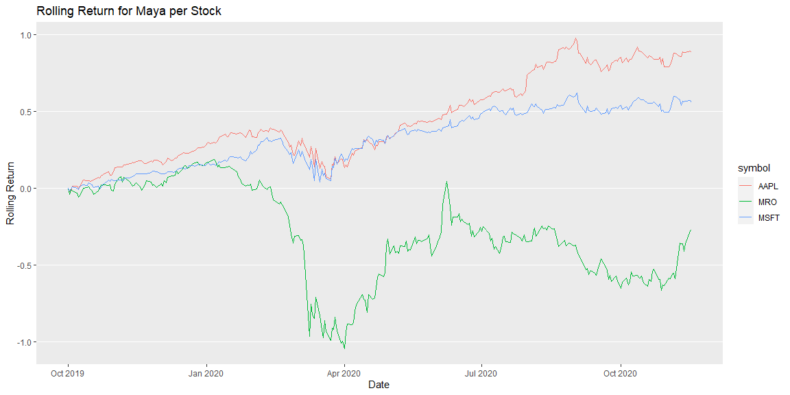

```r
# Use this R-Chunk to import all your datasets!
```

## Background

_The stock market is overflowing with data. There are many packages in R that allow us to get quick access to information on publicly traded companies. Imagine that you and a friend each purchased about $1,000 of stock in three different stocks at the start of October last year, and you want to compare your performance up to this week. Use the stock shares purchased and share prices to demonstrate how each of you fared over the period you were competing (assuming that you did not change your allocations)._

#### My Stock Choices
*Enphase, Tesla, Snapchat*

#### My Sister's Stock Choices
*Apple, Microsoft, Marathon Oil*

## Data Wrangling


```r
myticker <- c("ENPH", "TSLA", "SNAP")
mayaticker <- c("MRO", "AAPL", "MSFT")

my_price <- tq_get(myticker,
                    get = "stock.prices",
                    from = "2019-10-01")


maya_price <- tq_get(mayaticker,
                    get = "stock.prices",
                    from = "2019-10-01")

my_return <- my_price %>% 
  group_by(symbol) %>% 
  tq_transmute(selct = adjusted,
               mutate_fun = periodReturn,
               period = "daily",
               type = "arithmetic")%>%
  group_by(symbol) %>% 
  mutate(cumulative_sum = cumsum(daily.returns))

maya_return <- maya_price %>% 
  group_by(symbol) %>% 
  tq_transmute(select = adjusted,
               mutate_fun = periodReturn,
               period = "daily",
               type = "arithmetic")%>% 
  group_by(symbol) %>% 
  mutate(cumulative_sum = cumsum(daily.returns))

total_return <- my_return %>% 
  full_join(maya_return) %>% 
  mutate(who = case_when(
    symbol %in% c("ENPH", "TSLA", "SNAP") ~ "Jackson",
    TRUE ~ "Maya"
  )) 
```

## Data Visualization


```r
ggplot(total_return, aes(x = date, y = daily.returns))+
  geom_smooth(method = "loess", aes(color = as.factor(who)), se = FALSE)+
  labs(color = "Individual",
       x = "Date",
       y = "Daily Returns",
       title = "Daily Returns Between Individuals' Portfolios")+
  theme(panel.grid.minor = element_blank(),
        panel.grid.major.x = element_blank())
```

<!-- -->

```r
ggplot(total_return, aes(x = date, y = cumulative_sum))+
  geom_smooth(method = "loess", aes(color = as.factor(who)), se = FALSE)+
  labs(color = "Individual",
       x = "Date",
       y = "Daily Returns",
       title = "Cumulative Sum of Profit per Portfolio")+
  theme(panel.grid.minor = element_blank(),
        panel.grid.major.x = element_blank())
```

<!-- -->

```r
##


ggplot(my_return, aes(x = date, y = cumulative_sum, color = symbol))+
  geom_line()+
  theme(panel.grid.minor = element_blank(),
        panel.grid.major.x = element_blank())+
  labs(x = "Date",
       y = "Rolling Return",
       title = "Rolling Return for Jackson per Stock")
```

<!-- -->

```r
ggplot(maya_return, aes(x = date, y = cumulative_sum, color = symbol))+
  geom_line()+
  theme(panel.grid.minor = element_blank(),
        panel.grid.major.x = element_blank())+
  labs(x = "Date",
       y = "Rolling Return",
       title = "Rolling Return for Maya per Stock")
```

<!-- -->

## Conclusions


Based off of these charts, we see that I would have outperformed my sister (Maya) by a lot, had these been our exact portfolios. Her downfall was mainly due to Marathon Oil, as can be seen in the last plot. It is clear to see where each stock was affected by the Pandemic, and while 5 of the 6 stocks have recovered since then, Marathon Oil has not.
