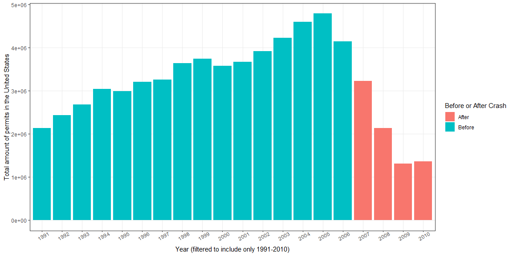
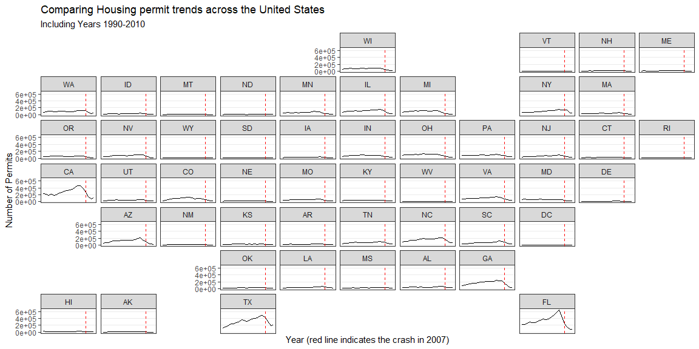

```r
# Use this R-Chunk to import all your datasets!
```

## Background

_You have been asked to support a story for the local paper (that has a web presence) that looks back on the housing collapse and the early effects of residential construction. You have data on residential building permits from 1980 through 2010 for each county in the United States. Your colleague that is writing the article would like a few maps and graphics that highlight the single family building permit patterns across your state as well as the patterns in the US._

_Remember the big story is the collapse of new building permits at the initial stages of the 2007-2010 mortgage crisis (Links to an external site.). Make sure your graphics highlight the collapse in a clear and honest manner._

## Data Wrangling


```r
devtools::install_github("hathawayj/buildings")
library(buildings)
library(USAboundaries)
library(tidyverse)
library(geofacet)

us_counties <- us_counties()
idaho <- us_counties %>% 
  filter(state_name == "Idaho")

cont_us <- us_counties %>% 
  filter(!state_name %in% c("Hawaii", "Alaska", "Puerto Rico"))

us_states <- us_states() %>% 
  filter(!state_name %in% c("Alaska", "Hawaii", "Puerto Rico"))

agg_permits <- permits %>% 
  group_by(StateAbbr, year) %>% 
  summarise(total_permits = sum(value)) %>% 
  filter(year > 1990) %>% 
  mutate(perm_adj = total_permits / 10000)

us_total_permits <- permits %>% 
  group_by(year) %>% 
  summarise(total_permits = sum(value)) %>% 
  mutate(year_cat = case_when(
    year > 2006 ~ "After",
    TRUE ~ "Before"
  )) %>% 
  filter(year > 1990)

idaho_permits <- permits %>% 
  filter(StateAbbr == "ID") %>% 
  group_by(year) %>% 
  summarise(total_permits = sum(value)) %>% 
  mutate(year_cat = case_when(
    year > 2006 ~ "After",
    TRUE ~ "Before"
  )) %>% 
  filter(year > 1990)
```

## Data Visualization


```r
ggplot(us_total_permits, aes(x = as.factor(year), y = total_permits))+
  geom_bar(stat = "identity", aes(fill = as.factor(year_cat)))+
  theme_bw()+
  theme(axis.text.x = element_text(angle = 30),
        panel.grid.minor = element_blank())+
  labs(x = "Year (filtered to include only 1991-2010)",
       y = "Total amount of permits in the United States",
       fill = "Before or After Crash")
```

<!-- -->

```r
ggplot(idaho_permits, aes(x = as.factor(year), y = total_permits))+
  geom_bar(stat = "identity", aes(fill = as.factor(year_cat)))+
  theme_bw()+
  theme(axis.text.x = element_text(angle = 30),
        panel.grid.minor = element_blank())+
  labs(x = "Year (filtered to include only 1991-2010)",
       y = "Total amount of permits in Idaho",
       fill = "Before or After Crash")
```

<!-- -->

```r
ggplot(agg_permits,aes(x = year, y = total_permits))+
  geom_line()+
  facet_geo(vars(StateAbbr))+
  theme_bw()+
  geom_vline(xintercept = 2007, color = "red", linetype = "dashed")+
  theme(axis.text.x = element_blank(),
        panel.grid.minor = element_blank(),
        panel.grid.major.x = element_blank(),
        axis.ticks.length.x = unit(0, "pt"))+
  labs(y = "Number of Permits",
       title = "Comparing Housing permit trends across the United States",
       subtitle = "Including Years 1990-2010",
       x = "Year (red line indicates the crash in 2007)")
```

<!-- -->

## Conclusions

The first plots show us how the total number of permits in the contiguous United States changed over time, specifically from 1990-2010. This plotting window was selected to place more emphasis on the time in question. The second plot shows the same data but only Idaho, my home-state. It appears that the trend observed in the United States as a whole is very similar to that observed in Idaho.

The final plot shows the United States with each state as a facet. It also shows the general relationship of geographic location between states. The red vertical line represents the year 2007, which is when the crash initially happened. The x-axis labels and tick-marks have been removed to provide a much cleaner look, and more specific data for Idaho and the US are included above. The states that seem to be hit the hardest are Florida, Texas and California. This makes sense, given that the y-axis has not been adjusted to population or another similar metric that could be used. These three states all have large populations and large land area, making them highly desirable to build a home, business, or other building.
