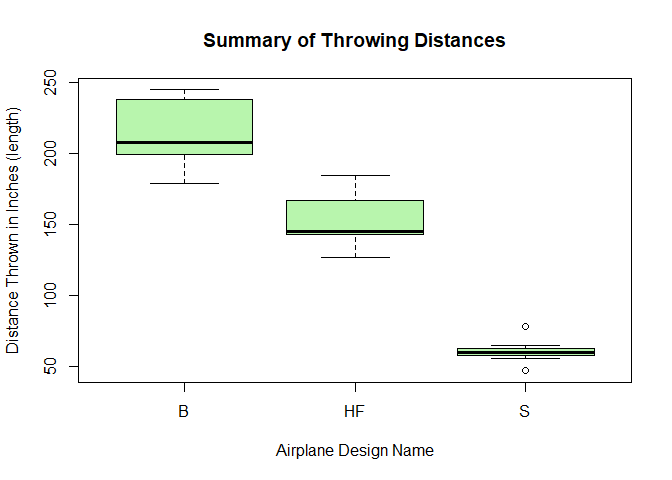
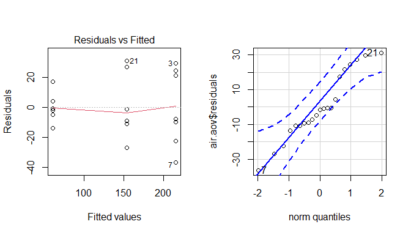

## Introduction

For decades, man has been fascinated with flying. Even since before the Wright Brothers first made their short flight, it has been an area of much focus and attention for engineers to create the most optimal aircraft design. In this experiement, I will test three different design of paper airplanes, each similar in type and difficulty. 

**Response Variable: **Flight distance

**Treatment Factor: **Design

**Levels:** 'The Buzz', 'The Sprinter', and 'Hunting Flight'

**Units: **Paper Airplanes

**Research Question: **Does the design of an airplane affect the average flight distance?

#### Mathematical Model

$$
Y_{ij}=\mu+\alpha_i+\epsilon_ij
$$

#### Hypotheses

$$
H_o:\alpha_{The Buzz}=\alpha_{The Sprinter}=\alpha_{Hunting Flight}=0
$$
Or in other words, the effect for each of the paper airplane designs is equal, and is equal to 0.

$$
H_a: \alpha_i\neq0 \text{ for at least one }i \in \text{{The Buzz, The Sprinter, Hunting Flight}}
$$
The significance level for this experiment will be set at $\alpha=0.05$


## Method

The most obvious source of variaiton was found between the designs of the airplane, which is the kind of variaiton we depend on to be able to run the experiment. There are other sources of variaiton however, which I have done my best to absolutley minimize. One is the strength of throw. Given that I am a human and not a calculated machine capable of executing the exact same movement with close to no error repeatedly, it is likely that the results may have been affected by this variaiton, but this variaiton is estimated to be very small. Another source of variation could be how firm the creases are in the airplanes. My method of minimizing this will be discussed later in this section. There was no variaiton due to wind change as this experiment was conducted in a room with windows closed, within a 15 minute time period. Variation could not be found in the quality of the airplanes over time, due to the fact that each individual airplane will be thrown only once.

Airplane designs were chosen from [this website](https://www.foldnfly.com/#/1-1-1-1-0-1-0-0-2), where a filter was placed to include only medium difficulty paper airplane designs. This level of difficulty refers to the level of difficulty of folding the airplane, and is not necessary directly related to the airplanes flight performance. I then selected 3 of the first four airplanes,  skipping the third in the row due to the fact that it required cutting of the paper, which would then create a possible source of variation due to the weight of the airplane. Eight of each of the three designs were created by following the exact directions found on the website with identical paper from the same source(8 1/2 X 11). The first fold of each of the designs was made to decrease any variation that could exist due to the exactness of the paper airplane, this can be viewed as a rough draft of each airplane. Each of the following versions of each airplane was then thrown, one at a time, and measured using a tape measure placed along the ground. Each airplane thrown was removed from the throwing field before a second airplane was thrown to ensure there is no variability caused by one airplane hitting the other while it is on the ground. Each airplane was thrown from a stationary sitting position, keeping the technique as close to the same as before. This process of throwing the airplanes one at a time and then measuring the distances from my sitting position was repeated until each plane design received 7 measurements, bringing the total amount of observations to 21.

Each measurement was then recorded in an excel dataset, and uploaded into R. The measurements were recorded in inchese from wheere my back was placedagainst the edge of the couch, which ensured the same throwing position for each observation.

## Analysis

To test the stated hypotheses, a boxplot of the observed distances thrown for each design of paper airplane was constructed and plotted. The Airplane Design abbreviations are to be interpreted as such: "B" refers to The Buzz, "HF" refers to Hunting Flight, and "S" refers to The Sprinter.


```r
library(tidyverse)
library(mosaic)
library(readxl)
library(car)
library(pander)
```


```r
airplanes <- read_xlsx("Airplane Data.xlsx")
View(airplanes)

airplanes$design <- factor(airplanes$design)

air.aov <- aov(length ~ design, data = airplanes, 
               contrasts = list(design = contr.sum))
boxplot(length ~ design, data = airplanes, col = rgb(.3,.9,.2,.4), ylab = "Distance Thrown in Inches (length)", xlab = "Airplane Design Name", main = "Summary of Throwing Distances")
```

<!-- -->

```r
favstats(length ~ design, data = airplanes) %>% pander()
```


---------------------------------------------------------------------------
 design   min    Q1     median    Q3     max   mean     sd     n   missing 
-------- ----- ------- -------- ------- ----- ------- ------- --- ---------
   B      179   199.5    208     238.5   245   215.4   25.55   7      0    

   HF     127    143     145      167    185   153.9   21.38   7      0    

   S      47    57.5      60     62.5    78    60.71   9.411   7      0    
---------------------------------------------------------------------------

That is very nice. It does appear as if there is a significant difference in the effect of the design on the distance thrown. To see if this is a statistically significant difference, an ANOVA test was run and table created:


```r
summary(air.aov) %>% pander(caption = "ANOVA Table")
```


-------------------------------------------------------------
    &nbsp;       Df   Sum Sq   Mean Sq   F value    Pr(>F)   
--------------- ---- -------- --------- --------- -----------
  **design**     2    84941     42470     106.3    1.076e-10 

 **Residuals**   18    7192     399.6      NA         NA     
-------------------------------------------------------------

Table: ANOVA Table


### Diagnostic Plots

In order to verify if we can trust these results, the assumptions of ANOVA must be met. These assumptions are checked here:


```r
par(mfrow=c(1,2))
plot(air.aov, which = 1)
qqPlot(air.aov$residuals)
```

<!-- -->

```
## [1]  7 21
```

Looking at the residuals vs fitted plot, we do see a bit of a megaphone shape, but referencing the standard deviation of each group found in the "favstats" table below the boxplots, the largest is not more than 3 times the smallest, which means the constant variance assumption is met. The QQ-Plot also shows that our error terms are normally distributed, so we can conclude that all our ANOVA assumptions are met.
## Conclusion

Because our p-value $p=0.000000000176<\alpha=0.05$ is less than our significance level, we reject our null hypothesis and can conclude that there is a significantly different effect on the distance a paper airplane will fly based on the design choice of the 3 observed models.

To determine which models differ significantly compared to each other, a Fisher's LSD Comparison Adjustment was run. The results are as follow, given our same $\alpha=0.05$ level of significance.


```r
pairwise.t.test(airplanes$length, airplanes$design, "none") %>% pander()
```


  * **method**: t tests with pooled SD
  * **data.name**: airplanes$length and airplanes$design
  * **p.value**:

    --------------------------------
     &nbsp;       B          HF
    -------- ----------- -----------
     **HF**   1.839e-05      NA

     **S**    2.322e-11   7.061e-08
    --------------------------------

  * **p.adjust.method**: none

<!-- end of list -->

This test confirms what our boxplot showed, that each design differs significantly from each other. Based on these results, if the objective of an airplane design is to achieve the longest flying distance, I recommend using the design of The Buzz, which has a significant difference in average flight distance over the Hunting Flight and Sprinter designs.

The effects for each of the treatment factors is shown here:


```r
dummy.coef(air.aov) %>% pander()
```


  * **(Intercept)**:

    -------------
     (Intercept)
    -------------
        143.3
    -------------

  * **design**:

    -----------------------
      B      HF       S
    ------ ------- --------
     72.1   10.52   -82.62
    -----------------------


<!-- end of list -->
