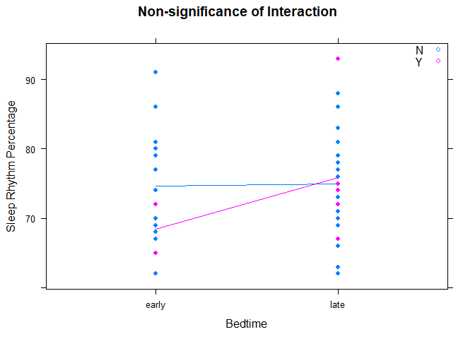
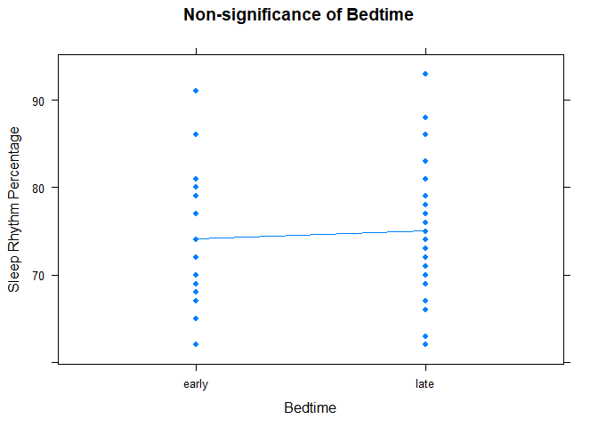
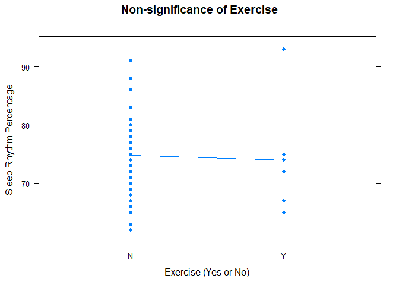
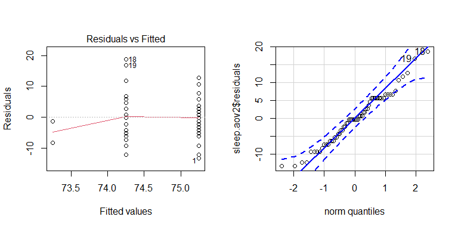

```r
library(mosaic)
library(tidyverse)
library(pander)
library(readxl)
library(car)
```

## Introduction

Sleep is of utmost importance. Without sleep, we would not be able to function. In this experiment, I will examine the effect of 3 different factors of sleep quality by running a two-way ANOVA test. This test is valuable because based on the possibility of a statistically significant difference between the effects of each factor, I can modify my sleep schedule and exercise habits to optimize my sleep.

**Response Variable: **Sleep Rhythm

**Treatment Factors: **Exercise, time sleep begins, and the interaction between the two.

**Levels: **Exercise: Yes or No, Time sleep begins: Before or after 11:30 p.m.

**Units: **Myself

**Research Question: **Is there an interaction between me exercising, and going to bed before 11:30 p.m. that affects the sleep rhythm achieved?

#### Mathematical Model

The following mathematical model will be used to model the analysis:

$$
Y_{ijk}=\mu+\alpha_i+\beta_j+\alpha\beta_{ij}+\epsilon_{ijk}
$$

### Hypotheses {.tabset .tabset-fade}

For this Two-Way ANOVA, there will be a set of 3 hypotheses, one for each factor, using a level of significance of $\alpha=0.05$:

#### Hypothesis 1


$$
H_0:\alpha_1 =\alpha_2=0
$$


$$
H_a: \alpha_i\neq0\text{ for at least one }i
$$

This set of hypotheses represents the effect of going to bed early versus late.

#### Hypothesis 2

$$
H_0:\beta_1 =\beta_2=0
$$

$$
H_a: \beta_j\neq0\text{ for at least one }j
$$

This set of hypotheses represents the effect of exercising or not.

#### Hypothesis 3

$$
H_0:\text{ The effect of }\alpha\text{ is the same for all levels of }\beta
$$

$$
H_a:\text{The effect of }\alpha\text{ is different for at least one level of }\beta
$$

The final set of hypotheses represent the interaction of the two factors of time and exercising.

##

## Methods

I use an apple watch to track different metrics about my activities, exercise, steps, and sleep quality. The app I use to track my quality of sleep is called Nightwatch. In this experiment, I will use the previously mentioned variables that are collected automatically on the watch. In order to qualify to be a two-way ANOVA, the time that I go to sleep must be converted into a qualitative variable. This will be done by creating a time grouping of "early" and "late". The early group will be defined as a day where I went to bed before 11:30 p.m., and the late will be at or later than 11:30 p.m. The sleep rhythm variable can be defined as the percentage of my total sleep time where my heartbeat is regular. The higher this is, the better, according to research cited in the app. The exercise factor will be binary, that is, having just two levels. These will be whether I completed a workout (such as a run, bike ride, trip to the gym, etc) or not. The interaction will also be observed between the factor of early or late, and exercise or not. Since the watch atutomatically collects this data, I do not need to create a data collection plan.The timespan of data collection is beginning April 1 and ending May 31, inclusive.

## Analysis

The Two-way ANOVA table has been created below, using a type 3 sum of squares due to the unbalanced design:


```r
sleep <- read_xlsx("Sleep Data.xlsx")

sleep$bed <- factor(sleep$bed)
sleep$exercise <- factor(sleep$exercise)

sleep.aov <- aov(rhythm ~ bed + exercise + bed:exercise, data = sleep)

Anova(sleep.aov, type = "3") %>% pander()
```


------------------------------------------------------
      &nbsp;        Sum Sq   Df   F value    Pr(>F)   
------------------ -------- ---- --------- -----------
 **(Intercept)**    122702   1     2283     4.448e-47 

     **bed**        0.8029   1    0.01494    0.9032   

   **exercise**     70.06    1     1.303     0.2584   

 **bed:exercise**   67.28    1     1.252      0.268   

  **Residuals**      3010    56     NA         NA     
------------------------------------------------------

Table: Anova Table (Type III tests)

As can be observed, our interaction term is not significant. An interaction plot has also been created:


```r
xyplot(rhythm ~ bed, data = sleep,
       group = exercise,
       type=c("p","a"),
       auto.key=list(corner=c(1,1)),
       main = "Non-significance of Interaction",
       xlab = "Bedtime",
       ylab = "Sleep Rhythm Percentage",
       pch = 19)
```

<!-- -->

Though it may appear that there is an interaction between our two initial factors due to the non-parallelity of the lines, our p-value is convincing in that there is no significant interaction. When this occurs in a two-way ANOVA, it is generally accepted that it is best to re-run the test, now excluding the interaction factor in the analysis. The ANOVA table for this situation is generated below, again using a type 3 sum of squares due to the design being unbalanced:


```r
sleep.aov2 <- aov(rhythm ~ bed + exercise, data = sleep)
Anova(sleep.aov2, type = "3") %>% pander()
```


-----------------------------------------------------
     &nbsp;        Sum Sq   Df   F value    Pr(>F)   
----------------- -------- ---- --------- -----------
 **(Intercept)**   129163   1     2392     3.025e-48 

     **bed**       14.19    1    0.2629     0.6101   

  **exercise**     6.833    1    0.1266     0.7233   

  **Residuals**     3077    57     NA         NA     
-----------------------------------------------------

Table: Anova Table (Type III tests)

We again see that neither of our factors are significant. This is rather unfortunate, but more interpretations will be addressed in the conclusion section of this analysis. Interaction plots have also been included for each of the factors and are shown below:


```r
xyplot(rhythm ~ bed, data = sleep,
       type=c("p","a"),
       main="Non-significance of Bedtime",
       auto.key=list(corner=c(1,1)),
       ylab = "Sleep Rhythm Percentage",
       xlab = "Bedtime",
       pch = 19)
```

<!-- -->


```r
xyplot(rhythm ~ exercise, data = sleep,
       type = c("p","a"),
       main="Non-significance of Exercise",
       auto.key=list(corner=c(1,1)),
       ylab = "Sleep Rhythm Percentage",
       xlab = "Exercise (Yes or No)",
       pch = 19)
```

<!-- -->


### Diagnostic Plots


```r
par(mfrow=c(1,2))
plot(sleep.aov2,which = 1)
qqPlot(sleep.aov2$residuals)
```

<!-- -->

```
## [1] 18 19
```

From these diagnostic plots, we are able to conclude that the residuals are normally distributed. The assumption for constant variance, however, raises some concern. This will further be verified here:


```r
favstats(sleep$rhythm ~ sleep$bed+sleep$exercise)[-10] %>% pander()
```


------------------------------------------------------------------------------------
 sleep$bed.sleep$exercise   min    Q1     median    Q3     max   mean     sd     n  
-------------------------- ----- ------- -------- ------- ----- ------- ------- ----
         early.N            62    67.25    75.5    80.75   91    74.68   7.937   22 

          late.N            62    71.25     75     80.5    88    74.93   6.612   30 

         early.Y            65    66.75    68.5    70.25   72    68.5    4.95    2  

          late.Y            67    72.5      74     74.75   93    75.83   8.886   6  
------------------------------------------------------------------------------------

As shown above, the constant variance assumption is met given that the largest standard deviation is no more than 3 times larger than the smallest standard deviation. Given that both of our ANOVA assumptions have been met, we are able to trust the results of our test.

## Conclusion

Given our p-values for each of our factors, we can make three conclusions:

1) We have insufficient evidence to conclude that the effect on sleep rhythm of going to bed early or late is different for a day where exercise was recorded or not. This is the conclusion for hypothesis 3, the interaction term, or $\alpha\beta$.

2) We have insufficient evidence to conclude that going to bed before or after 11:30 p.m. has a significant effect on sleep rhythm. This is the conclusion for our first hypothesis, or $\alpha$.

3) We have insufficient evidence to conclude that exercising on a given day has a significant effect on the sleep rhythm of the following night. This is the conclusion for the second hypothesis, or $\beta$.

A possible issue may have occured due to insufficent data in both the $\alpha_1\beta_2$ and the $\alpha_2\beta_2$ groups. This was caused due to my lack of exercise, and my inconsistency of going to bed before 11:30 p.m. Since none of our factors were significant, the effects of each factor will not be discussed.
