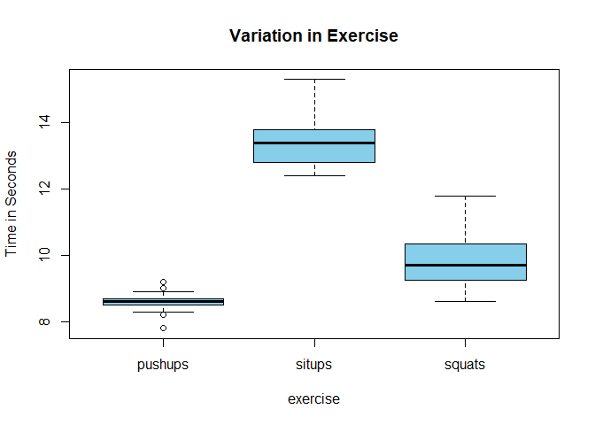
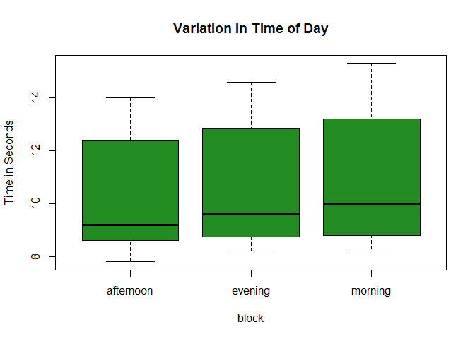
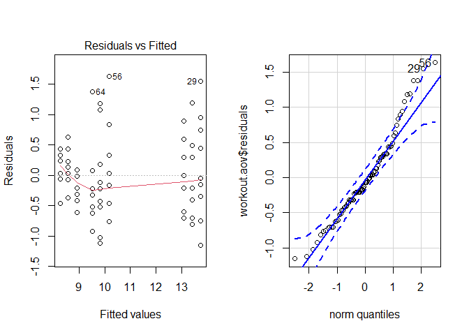

## Introduction

Staying healthy and in shape can be challenging, given that most adult individuals have jobs, are in school, or other tasks that demand their attention and energy. Due to this lack of time, energy, and motivation, it is often a question as to which exercise provides the best results for the shortest amount of input time. While this analysis will not allow for the 'best results' to be a factor and will assume that they all provide the same results per repitition (though for different muscles), an analysis will be performed on the amount of time each exercise takes.

**Response: **Time taken to complete a set of 10 reps of exercise

**Treatment: **Type of Exercise

**Levels: **Pushups, Sit-ups, Air squats

**Nuisance Factor: **Time of Day

**Block Levels: **Morning, Afternoon, Evening

**Experimental Units: **Myself

**Research Question: **Is there a significant difference between the time taken to complete 10 reps of different exercises?


#### Model

$$
\underbrace{Y_{ij}}_\text{Observed Time}=\underbrace{\mu}_\text{Benchmark}+\underbrace{\tau_i}_\text{Effect of Exercise}+\underbrace{\beta_j}_\text{Effect of Block}+\underbrace{\epsilon_{ij}}_\text{Residual Error}
$$

#### Hypothesis

A hypothesis will be used only for the exercise effect, or $\tau$:

$$
H_o: \tau_\text{pushups}=\tau_\text{sit-ups}=\tau_\text{air squats}=0
$$

$$
H_a: \tau_i \neq0 \text{ for at least one }i
$$

## Methods

Each day for 9 days, the elapsed time of completing a single set of 10 repetitions of each of the aforementioned exercises was recorded at 3 different times of day. The timer app on an iPhone was used. Each exercise was begun as close as possible to the starting of the timer, however a minimal source of variation may be the time taken to transition from beginning the timer and beginning the exercise. This possible source of variation was not deemed significant enough to adjust for. Each set was recorded a total of 27 times (meaning 270 total pushups, 270 total sit-ups, and 270 total airsquats), but was also split up into 3 different times during the day: Morning, Afternoon, and Evening. Morning was defined as anytime between waking up and 12:00 p.m., afternoon was defined as beginning at 12:00 p.m. and ending at 5:00 p.m. Evening was defined to be anytime between 5:00 p.m. and going to bed. As is well known, there are different forms of pushups, sit-ups, and air squats. The form for completing the kind of pushups used in this test can be found [here](https://www.self.com/story/heres-exactly-how-to-do-a-push-up-correctly). The form used for a sit-up was similar to the version here called [ab crunch](https://www.puregym.com/exercises/abs/sit-up/), but the torso was instead brought up completely to a sitting position during each repitition. The same form used to complete each air squat used can be found on [this website](https://www.12minuteathlete.com/how-to-do-a-proper-air-squat/). Each time of day was constructed as a block, in order to absorb some of the variation that we could see in the residuals. There are a total of 9 blocks, and a total of 9 observations in each block. A possible source of variation could be caused by the order of exercises performed. This will be controlled by performing the exercises in a random order each time.Variation could also be caused by becoming tired later in the day, due to me doing the exercises twice already in the morning and afternoon once it is after 5 p.m. This possible variation was also deemed insignificant, considering the amount of strain that is caused by the small amount of 20 reps over a relatively long period of time.

## Analysis


```r
library(readr)
library(car)
library(mosaic)
library(tidyverse)
library(pander)
library(DT)
```

The following data were collected over a 9-day period, following the steps given in the methods section:


```r
workout <- read.csv("Workout Data.csv")
datatable(workout)
```

<!--html_preserve--><div id="htmlwidget-35eab2f0cc3af33c74fc" style="width:100%;height:auto;" class="datatables html-widget"></div>
<script type="application/json" data-for="htmlwidget-35eab2f0cc3af33c74fc">{"x":{"filter":"none","data":[["1","2","3","4","5","6","7","8","9","10","11","12","13","14","15","16","17","18","19","20","21","22","23","24","25","26","27","28","29","30","31","32","33","34","35","36","37","38","39","40","41","42","43","44","45","46","47","48","49","50","51","52","53","54","55","56","57","58","59","60","61","62","63","64","65","66","67","68","69","70","71","72","73","74","75","76","77","78","79","80","81"],[8.7,9,8.6,8.5,8.3,8.9,8.6,8.6,8.7,8.7,8.6,8.3,8.2,8.6,8.5,8.6,8.3,7.8,8.7,9.2,8.6,8.2,8.5,8.5,8.7,9,8.8,14.2,15.3,13.7,13.4,14.5,12.6,14.7,13,13.6,14,13.7,12.5,12.4,12.4,12.4,13.4,12.9,13.1,14.6,12.7,13,13.2,13.7,13.2,12.6,13.7,13.9,11,11.8,10,10.2,10.5,10,9.7,9.4,10,10.9,10.9,9.2,9.6,8.9,9,8.6,9.2,9.3,10.9,11,9.4,9.3,10,9.7,8.8,8.7,9.6],["morning","morning","morning","morning","morning","morning","morning","morning","morning","afternoon","afternoon","afternoon","afternoon","afternoon","afternoon","afternoon","afternoon","afternoon","evening","evening","evening","evening","evening","evening","evening","evening","evening","morning","morning","morning","morning","morning","morning","morning","morning","morning","afternoon","afternoon","afternoon","afternoon","afternoon","afternoon","afternoon","afternoon","afternoon","evening","evening","evening","evening","evening","evening","evening","evening","evening","morning","morning","morning","morning","morning","morning","morning","morning","morning","afternoon","afternoon","afternoon","afternoon","afternoon","afternoon","afternoon","afternoon","afternoon","evening","evening","evening","evening","evening","evening","evening","evening","evening"],["pushups","pushups","pushups","pushups","pushups","pushups","pushups","pushups","pushups","pushups","pushups","pushups","pushups","pushups","pushups","pushups","pushups","pushups","pushups","pushups","pushups","pushups","pushups","pushups","pushups","pushups","pushups","situps","situps","situps","situps","situps","situps","situps","situps","situps","situps","situps","situps","situps","situps","situps","situps","situps","situps","situps","situps","situps","situps","situps","situps","situps","situps","situps","squats","squats","squats","squats","squats","squats","squats","squats","squats","squats","squats","squats","squats","squats","squats","squats","squats","squats","squats","squats","squats","squats","squats","squats","squats","squats","squats"]],"container":"<table class=\"display\">\n  <thead>\n    <tr>\n      <th> <\/th>\n      <th>time<\/th>\n      <th>block<\/th>\n      <th>exercise<\/th>\n    <\/tr>\n  <\/thead>\n<\/table>","options":{"columnDefs":[{"className":"dt-right","targets":1},{"orderable":false,"targets":0}],"order":[],"autoWidth":false,"orderClasses":false}},"evals":[],"jsHooks":[]}</script><!--/html_preserve-->

Boxplots were created, showing that there is a lot of variation between the different exercise groups, while there is not a lot of variation between blocks, or time of day. Nevertheless, this nuisance factor was used in the analysis to absorb any possible variation that was caused due to the time of day.


```r
boxplot(time ~ exercise, data = workout, col= "skyblue", ylab = "Time in Seconds", main = "Variation in Exercise")
```

<!-- -->

```r
boxplot(time ~ block, data = workout, col = "forestgreen", ylab = "Time in Seconds", main = "Variation in Time of Day")
```

<!-- -->

Below is the ANOVA table that was contrsucted, using a Type I sum of squares.


```r
workout.aov <- aov(time ~ exercise + block, data = workout,
                   contrasts = list(exercise = contr.sum, block = contr.sum))

summary(workout.aov) %>% pander()
```


-------------------------------------------------------------
    &nbsp;       Df   Sum Sq   Mean Sq   F value    Pr(>F)   
--------------- ---- -------- --------- --------- -----------
 **exercise**    2    340.8     170.4     426.4    4.915e-42 

   **block**     2    5.679     2.839     7.105    0.001483  

 **Residuals**   76   30.37    0.3996      NA         NA     
-------------------------------------------------------------

Table: Analysis of Variance Model

It is here shown to have been effective to block on the time of day, given that the p-value for this factor level is significant. Since the exercise type does have a significant effect on the amount of time taken to complete the exercise, a pairwise comparison test was run, using Fisher's LSD comparison, to be able to detect any real differences. The results of the pairwise comparison are included here:


```r
pairwise.t.test(workout$time, workout$exercise, "none") %>% pander()
```


  * **method**: t tests with pooled SD
  * **data.name**: workout$time and workout$exercise
  * **p.value**:

    -----------------------------------
       &nbsp;      pushups     situps
    ------------ ----------- ----------
     **situps**   2.305e-40      NA

     **squats**   2.009e-09   1.52e-31
    -----------------------------------

  * **p.adjust.method**: none

<!-- end of list -->

It is shown here that each of the workout types differ significantly from each other in the time taken to complete a set of 10 repititions.

#### Diagnostic Plots


```r
par(mfrow=c(1,2))
plot(workout.aov,which = 1)
qqPlot(workout.aov$residuals)
```

<!-- -->

```
## [1] 56 29
```

```r
favstats(workout$time ~ workout$exercise) %>% pander()
```


----------------------------------------------------------------------------------------
 workout$exercise   min     Q1    median    Q3     max    mean      sd     n    missing 
------------------ ------ ------ -------- ------- ------ ------- -------- ---- ---------
     pushups        7.8    8.5     8.6      8.7    9.2    8.581   0.2856   27      0    

      situps        12.4   12.8    13.4    13.8    15.3   13.42   0.7822   27      0    

      squats        8.6    9.25    9.7     10.35   11.8   9.837   0.8326   27      0    
----------------------------------------------------------------------------------------

Based on these diagnostic plots we are a bit concerned about the constant variance assumption, but using the favstats table we are able to conclude that the largest group's variance is no more than 3 times the smallest group's variance, meaning the constant variance assumption has been met. Our QQ-Plot also raises some concerns regarding the normality of the error terms, but it is not enough to discredit the results of our test.

## Conclusion

Based on the results of our Type I sum of squares ANOVA table where $p < 4.915e^{-42}$, we have sufficient evidence to conclude that $\tau_i \neq 0 \text{ for at least one }i$. This is consistent with the pattern we saw in the boxplots, that there is a large difference in mean time required to complete 10 repititions of each of the exercises. We can conclude that pushups require the shortest amount of time, then squats, and sit-ups require the longest amount of time.


