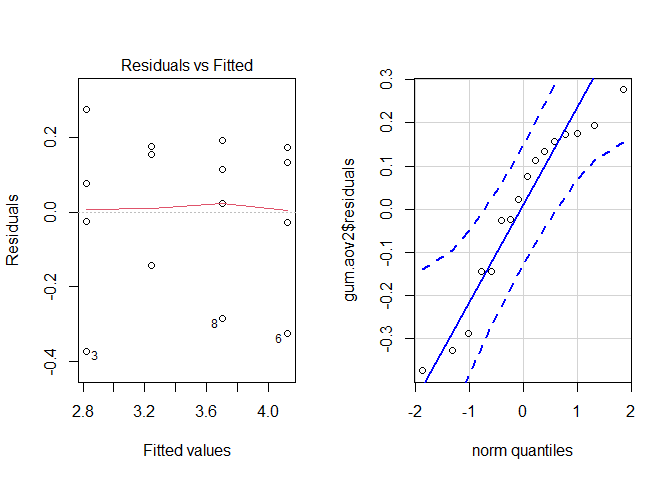

## Introduction

Chewing gum was initially created as a quick way to freshen one's breath on the run, but it is also used as something to keep yourself busy, in  a way. Some brands also claim that chewing their gum is good for your teeth. While this experiment will not consider that as a factor nor a response, it will examine how the flavor length of gum differs between different flavors, as well as the cleanliness of the mouth of the individual who is chewing.

**Response: **Length of flavor of chewing gum in minutes

**Treatment: **Combination of cleanliness of mouth and flavor of gum

**Within Blocks Factor: **Cleanliness of mouth

**Between Blocks Factor: **Flavor of Gum

**Blocking Factor: **Individual

**Experimental Units: **Individuals

**Research Question: **Is there a significant difference in the longevity of flavor of gum depending on flavor and cleanliness of mouth when chewing?


## Model

The following mathematical model will be used in this analysis:

$$
Y_{ijk} = \mu + \underbrace{\alpha_i}_\text{effect of flavor} + \underbrace{\beta_{ij}}_\text{effect of individual} + \underbrace{\Upsilon_k}_\text{effect of cleanliness} + (\alpha\Upsilon)_{ijk} + \underbrace{\epsilon_{ijk}}_\text{Residual Error}
$$


### Hypotheses {.tabset .tabset-fade}

#### Flavor

$$
H_O: \alpha_{\text{polar ice}} = \alpha_{\text{spearmint}}=0 \text{ for every level of }\Upsilon
$$

$$
H_a: \alpha_{\text{polar ice}} \neq \alpha_{\text{spearmint}}\neq 0 \text{ for at least one level of }\Upsilon
$$

#### Cleanliness

$$
H_O: \Upsilon_{\text{just eaten}} = \Upsilon_{\text{just brushed}}=0 \text{ for every level of }\alpha
$$

$$
H_a: \Upsilon_{\text{just eaten}} \neq \Upsilon_{\text{just brushed}}\neq 0 \text{ for at least one level of }\alpha
$$

###

## Methods

Two individuals have been chosen for this study, matched on age. Each individual will place a single piece of Extra gum in his/her mouth and chew just as he/she does on a normal occasion. This will be done both just after eating and just after brushing one's teeth. This will also be done on seperate occasions, with both flavors of gum. The individual will record the time the piece of gum was placed in his/hermouth, and the approximate time when the flavor seems to have gone. This is a possible source of variability, but it is deemed as insignificant due to the total amount of observations. This process will be repeated until for each individual, in each treatment level, there are 3 observations. This will bring the total amount of observations to 24.

## Analysis


```r
library(tidyverse)
library(car)
library(mosaic)
library(pander)
library(readr)
```


```r
gum <- read.csv("Gum Data.csv")

gum$block <- factor(gum$block)

gum.aov <- aov(minutes ~ flavor + block + cleanliness + flavor:cleanliness, data = gum,
               contrasts = list(flavor = contr.sum, block = contr.sum, cleanliness = contr.sum))
summary(gum.aov) %>% pander(caption="ANOVA Table")
```


-------------------------------------------------------------------------
         &nbsp;           Df    Sum Sq    Mean Sq    F value    Pr(>F)   
------------------------ ---- ---------- ---------- --------- -----------
       **flavor**         1     3.115      3.115      69.97    4.264e-06 

       **block**          1     0.1156     0.1156     2.596     0.1354   

    **cleanliness**       1     0.7056     0.7056     15.85    0.002155  

 **flavor:cleanliness**   1    0.002025   0.002025   0.04548     0.835   

     **Residuals**        11    0.4898    0.04452      NA         NA     
-------------------------------------------------------------------------

Table: ANOVA Table

As can be seen here, the interaction term of the within block factor and the between block factor is not significant. In other words, the interaction between flavor and cleanliness of mouth has no significant effect on the length of flavor. Due to this insignificance, a second ANOVA table was created, excluding the interaction as well as any other insignificant variables.


```r
gum.aov2 <- aov(minutes ~ flavor + cleanliness, data = gum,
                contrasts = list(flavor = contr.sum, cleanliness = contr.sum))
summary(gum.aov2) %>% pander()
```


---------------------------------------------------------------
     &nbsp;        Df   Sum Sq   Mean Sq   F value    Pr(>F)   
----------------- ---- -------- --------- --------- -----------
   **flavor**      1    3.115     3.115     66.68    1.786e-06 

 **cleanliness**   1    0.7056   0.7056     15.1     0.001875  

  **Residuals**    13   0.6074   0.04672     NA         NA     
---------------------------------------------------------------

Table: Analysis of Variance Model

That is much better, now that each of our factors seem to have a significant effect on the response variable. The assumptions of this ANOVA will be further examined here:

### Diagnostic Plots


```r
par(mfrow=c(1,2))
plot(gum.aov2,which =1, id=FALSE)
qqPlot(gum.aov2$residuals,id = FALSE)
```

<!-- -->

According to these diagnostic plots, we are a bit concerned about the constant variance assumption, but it is not drastic enough to disregard the results of the experiment. The normality assumption also appears to have been met.

## Conclusion

We are able to reject the null hypothesis for both flavor and cleanliness. This means that we have sufficient evidence to conclude that both of these factors have a significant effect on the length of time that a single piece of gum's flavor will last. To find out which level of each of these factors has the more positive effect, we look at an effects model here:


```r
dummy.coef(gum.aov2) %>% pander()
```


  * **(Intercept)**:

    -------------
     (Intercept)
    -------------
        3.475
    -------------

  * **flavor**:

    ---------
     flavor
    ---------
     -0.4412
    ---------

  * **cleanliness**:

    -------------
     cleanliness
    -------------
        0.21
    -------------


<!-- end of list -->

With this information, we can see that the spearmint flavor of gum tends to last .44125 minutes longer than does polar ice. Brushing your teeth also shows a significant increase in time compared to not, increasing the time by .21 minutes.

